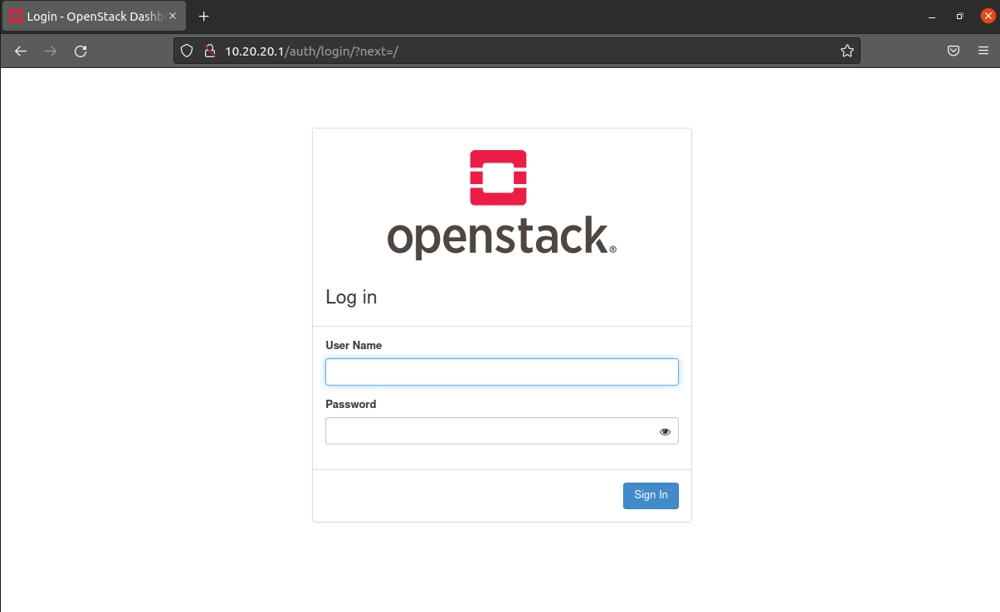

# OpenStack的搭建

```shell
开始的命令：
依次运行下列命令
hadoop@ubuntu:~$ sudo apt update
[sudo] password for hadoop: 
Get:1 http://security.ubuntu.com/ubuntu focal-security InRelease [114 kB]      
Hit:2 http://us.archive.ubuntu.com/ubuntu focal InRelease                      
Get:3 http://us.archive.ubuntu.com/ubuntu focal-updates InRelease [114 kB]
.....
.....
.....

------------------------------------------------------------------------

hadoop@ubuntu:~$ sudo snap install microstack --beta --devmode
确保 "microstack" 的先决条件可用                                                                                                    确保 "microstack" 的先决条件可用                                                                                                    确保 "microstack" 的先决条件可用                                                                                                    确保 "microstack" 的先决条件可用  
.....
.....
.....


--------------------------------------------------------------------------
hadoop@ubuntu:~$ sudo microstack init --auto --control
2021-10-12 05:41:39,075 - microstack_init - INFO - Configuring clustering ...
2021-10-12 05:41:39,166 - microstack_init - INFO - Setting up as a control node.
2021-10-12 05:41:42,413 - microstack_init - INFO - Configuring networking ...
.....
.....
.....

----------------------------------------------------------------------------
hadoop@ubuntu:~$ sudo snap get microstack config.credentials.keystone-password
o4BgKIx9xRJgAA6D4I4OkpTzhC6gQkUF


----------------------------------------------------------------------------
hadoop@ubuntu:~$ ip addr
1: lo: <LOOPBACK,UP,LOWER_UP> mtu 65536 qdisc noqueue state UNKNOWN group default qlen 1000
    link/loopback 00:00:00:00:00:00 brd 00:00:00:00:00:00
    inet 127.0.0.1/8 scope host lo
       valid_lft forever preferred_lft forever
    inet6 ::1/128 scope host 
.....
.....
.....
--------------------------------------------------------------------------------

s


```



