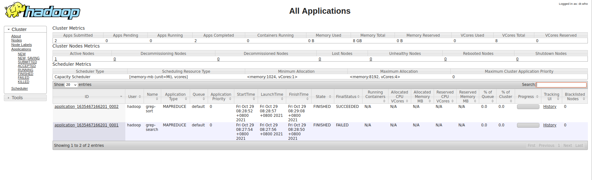
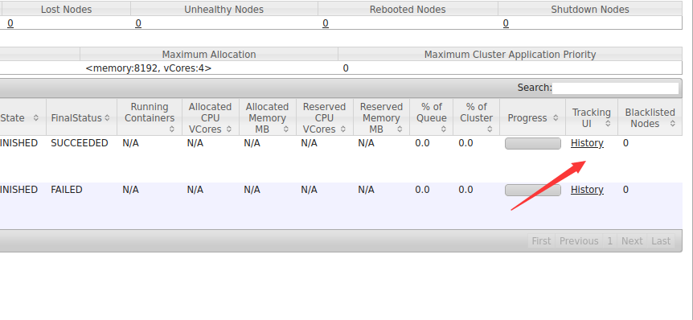

# Hadoop分布式实例

author:Damon

完成了分布式集群的搭建

我们对这个集群进行简单的测试，具体步骤如下：

#### 1.创建目录

执行分布式实例过程与伪分布式模式一样，首先创建HDFS上的用户目录，命令如下：

```shell
hadoop@Master:/usr/local/hadoop$ start-dfs.sh
Starting namenodes on [Master]
Starting datanodes
Starting secondary namenodes [Master]
hadoop@Master:/usr/local/hadoop$ start-yarn.sh
Starting resourcemanager
Starting nodemanagers
hadoop@Master:/usr/local/hadoop$ mr-jobhistory-daemon.sh start historyserver
WARNING: Use of this script to start the MR JobHistory daemon is deprecated.
WARNING: Attempting to execute replacement "mapred --daemon start" instead.
hadoop@Master:/usr/local/hadoop$ hdfs dfs -mkdir -p /user/hadoop
hadoop@Master:/usr/local/hadoop$ hdfs dfs -mkdir input
hadoop@Master:/usr/local/hadoop$ hdfs dfs -put /usr/local/hadoop/etc/hadoop/*.xml input
2021-10-29 08:27:19,930 INFO sasl.SaslDataTransferClient: SASL encryption trust check: localHostTrusted = false, remoteHostTrusted = false
2021-10-29 08:27:20,571 INFO sasl.SaslDataTransferClient: SASL encryption trust check: localHostTrusted = false, remoteHostTrusted = false
2021-10-29 08:27:20,608 INFO sasl.SaslDataTransferClient: SASL encryption trust check: localHostTrusted = false, remoteHostTrusted = false
2021-10-29 08:27:20,628 WARN hdfs.DataStreamer: Caught exception
java.lang.InterruptedException
	at java.lang.Object.wait(Native Method)
	at java.lang.Thread.join(Thread.java:1252)
	at java.lang.Thread.join(Thread.java:1326)
	at org.apache.hadoop.hdfs.DataStreamer.closeResponder(DataStreamer.java:986)
	at org.apache.hadoop.hdfs.DataStreamer.endBlock(DataStreamer.java:640)
	at org.apache.hadoop.hdfs.DataStreamer.run(DataStreamer.java:810)
2021-10-29 08:27:20,651 INFO sasl.SaslDataTransferClient: SASL encryption trust check: localHostTrusted = false, remoteHostTrusted = false
2021-10-29 08:27:20,679 INFO sasl.SaslDataTransferClient: SASL encryption trust check: localHostTrusted = false, remoteHostTrusted = false
2021-10-29 08:27:20,706 INFO sasl.SaslDataTransferClient: SASL encryption trust check: localHostTrusted = false, remoteHostTrusted = false
2021-10-29 08:27:20,719 WARN hdfs.DataStreamer: Caught exception
java.lang.InterruptedException
	at java.lang.Object.wait(Native Method)
	at java.lang.Thread.join(Thread.java:1252)
	at java.lang.Thread.join(Thread.java:1326)
	at org.apache.hadoop.hdfs.DataStreamer.closeResponder(DataStreamer.java:986)
	at org.apache.hadoop.hdfs.DataStreamer.endBlock(DataStreamer.java:640)
	at org.apache.hadoop.hdfs.DataStreamer.run(DataStreamer.java:810)
2021-10-29 08:27:20,740 INFO sasl.SaslDataTransferClient: SASL encryption trust check: localHostTrusted = false, remoteHostTrusted = false
2021-10-29 08:27:20,755 WARN hdfs.DataStreamer: Caught exception
java.lang.InterruptedException
	at java.lang.Object.wait(Native Method)
	at java.lang.Thread.join(Thread.java:1252)
	at java.lang.Thread.join(Thread.java:1326)
	at org.apache.hadoop.hdfs.DataStreamer.closeResponder(DataStreamer.java:986)
	at org.apache.hadoop.hdfs.DataStreamer.endBlock(DataStreamer.java:640)
	at org.apache.hadoop.hdfs.DataStreamer.run(DataStreamer.java:810)
2021-10-29 08:27:20,776 INFO sasl.SaslDataTransferClient: SASL encryption trust check: localHostTrusted = false, remoteHostTrusted = false
2021-10-29 08:27:20,799 WARN hdfs.DataStreamer: Caught exception
java.lang.InterruptedException
	at java.lang.Object.wait(Native Method)
	at java.lang.Thread.join(Thread.java:1252)
	at java.lang.Thread.join(Thread.java:1326)
	at org.apache.hadoop.hdfs.DataStreamer.closeResponder(DataStreamer.java:986)
	at org.apache.hadoop.hdfs.DataStreamer.endBlock(DataStreamer.java:640)
	at org.apache.hadoop.hdfs.DataStreamer.run(DataStreamer.java:810)
2021-10-29 08:27:20,819 INFO sasl.SaslDataTransferClient: SASL encryption trust check: localHostTrusted = false, remoteHostTrusted = false


hadoop@Master:/usr/local/hadoop$ hadoop jar /usr/local/hadoop/share/hadoop/mapreduce/hadoop-mapreduce-examples-3.1.3.jar grep input output 'dfs[a-z.]+'
2021-10-29 08:27:52,484 INFO client.RMProxy: Connecting to ResourceManager at Master/192.168.50.40:8032
2021-10-29 08:27:53,236 INFO mapreduce.JobResourceUploader: Disabling Erasure Coding for path: /tmp/hadoop-yarn/staging/hadoop/.staging/job_1635467166201_0001
2021-10-29 08:27:53,398 INFO sasl.SaslDataTransferClient: SASL encryption trust check: localHostTrusted = false, remoteHostTrusted = false
2021-10-29 08:27:53,594 INFO input.FileInputFormat: Total input files to process : 9
2021-10-29 08:27:53,629 INFO sasl.SaslDataTransferClient: SASL encryption trust check: localHostTrusted = false, remoteHostTrusted = false
2021-10-29 08:27:53,645 WARN hdfs.DataStreamer: Caught exception
java.lang.InterruptedException
	at java.lang.Object.wait(Native Method)
	at java.lang.Thread.join(Thread.java:1252)
	at java.lang.Thread.join(Thread.java:1326)
	at org.apache.hadoop.hdfs.DataStreamer.closeResponder(DataStreamer.java:986)
	at org.apache.hadoop.hdfs.DataStreamer.endBlock(DataStreamer.java:640)
	at org.apache.hadoop.hdfs.DataStreamer.run(DataStreamer.java:810)
2021-10-29 08:27:53,669 INFO sasl.SaslDataTransferClient: SASL encryption trust check: localHostTrusted = false, remoteHostTrusted = false
2021-10-29 08:27:53,686 WARN hdfs.DataStreamer: Caught exception
java.lang.InterruptedException
.....
.....
.....
```





