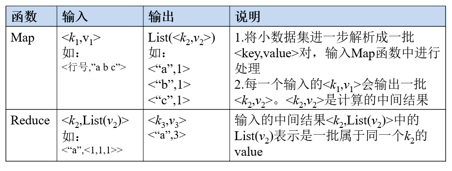
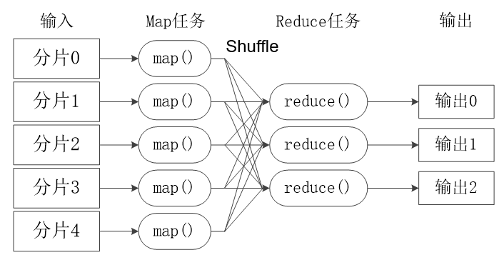
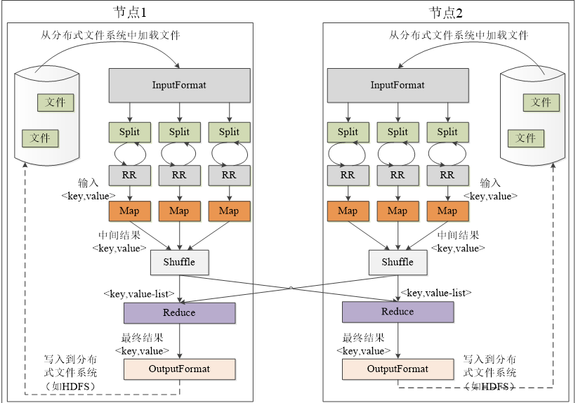
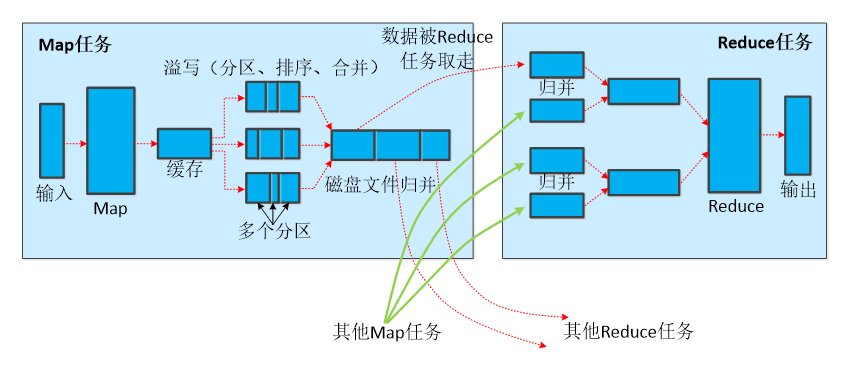
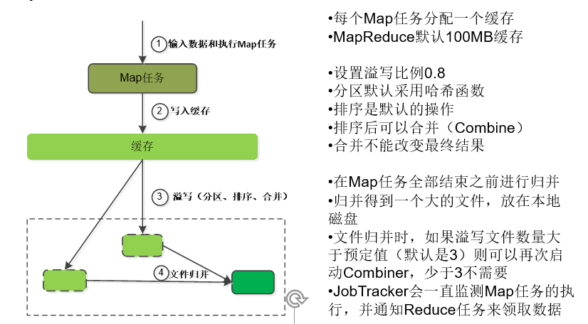
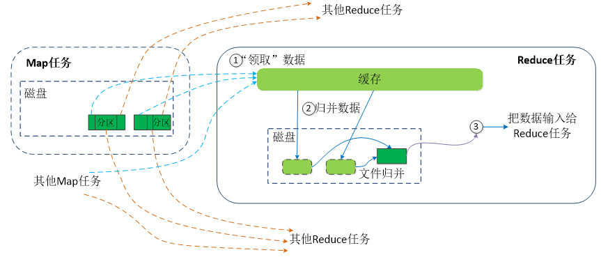
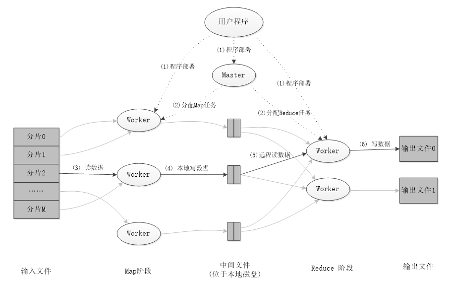

# Hadoop学习笔记_MapReduce_

### MapReduce简单介绍

MapReduce将复杂的、运行于大规模集群上的并行计算过程高度地抽象到了两个函数：**Map和Reduce**

也就是说，

你输入aabbcddd,

Map函数就会识别<a,1><a,1><b,1><b,1><c,1><d,1><d,1><d,1>

系统会统计<a,(1,1,1)><b,(1,1)><c,(1)><d,(1,1,1)>======这一过程叫shuffle

Reduce函数帮你合并<a,3><b,2><c,1><d,3>

----

### MapReduce体系结构

**MapReduce体系结构主要由四个部分组成，分别是：Client、JobTracker、TaskTracker以及Task**

##### Client

- 用户编写的MapReduce程序通过Client提交到JobTracker端
- 用户可通过Client提供的一些接口查看作业运行状态

##### JobTracker

- JobTracker负责资源监控和作业调度
- JobTracker 监控所有TaskTracker与Job的健康状况，一旦发现失败，就将相应的任务转移到其他节点
- JobTracker 会跟踪任务的执行进度、资源使用量等信息，并将这些信息告诉任务调度器（TaskScheduler），而调度器会在资源出现空闲时，选择合适的任务去使用这些资源

##### TaskTracker

- TaskTracker 会周期性地通过“心跳”将本节点上资源的使用情况和任务的运行进度汇报给JobTracker，同时接收JobTracker 发送过来的命令并执行相应的操作（如启动新任务、杀死任务等）
- TaskTracker 使用“slot”等量划分本节点上的资源量（CPU、内存等）。一个Task 获取到一个slot 后才有机会运行，而Hadoop调度器的作用就是将各个TaskTracker上的空闲slot分配给Task使用。slot 分为Map slot 和Reduce slot 两种，分别供MapTask 和Reduce Task 使用

##### Task

Task 分为Map Task 和Reduce Task 两种，均由TaskTracker 启动

----

### MapReduce的工作流程

**注意：**

- 不同的Map任务之间不会进行通信
- 不同的Reduce任务之间也不会发生任何信息交换
- 用户不能显式地从一台机器向另一台机器发送消息
- 所有的数据交换都是通过MapReduce框架自身去实现的

##### Split

HDFS 以固定大小的block 为基本单位存储数据，而对于MapReduce 而言，其处理单位是split。split 是一个逻辑概念，它只包含一些元数据信息，比如数据起始位置、数据长度、数据所在节点等。它的划分方法完全由用户自己决定。

##### Map

Hadoop为每个split创建一个Map任务，split 的多少决定了Map任务的数目。大多数情况下，理想的分片大小是一个HDFS块

##### Reduce

最优的Reduce任务个数取决于集群中可用的reduce任务槽(slot)的数目

通常设置比reduce任务槽数目稍微小一些的Reduce任务个数（这样可以预留一些系统资源处理可能发生的错误）

##### shuffle

**Map端的shuffle**

合并（Combine）和归并（Merge）的区别：

两个键值对<“a”,1>和<“a”,1>，如果合并，会得到<“a”,2>，如果归并，会得到<“a”,<1,1>>

**Reduce端的shuffle**

- Reduce任务通过RPC向JobTracker询问Map任务是否已经完成，若完成，则领取数据
- Reduce领取数据先放入缓存，来自不同Map机器，先归并，再合并，写入磁盘
- 多个溢写文件归并成一个或多个大文件，文件中的键值对是排序的
- 当数据很少时，不需要溢写到磁盘，直接在缓存中归并，然后输出给Reduce

小结：也就是说MapReduce在读入和写入数据都得经过磁盘，磁盘IO开销大

### MapReduce可以很好地应用于各种计算问题

- 关系代数运算（选择、投影、并、交、差、连接）
- 分组与聚合运算
- 矩阵-向量乘法
- 矩阵乘法

但是，不适合机器学习，因为机器学习经常需要迭代计算，所以机器学习还是得使用Spark的DAG任务调度执行机制