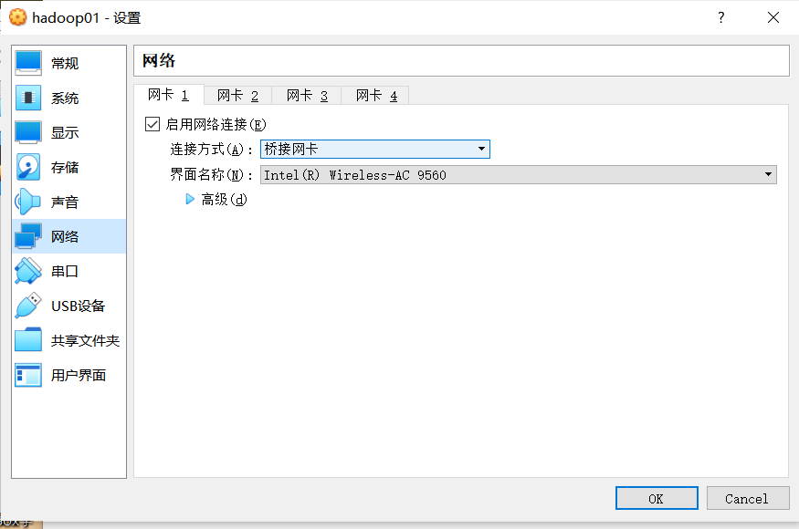
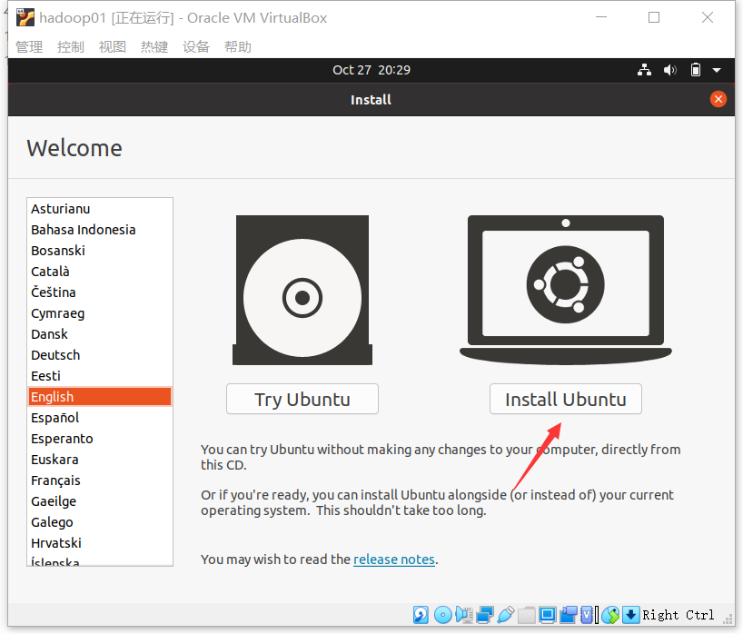
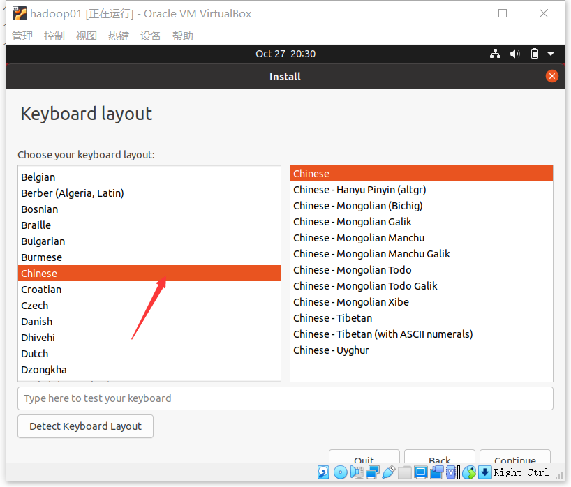
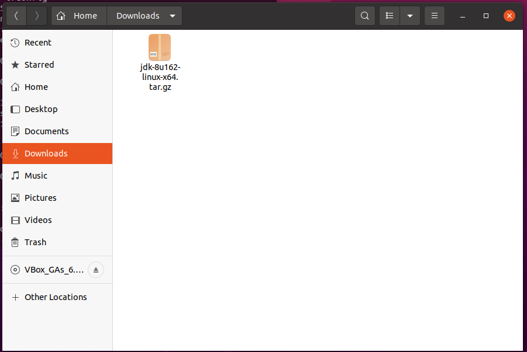
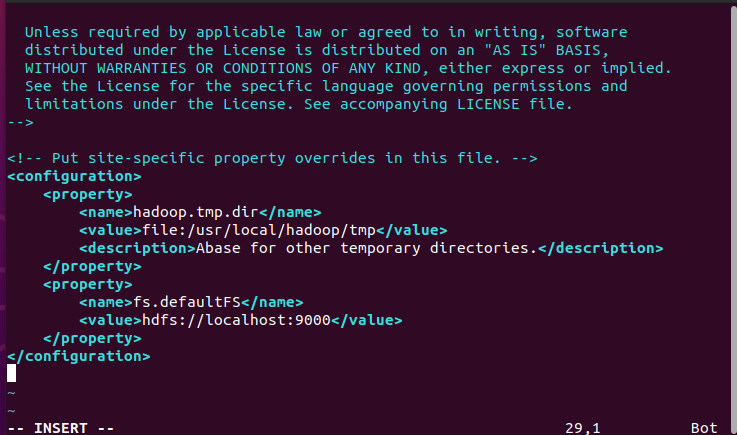
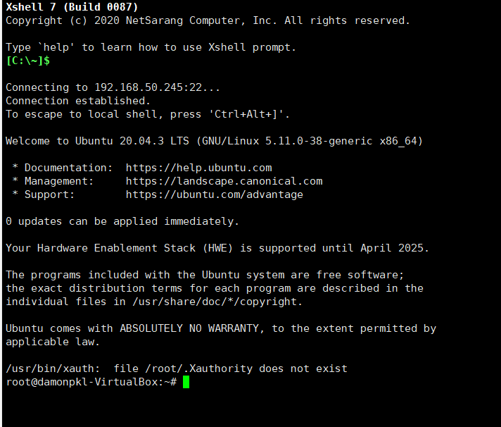

# ubuntu安装hadoop

author:Damon

### 安装前的 网络设置



扩展


其他步骤默认即可

----

### 进入ubuntu界面





其他步骤默认安装即可

安装好以后，为了方便管理直接创建一个新的用户，赋予超级管理员的权限。

为了方便学习。笔者直接使用第二种进行伪分布部署。

### Hadoop伪分布式部署

创建一个管理员权限的新用户,本来想直接使用root进行部署，后来想了hadoop是一个集群的概念，就正常的安装部署吧

```shell
damonpkl@damonpkl-VirtualBox:~$ sudo useradd -m hadoop -s /bin/bash
[sudo] password for damonpkl: 
damonpkl@damonpkl-VirtualBox:~$ sudo passwd hadoop
New password: 
Retype new password: 
passwd: password updated successfully
damonpkl@damonpkl-VirtualBox:~$ sudo adduser hadoop sudo
Adding user `hadoop' to group `sudo' ...
Adding user hadoop to group sudo
Done.
```

电脑关机，进入hadoop

更新和安装插件

```shell
hadoop@damonpkl-VirtualBox:~/.ssh$ sudo apt install net-tools
Reading package lists... Done
Building dependency tree       
Reading state information... Done
The following NEW packages will be installed:
#更新apt
hadoop@damonpkl-VirtualBox:~$ sudo apt-get update
[sudo] password for hadoop: 
Hit:1 http://security.ubuntu.com/ubuntu focal-security InRelease             
Hit:2 http://mo.archive.ubuntu.com/ubuntu focal InRelease                    
Hit:3 http://mo.archive.ubuntu.com/ubuntu focal-updates InRelease
Hit:4 http://mo.archive.ubuntu.com/ubuntu focal-backports InRelease
Reading package lists... Done
#安装vim,个人喜欢也可以用自带的nano
hadoop@damonpkl-VirtualBox:~$ sudo apt-get install vim
Reading package lists... Done
Building dependency tree       
Reading state information... Done
vim is already the newest version (2:8.1.2269-1ubuntu5.3).
0 upgraded, 0 newly installed, 0 to remove and 2 not upgraded.
#方便后续集群或者单机部署，可以使用ssh远程登录，代码照着打就好了
hadoop@damonpkl-VirtualBox:~$ sudo apt-get install openssh-server
Reading package lists... Done
Building dependency tree       
Reading state information... Done
openssh-server is already the newest version (1:8.2p1-4ubuntu0.3).
0 upgraded, 0 newly installed, 0 to remove and 2 not upgraded.
hadoop@damonpkl-VirtualBox:~$ ssh localhost
The authenticity of host 'localhost (127.0.0.1)' can't be established.
hadoop@damonpkl-VirtualBox:~$ exit
logout
Connection to localhost closed.
hadoop@damonpkl-VirtualBox:~$ cd ~/.ssh/
hadoop@damonpkl-VirtualBox:~/.ssh$ ssh-keygen -t rsa #遇到没有提示就回车
Generating public/private rsa key pair.
Enter file in which to save the key (/home/hadoop/.ssh/id_rsa): 
Enter passphrase (empty for no passphrase): 
Enter same passphrase again: 
Your identification has been saved in /home/hadoop/.ssh/id_rsa
Your public key has been saved in /home/hadoop/.ssh/id_rsa.pub
The key fingerprint is:
SHA256:g232LFli8y9m/p7KrvBvNYh1MgkgWc3xodfvuhDMsnc hadoop@damonpkl-VirtualBox
The key's randomart image is:
+---[RSA 3072]----+
|    .oo+...      |
|    ..  +o o     |
|        ..o..    |
|       o += ..   |
|      . So==  .  |
|       +.%..o.   |
|      . + *.E..  |
|       o +=+ o   |
|        oO*=B.   |
+----[SHA256]-----+
hadoop@damonpkl-VirtualBox:~/.ssh$ cat ./id_rsa.pub >> ./authorized_keys
hadoop@damonpkl-VirtualBox:~/.ssh$ ssh localhost
Welcome to Ubuntu 20.04.3 LTS (GNU/Linux 5.11.0-38-generic x86_64)

 * Documentation:  https://help.ubuntu.com
 * Management:     https://landscape.canonical.com
 * Support:        https://ubuntu.com/advantage

0 updates can be applied immediately.

Your Hardware Enablement Stack (HWE) is supported until April 2025.
Last login: Thu Oct 28 07:09:46 2021 from 127.0.0.1
hadoop@damonpkl-VirtualBox:~$ ifconfig
enp0s3: flags=4163<UP,BROADCAST,RUNNING,MULTICAST>  mtu 1500
        inet 192.168.50.245  netmask 255.255.255.0  broadcast 192.168.50.255
        inet6 fe80::5e13:7d6e:ea7c:2a55  prefixlen 64  scopeid 0x20<link>
        ether 08:00:27:ee:29:e7  txqueuelen 1000  (Ethernet)
        RX packets 106  bytes 31028 (31.0 KB)
        RX errors 0  dropped 0  overruns 0  frame 0
        TX packets 161  bytes 18019 (18.0 KB)
        TX errors 0  dropped 0 overruns 0  carrier 0  collisions 0

lo: flags=73<UP,LOOPBACK,RUNNING>  mtu 65536
        inet 127.0.0.1  netmask 255.0.0.0
        inet6 ::1  prefixlen 128  scopeid 0x10<host>
        loop  txqueuelen 1000  (Local Loopback)
        RX packets 319  bytes 36920 (36.9 KB)
        RX errors 0  dropped 0  overruns 0  frame 0
        TX packets 319  bytes 36920 (36.9 KB)
        TX errors 0  dropped 0 overruns 0  carrier 0  collisions 0

hadoop@damonpkl-VirtualBox:~$ hadoop@damonpkl-VirtualBox:~$ exit
hadoop@damonpkl-VirtualBox:~$: command not found
hadoop@damonpkl-VirtualBox:~$ logout
Connection to localhost closed.
#每次登录ssh 都需要密码，我们需要配置成SSH无密码登陆比较方便
```

安装java,hadoop3版本需要的jdk版本在1.8以上


在网上下载了1.8版本，可以使用xftp或者filezilla上传到虚拟机，或者直接网上下载到虚拟机

我放的目录在Downloads里

192.168.50.40 




### 安装和解压jdk

我们选择将jdk安装到/usr/lib

扩展：

如果是用户和管理员必备的二进制文件，就会放在/bin；
如果是系统管理员必备，但是一般用户根本不会用到的二进制文件，就会放在 /sbin。
如果不是用户必备的二进制文件，多半会放在/usr/bin；
如果不是系统管理员必备的工具，如网络管理命令，多半会放在/usr/sbin。

/lib是内核级的,/usr/lib是系统级的,/usr/local/lib是用户级的.

```shell
hadoop@damonpkl-VirtualBox:~$ cd /usr/lib
hadoop@damonpkl-VirtualBox:/usr/lib$ sudo mkdir jvm
hadoop@damonpkl-VirtualBox:/usr/lib$ cd ~
hadoop@damonpkl-VirtualBox:~$ cd Downloads
hadoop@damonpkl-VirtualBox:~/Downloads$sudo tar -zxvf ./jdk-8u162-linux-x64.tar.gz -C /usr/lib/jvm  #jdk的名字看你当前下载的版本
...
...
jdk1.8.0_162/jre/lib/amd64/libprism_common.so
jdk1.8.0_162/jre/lib/amd64/libnio.so
jdk1.8.0_162/jre/lib/amd64/libprism_es2.so
jdk1.8.0_162/jre/lib/amd64/libinstrument.so
jdk1.8.0_162/jre/lib/amd64/libkcms.so
jdk1.8.0_162/jre/lib/amd64/libawt_xawt.so
jdk1.8.0_162/jre/lib/amd64/libmanagement.so
jdk1.8.0_162/jre/lib/amd64/libunpack.so
jdk1.8.0_162/jre/lib/amd64/libgstreamer-lite.so
jdk1.8.0_162/jre/lib/amd64/libawt_headless.so
jdk1.8.0_162/jre/lib/amd64/libsplashscreen.so
jdk1.8.0_162/jre/lib/fontconfig.properties.src
jdk1.8.0_162/jre/lib/psfont.properties.ja
jdk1.8.0_162/jre/lib/fontconfig.Turbo.properties.src
jdk1.8.0_162/jre/lib/jce.jar
...
...
hadoop@damonpkl-VirtualBox:~/Downloads$ cd /usr/lib/jvm
hadoop@damonpkl-VirtualBox:/usr/lib/jvm$ ls
jdk1.8.0_162

#设置环境变量
hadoop@damonpkl-VirtualBox:/usr/lib/jvm$ cd ~
hadoop@damonpkl-VirtualBox:~$ vim ~/.bashrc#复制export那几句话

# ~/.bashrc: executed by bash(1) for non-login shells.
# see /usr/share/doc/bash/examples/startup-files (in the package bash-doc)
# for examples
export JAVA_HOME=/usr/lib/jvm/jdk1.8.0_162
export JRE_HOME=${JAVA_HOME}/jre
export CLASSPATH=.:${JAVA_HOME}/lib:${JRE_HOME}/lib
export PATH=${JAVA_HOME}/bin:$PATH
# If not running interactively, don't do anything

hadoop@damonpkl-VirtualBox:~$ source ~/.bashrc
hadoop@damonpkl-VirtualBox:~$ java -version
java version "1.8.0_162"
Java(TM) SE Runtime Environment (build 1.8.0_162-b12)
Java HotSpot(TM) 64-Bit Server VM (build 25.162-b12, mixed mode)
##如果出现上面的信息，表示你已经成功安装
```


### 安装hadoop

我们选择将 Hadoop 安装至 /usr/local/ 中：

```shell
#前提将安装包放到Downloads目录中
hadoop@damonpkl-VirtualBox:/usr/lib$ cd ~
hadoop@damonpkl-VirtualBox:~$ cd Downloads
hadoop@damonpkl-VirtualBox:~/Downloads$ ls
hadoop-3.1.3.tar.gz  jdk-8u162-linux-x64.tar.gz
hadoop@damonpkl-VirtualBox:~$ sudo tar -zxf ~/Downloads/hadoop-3.1.3.tar.gz -C /usr/local
[sudo] password for hadoop: 

hadoop@damonpkl-VirtualBox:~/Downloads$ cd /usr/local/
hadoop@damonpkl-VirtualBox:/usr/local$ ls
bin  etc  games  hadoop-3.1.3  include  lib  man  sbin  share  sr
#改个名
hadoop@damonpkl-VirtualBox:/usr/local$ sudo mv ./hadoop-3.1.3/ ./hadoop   
hadoop@damonpkl-VirtualBox:/usr/local$ ls
bin  etc  games  hadoop  include  lib  man  sbin  share  src
#改权限
hadoop@damonpkl-VirtualBox:/usr/local$ sudo chown -R hadoop ./hadoop 
#查看hadoop版本
hadoop@damonpkl-VirtualBox:/usr/local$ cd /usr/local/hadoop
hadoop@damonpkl-VirtualBox:/usr/local/hadoop$ ./bin/hadoop version
Hadoop 3.1.3
Source code repository https://gitbox.apache.org/repos/asf/hadoop.git -r ba631c436b806728f8ec2f54ab1e289526c90579
Compiled by ztang on 2019-09-12T02:47Z
Compiled with protoc 2.5.0
From source with checksum ec785077c385118ac91aadde5ec9799
This command was run using /usr/local/hadoop/share/hadoop/common/hadoop-common-3.1.3.jar
```

### Hadoop的单机配置（直接测试即可，不用其他配置即可运行）

单机配置就是单一的java进程

```shell
hadoop@damonpkl-VirtualBox:/usr/local/hadoop$ cd /usr/local/hadoop
hadoop@damonpkl-VirtualBox:/usr/local/hadoop$ mkdir ./input
hadoop@damonpkl-VirtualBox:/usr/local/hadoop$ cp ./etc/hadoop/*.xml ./input
hadoop@damonpkl-VirtualBox:/usr/local/hadoop$ ./bin/hadoop jar ./share/hadoop/mapreduce/hadoop-mapreduce-examples-3.1.3.jar grep ./input ./output 'dfs[a-z.]+'
2021-10-28 07:55:22,040 INFO impl.MetricsConfig: loaded properties from hadoop-metrics2.properties
2021-10-28 07:55:22,163 INFO impl.MetricsSystemImpl: Scheduled Metric snapshot period at 10 second(s).
2021-10-28 07:55:22,164 INFO impl.MetricsSystemImpl: JobTracker metrics system started
2021-10-28 07:55:22,627 INFO input.FileInputFormat: Total input files to process : 9
2021-10-28 07:55:22,674 INFO mapreduce.JobSubmitter: number of splits:9
.....
.....
.....
File System Counters
		FILE: Number of bytes read=1336178
		FILE: Number of bytes written=3281470
		FILE: Number of read operations=0
		FILE: Number of large read operations=0
		FILE: Number of write operations=0
	Map-Reduce Framework
		Map input records=1
		Map output records=1
		Map output bytes=17
		Map output materialized bytes=25
		Input split bytes=121
		Combine input records=0
		Combine output records=0
		Reduce input groups=1
		Reduce shuffle bytes=25
		Reduce input records=1
		Reduce output records=1
		Spilled Records=2
		Shuffled Maps =1
		Failed Shuffles=0
		Merged Map outputs=1
		GC time elapsed (ms)=23
		Total committed heap usage (bytes)=290217984
	Shuffle Errors
		BAD_ID=0
		CONNECTION=0
		IO_ERROR=0
		WRONG_LENGTH=0
		WRONG_MAP=0
		WRONG_REDUCE=0
	File Input Format Counters 
		Bytes Read=123
	File Output Format Counters 
		Bytes Written=23

##查看结果
hadoop@damonpkl-VirtualBox:/usr/local/hadoop$ cat ./output/*
1	dfsadmin
用完就把这个文件夹删了，避免下次使用的时候出现错误
hadoop@damonpkl-VirtualBox:/usr/local/hadoop$ rm -r ./output

```


### Hadoop伪分布配置


```shell
hadoop@damonpkl-VirtualBox:/usr/local/hadoop$ cd /usr/local/hadoop/etc/hadoop/ 
hadoop@damonpkl-VirtualBox:/usr/local/hadoop/etc/hadoop$ ls
capacity-scheduler.xml  hadoop-metrics2.properties        httpfs-signature.secret  log4j.properties            ssl-client.xml.example         yarnservice-log4j.properties
configuration.xsl       hadoop-policy.xml                 httpfs-site.xml          mapred-env.cmd              ssl-server.xml.example         yarn-site.xml
container-executor.cfg  hadoop-user-functions.sh.example  kms-acls.xml             mapred-env.sh               user_ec_policies.xml.template
core-site.xml           hdfs-site.xml                     kms-env.sh               mapred-queues.xml.template  workers
hadoop-env.cmd          httpfs-env.sh                     kms-log4j.properties     mapred-site.xml             yarn-env.cmd
hadoop-env.sh           httpfs-log4j.properties           kms-site.xml             shellprofile.d              yarn-env.sh
hadoop@damonpkl-VirtualBox:/usr/local/hadoop/etc/hadoop$ vim core-site.xml 
##
<configuration>
    <property>
        <name>hadoop.tmp.dir</name>      ##临时目录
        <value>file:/usr/local/hadoop/tmp</value>
        <description>Abase for other temporary directories.</description>
    </property>
    <property>
        <name>fs.defaultFS</name>       ##访问路径
        <value>hdfs://localhost:9000</value>
    </property>
</configuration>
##将上面复制到文件中
hadoop@damonpkl-VirtualBox:/usr/local/hadoop/etc/hadoop$ vim hdfs-site.xml 
##
<configuration>
    <property>
        <name>dfs.replication</name>
        <value>1</value>   #副本
    </property>
    <property>
        <name>dfs.namenode.name.dir</name>   ##名称节点
        <value>file:/usr/local/hadoop/tmp/dfs/name</value>  ##名称节点保存目录
    </property>
    <property>
        <name>dfs.datanode.data.dir</name>   #数字节点
        <value>file:/usr/local/hadoop/tmp/dfs/data</value>   ##数字节点保存目录
    </property>
</configuration>
##将上面复制到文件中
hadoop@damonpkl-VirtualBox:/usr/local/hadoop/etc/hadoop$ cd /usr/local/hadoop
#格式化
hadoop@damonpkl-VirtualBox:/usr/local/hadoop$ ./bin/hdfs namenode -format

hadoop@damonpkl-VirtualBox:/usr/local/hadoop$ cd /usr/local/hadoop
hadoop@damonpkl-VirtualBox:/usr/local/hadoop$ ./sbin/start-dfs.sh
Starting namenodes on [localhost]
Starting datanodes
Starting secondary namenodes [damonpkl-VirtualBox]
damonpkl-VirtualBox: Warning: Permanently added 'damonpkl-virtualbox' (ECDSA) to the list of known hosts.
hadoop@damonpkl-VirtualBox:/usr/local/hadoop$ jps
2196 NameNode
2518 SecondaryNameNode
2327 DataNode
2648 Jps

#关掉文件
./sbin/stop-dfs.sh
```

#### 配置文件说明

Hadoop 的运行方式是由配置文件决定的（运行 Hadoop 时会读取配置文件），因此如果需要从伪分布式模式切换回非分布式模式，需要删除 core-site.xml 中的配置项。

此外，伪分布式虽然只需要配置 fs.defaultFS 和 dfs.replication 就可以运行（官方教程如此），不过若没有配置 hadoop.tmp.dir 参数，则默认使用的临时目录为 /tmp/hadoo-hadoop，而这个目录在重启时有可能被系统清理掉，导致必须重新执行 format 才行。所以我们进行了设置，同时也指定 dfs.namenode.name.dir 和 dfs.datanode.data.dir，否则在接下来的步骤中可能会出错。





# 忽略


**外网方便，不用更改网络根目录**

升级apt

```shell
root@damonpkl-VirtualBox:/home/damonpkl# apt-get update
Hit:1 http://mo.archive.ubuntu.com/ubuntu focal InRelease                      
Hit:2 http://security.ubuntu.com/ubuntu focal-security InRelease               
Hit:3 http://mo.archive.ubuntu.com/ubuntu focal-updates InRelease
Hit:4 http://mo.archive.ubuntu.com/ubuntu focal-backports InRelease
Reading package lists... Done
root@damonpkl-VirtualBox:/home/damonpkl# apt-get upgrade
Reading package lists... Done
Building dependency tree       
Reading state information... Done
Calculating upgrade... Done
0 upgraded, 0 newly installed, 0 to remove and 0 not upgraded.

```

安装net-tools

```shell
root@damonpkl-VirtualBox:/home/damonpkl# apt-get upgrade
Reading package lists... Done
Building dependency tree       
Reading state information... Done
Calculating upgrade... Done
0 upgraded, 0 newly installed, 0 to remove and 0 not upgraded.
root@damonpkl-VirtualBox:/home/damonpkl# apt install net-tools
Reading package lists... Done
Building dependency tree       
Reading state information... Done

```

安装ssh服务

```shell
root@damonpkl-VirtualBox:/home/damonpkl# apt-get install openssh-server
Reading package lists... Done
Building dependency tree       
Reading state information... Done
The following additional packages will be installed:
  ncurses-term openssh-sftp-server ssh-import-id
Suggested packages:
  molly-guard monkeysphere ssh-askpass
The following NEW packages will be installed:
  ncurses-term openssh-server openssh-sftp-server ssh-import-id
0 upgraded, 4 newly installed, 0 to remove and 2 not upgraded.

#启动ssh服务
root@damonpkl-VirtualBox:/home/damonpkl# service sshd start
root@damonpkl-VirtualBox:/home/damonpkl# service sshd restart
root@damonpkl-VirtualBox:/home/damonpkl# sudo ps -ef |grep ssh
damonpkl    1482    1384  0 06:12 ?        00:00:00 /usr/bin/ssh-agent /usr/bin/im-launch env GNOME_SHELL_SESSION_MODE=ubuntu /usr/bin/gnome-session --systemd --session=ubuntu
root       16489       1  0 06:17 ?        00:00:00 sshd: /usr/sbin/sshd -D [listener] 0 of 10-100 startups
root       16493    1969  0 06:19 pts/0    00:00:00 grep --color=auto ssh
root@damonpkl-VirtualBox:/home/damonpkl# sudo gedit /etc/ssh/sshd_config
#修改：将Authentication那一部分改为：

# Authentication:
LoginGraceTime 120
#PermitRootLogin without-password
PermitRootLogin yes
StrictModes yes

root@damonpkl-VirtualBox:/home/damonpkl# service sshd restart
root@damonpkl-VirtualBox:/home/damonpkl# ifconfig
enp0s3: flags=4163<UP,BROADCAST,RUNNING,MULTICAST>  mtu 1500
        inet 192.168.50.245  netmask 255.255.255.0  broadcast 192.168.50.255
        inet6 fe80::5e13:7d6e:ea7c:2a55  prefixlen 64  scopeid 0x20<link>
        ether 08:00:27:ee:29:e7  txqueuelen 1000  (Ethernet)
        RX packets 748  bytes 949162 (949.1 KB)
        RX errors 0  dropped 0  overruns 0  frame 0
        TX packets 509  bytes 41505 (41.5 KB)
        TX errors 0  dropped 0 overruns 0  carrier 0  collisions 0

lo: flags=73<UP,LOOPBACK,RUNNING>  mtu 65536
        inet 127.0.0.1  netmask 255.0.0.0
        inet6 ::1  prefixlen 128  scopeid 0x10<host>
        loop  txqueuelen 1000  (Local Loopback)
        RX packets 189  bytes 16125 (16.1 KB)
        RX errors 0  dropped 0  overruns 0  frame 0
        TX packets 189  bytes 16125 (16.1 KB)
        TX errors 0  dropped 0 overruns 0  carrier 0  collisions 0

```

使用xshell登录root用户，当然也可以选择直接正常登录




做一些准备工作：

```shell
root@damonpkl-VirtualBox:~# apt-get update
Get:1 http://security.ubuntu.com/ubuntu focal-security InRelease [114 kB]
Hit:2 http://mo.archive.ubuntu.com/ubuntu focal InRelease
Get:3 http://mo.archive.ubuntu.com/ubuntu focal-updates InRelease [114 kB]
Get:4 http://mo.archive.ubuntu.com/ubuntu focal-backports InRelease [101 kB]
root@damonpkl-VirtualBox:~# apt-get install vim #个人喜好用vim，当然也可以使用自带的nano
Reading package lists... Done
Building dependency tree       
Reading state information... Done
The following additional packages will be installed:
  vim-runtime
Suggested packages:
  ctags vim-doc vim-scripts

```


修改root的密码:

```shell
damonpkl@damonpkl-VirtualBox:~$ sudo passwd root
[sudo] password for damonpkl: 
New password: 
Retype new password: 
passwd: password updated successfully
```

进入root账户：

```shell
damonpkl@damonpkl-VirtualBox:~$ su root
Password: 
root@damonpkl-VirtualBox:/home/damonpkl# 
```

