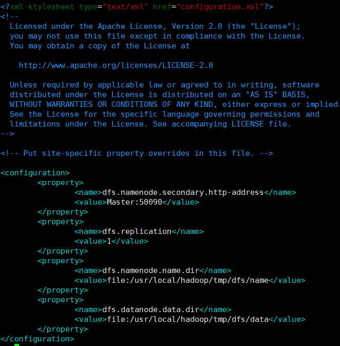

# ubuntu上安装部署hadoop分布式集群

author:Damon

前言，先看上一个文档把伪分布式尝试搭建好。

因为笔者的是笔记本电脑，打算部署一个hadoop集群包含一个主节点和一个从节点，看电脑运行的情况看看能否加多一个从节点。（三台机的话好像不能两个主节点一个从节点，为了满足一致性原则）。

简单介绍一下部署集群的步骤：

Hadoop 集群的安装配置大致包括以下步骤：
（1）步骤1：选定一台机器作为 Master；
（2）步骤2：在Master节点上创建hadoop用户、安装SSH服务端、安装Java环境；
（3）步骤3：在Master节点上安装Hadoop，并完成配置；
（4）步骤4：在其他Slave节点上创建hadoop用户、安装SSH服务端、安装Java环境；
（5）步骤5：将Master节点上的“/usr/local/hadoop”目录复制到其他Slave节点上；
（6）步骤6：在Master节点上开启Hadoop；

其中（2）（3）（4），笔者在前一篇文章已经阐述了如何去操作。

### 网络配置

为了能让各个节点能够连接，我们选用的是桥接网络。


#### 具体设置如下：


#### 查看是否设置成功

第一台电脑ip


第二台电脑ip


可以看到他们都是同一网段的的，可以互相通信。

为了能清晰的识别哪一台机是主节点，哪一台机是从节点。我们可以将主节点命名为Master,从节点命名为Slave1

```shell
#修改主机名和虚拟机的映射关系
##Master机：
hadoop@damon-VirtualBox:~$ sudo vim /etc/hostname
[sudo] password for hadoop: 
##关机开机
hadoop@Master:~$ sudo vim /etc/hosts
##Slave1机
hadoop@damon-VirtualBox:~$ sudo vim /etc/hostname
[sudo] password for hadoop: 
##关机开机
hadoop@Slave1:~$ sudo vim /etc/hosts
[sudo] password for hadoop: 
##
hadoop@Slave1:~$ cat vim /etc/hosts
cat: vim: No such file or directory
127.0.0.1	localhost
127.0.1.1	damon-VirtualBox

192.168.50.40   Master
192.168.50.212  Slave1


```


测试两台虚拟机是否能够ping通，这个有点像docker里面测试不同容器之间是否能够ping通。

```shell
hadoop@Slave1:~$ ping Master  ##可以在后面写-c 3  就不用手动停止
PING Master (192.168.50.40) 56(84) bytes of data.
64 bytes from Master (192.168.50.40): icmp_seq=1 ttl=64 time=0.327 ms
64 bytes from Master (192.168.50.40): icmp_seq=2 ttl=64 time=0.667 ms
64 bytes from Master (192.168.50.40): icmp_seq=3 ttl=64 time=0.206 ms

hadoop@Master:~$ ping Slave1
PING Slave1 (192.168.50.212) 56(84) bytes of data.
64 bytes from Slave1 (192.168.50.212): icmp_seq=1 ttl=64 time=0.116 ms
64 bytes from Slave1 (192.168.50.212): icmp_seq=2 ttl=64 time=0.395 ms
64 bytes from Slave1 (192.168.50.212): icmp_seq=3 ttl=64 time=0.241 ms
```


因为对主机名进行了修改，所以得重新配置SSH文件，让Master可以无密码的登录各个节点。

具体步骤就是重新生成密钥即可。

### SSH无密码登陆节点

Master重新配置SSH

```shell
hadoop@Master:~$ cd ~/.ssh
hadoop@Master:~/.ssh$ ls
authorized_keys  id_rsa  id_rsa.pub  known_hosts
hadoop@Master:~/.ssh$ rm ./id_rsa*
hadoop@Master:~/.ssh$ ls
authorized_keys  known_hosts
hadoop@Master:~/.ssh$ ssh-keygen -t rsa  
Generating public/private rsa key pair.
Enter file in which to save the key (/home/hadoop/.ssh/id_rsa): 
Enter passphrase (empty for no passphrase): 
Enter same passphrase again: 
Your identification has been saved in /home/hadoop/.ssh/id_rsa
Your public key has been saved in /home/hadoop/.ssh/id_rsa.pub
The key fingerprint is:
SHA256:pG7QpazCoKJU2OrZBylNemiiR6q6SBXaN0Ad2JG4fl4 hadoop@Master
The key's randomart image is:
+---[RSA 3072]----+
|   .=o+          |
|  .o +           |
|   o.   o        |
|  =ooo =         |
|.o*=oo= S        |
|oB=*.=.E         |
|**= = +          |
|X +. +           |
|O= ..            |
+----[SHA256]-----+
hadoop@Master:~/.ssh$ cat ./id_rsa.pub >> ./authorized_keys
```

测试Master机的ssh是否配置成功

```shell
hadoop@Master:~/.ssh$ ssh Master
The authenticity of host 'master (192.168.50.40)' can't be established.
ECDSA key fingerprint is SHA256:FbSVBWzLjtbYtVo1nZ8K9dDv0ADs6r2XfiY160ja6Kg.
Are you sure you want to continue connecting (yes/no/[fingerprint])? yes
Warning: Permanently added 'master,192.168.50.40' (ECDSA) to the list of known hosts.
Welcome to Ubuntu 20.04.3 LTS (GNU/Linux 5.11.0-38-generic x86_64)

 * Documentation:  https://help.ubuntu.com
 * Management:     https://landscape.canonical.com
 * Support:        https://ubuntu.com/advantage

97 updates can be applied immediately.
41 of these updates are standard security updates.
To see these additional updates run: apt list --upgradable

Your Hardware Enablement Stack (HWE) is supported until April 2025.
Last login: Fri Oct 29 05:59:41 2021 from 192.168.50.159
hadoop@Master:~$ exit
logout
Connection to master closed.
```

将在Master节点的公钥传输到Slave1节点中：

```shell
hadoop@Master:~$ scp ~/.ssh/id_rsa.pub hadoop@Slave1:/home/hadoop/
The authenticity of host 'slave1 (192.168.50.212)' can't be established.
ECDSA key fingerprint is SHA256:FbSVBWzLjtbYtVo1nZ8K9dDv0ADs6r2XfiY160ja6Kg.
Are you sure you want to continue connecting (yes/no/[fingerprint])? yes
Warning: Permanently added 'slave1,192.168.50.212' (ECDSA) to the list of known hosts.
hadoop@slave1's password: 
id_rsa.pub                                        100%  567    60.8KB/s   00:00  
```

扩展： scp 是 linux 系统下基于 ssh 登陆进行安全的远程文件拷贝命令。

接着在Slave1节点上，将SSH公匙加入授权：

```shell
hadoop@Slave1:~$ cat ~/id_rsa.pub >> ~/.ssh/authorized_keys
##删除命令
rm ~/id_rsa.pub 
```

测试通过Master用户登录Slave1

```shell
hadoop@Master:~$ ssh Slave1
Welcome to Ubuntu 20.04.3 LTS (GNU/Linux 5.11.0-38-generic x86_64)

 * Documentation:  https://help.ubuntu.com
 * Management:     https://landscape.canonical.com
 * Support:        https://ubuntu.com/advantage

97 updates can be applied immediately.
41 of these updates are standard security updates.
To see these additional updates run: apt list --upgradable

Your Hardware Enablement Stack (HWE) is supported until April 2025.
Last login: Fri Oct 29 06:00:32 2021 from 192.168.50.159
hadoop@Slave1:~$ exit
logout
Connection to slave1 closed.
```

### 配置PATH变量

为什么要配置PATH变量呢

为了可以在任意目录使用hadoop、hdfs等命令，在Master节点配置，具体步骤如下

```shell
hadoop@Master:~$ vim ~/.bashrc
##增加下列这一行
export PATH=$PATH:/usr/local/hadoop/bin:/usr/local/hadoop/sbin

hadoop@Master:/usr/local/hadoop$ source ~/.bashrc
```


### 配置集群/分布式环境

在配置集群/分布式模式时，需要修改“/usr/local/hadoop/etc/hadoop”目录下的配置文件，这里仅设置正常启动所必须的设置项，包括workers 、core-site.xml、hdfs-site.xml、mapred-site.xml、yarn-site.xml共5个文件。

扩展：伪分布式的意义就是将一台机器同时作为名称节点和数据节点。本文部署的分布式环境是将一台机器作为名称节点，另外一台作为数据节点。

具体步骤如下：

#### 1.修改workers 

```shell
hadoop@Master:~$ cd /usr/local/hadoop/etc/hadoop
hadoop@Master:/usr/local/hadoop/etc/hadoop$ ls
capacity-scheduler.xml            kms-log4j.properties
configuration.xsl                 kms-site.xml
container-executor.cfg            log4j.properties
core-site.xml                     mapred-env.cmd
hadoop-env.cmd                    mapred-env.sh
hadoop-env.sh                     mapred-queues.xml.template
hadoop-metrics2.properties        mapred-site.xml
hadoop-policy.xml                 shellprofile.d
hadoop-user-functions.sh.example  ssl-client.xml.example
hdfs-site.xml                     ssl-server.xml.example
httpfs-env.sh                     user_ec_policies.xml.template
httpfs-log4j.properties           workers
httpfs-signature.secret           yarn-env.cmd
httpfs-site.xml                   yarn-env.sh
kms-acls.xml                      yarnservice-log4j.properties
kms-env.sh                        yarn-site.xml
hadoop@Master:/usr/local/hadoop/etc/hadoop$ sudo vim workers 
[sudo] password for hadoop: 

```


#### 2.修改文件core-site.xml

具体步骤如下：#这里可以设置网页登录的端口

```shell
hadoop@Master:/usr/local/hadoop/etc/hadoop$ sudo vim core-site.xml 
hadoop@Master:/usr/local/hadoop/etc/hadoop$ cat core-site.xml
<?xml version="1.0" encoding="UTF-8"?>
<?xml-stylesheet type="text/xsl" href="configuration.xsl"?>
<!--
  Licensed under the Apache License, Version 2.0 (the "License");
  you may not use this file except in compliance with the License.
  You may obtain a copy of the License at

    http://www.apache.org/licenses/LICENSE-2.0

  Unless required by applicable law or agreed to in writing, software
  distributed under the License is distributed on an "AS IS" BASIS,
  WITHOUT WARRANTIES OR CONDITIONS OF ANY KIND, either express or implied.
  See the License for the specific language governing permissions and
  limitations under the License. See accompanying LICENSE file.
-->

<!-- Put site-specific property overrides in this file. -->

<configuration>
        <property>
                <name>fs.defaultFS</name>
                <value>hdfs://Master:9000</value>
        </property>
        <property>
                <name>hadoop.tmp.dir</name>
                <value>file:/usr/local/hadoop/tmp</value>
                <description>Abase for other temporary directories.</description>
        </property>
</configuration>

```

#### 3.修改文件hdfs-site.xml

具体步骤如下

因为只有一个数据节点，使用冗余备份也只能是1

```shell
hadoop@Master:/usr/local/hadoop/etc/hadoop$ sudo vim hdfs-site.xml 
hadoop@Master:/usr/local/hadoop/etc/hadoop$ cat hdfs-site.xml 
<?xml version="1.0" encoding="UTF-8"?>
<?xml-stylesheet type="text/xsl" href="configuration.xsl"?>
<!--
  Licensed under the Apache License, Version 2.0 (the "License");
  you may not use this file except in compliance with the License.
  You may obtain a copy of the License at

    http://www.apache.org/licenses/LICENSE-2.0

  Unless required by applicable law or agreed to in writing, software
  distributed under the License is distributed on an "AS IS" BASIS,
  WITHOUT WARRANTIES OR CONDITIONS OF ANY KIND, either express or implied.
  See the License for the specific language governing permissions and
  limitations under the License. See accompanying LICENSE file.
-->

<!-- Put site-specific property overrides in this file. -->

<configuration>
        <property>
                <name>dfs.namenode.secondary.http-address</name>
                <value>Master:50090</value>
        </property>
        <property>
                <name>dfs.replication</name>
                <value>1</value>
        </property>
        <property>
                <name>dfs.namenode.name.dir</name>
                <value>file:/usr/local/hadoop/tmp/dfs/name</value>
        </property>
        <property>
                <name>dfs.datanode.data.dir</name>
                <value>file:/usr/local/hadoop/tmp/dfs/data</value>
        </property>
</configuration>

```




#### 4.修改mapred-site.xml

具体步骤如下，将分布式集群的功能端口弄出来

```shell
hadoop@Master:/usr/local/hadoop/etc/hadoop$ cd /usr/local/hadoop/etc/hadoop
hadoop@Master:/usr/local/hadoop/etc/hadoop$ sudo vim mapred-site.xml 
hadoop@Master:/usr/local/hadoop/etc/hadoop$ cat mapred-site.xml 
<?xml version="1.0"?>
<?xml-stylesheet type="text/xsl" href="configuration.xsl"?>
<!--
  Licensed under the Apache License, Version 2.0 (the "License");
  you may not use this file except in compliance with the License.
  You may obtain a copy of the License at

    http://www.apache.org/licenses/LICENSE-2.0

  Unless required by applicable law or agreed to in writing, software
  distributed under the License is distributed on an "AS IS" BASIS,
  WITHOUT WARRANTIES OR CONDITIONS OF ANY KIND, either express or implied.
  See the License for the specific language governing permissions and
  limitations under the License. See accompanying LICENSE file.
-->

<!-- Put site-specific property overrides in this file. -->

<configuration>
        <property>
                <name>mapreduce.framework.name</name>
                <value>yarn</value>
        </property>
        <property>
                <name>mapreduce.jobhistory.address</name>
                <value>Master:10020</value>
        </property>
        <property>
                <name>mapreduce.jobhistory.webapp.address</name>
                <value>Master:19888</value>
        </property>
        <property>
                <name>yarn.app.mapreduce.am.env</name>
                <value>HADOOP_MAPRED_HOME=/usr/local/hadoop</value>
        </property>
        <property>
                <name>mapreduce.map.env</name>
                <value>HADOOP_MAPRED_HOME=/usr/local/hadoop</value>
        </property>
        <property>
                <name>mapreduce.reduce.env</name>
                <value>HADOOP_MAPRED_HOME=/usr/local/hadoop</value>
        </property> 
</configuration>

```

#### 5.修改文件 yarn-site.xml

具体步骤如下：

```shell
hadoop@Master:/usr/local/hadoop/etc/hadoop$ sudo vim yarn-site.xml 
hadoop@Master:/usr/local/hadoop/etc/hadoop$ cat yarn-site.xml 
<?xml version="1.0"?>
<!--
  Licensed under the Apache License, Version 2.0 (the "License");
  you may not use this file except in compliance with the License.
  You may obtain a copy of the License at

    http://www.apache.org/licenses/LICENSE-2.0

  Unless required by applicable law or agreed to in writing, software
  distributed under the License is distributed on an "AS IS" BASIS,
  WITHOUT WARRANTIES OR CONDITIONS OF ANY KIND, either express or implied.
  See the License for the specific language governing permissions and
  limitations under the License. See accompanying LICENSE file.
-->
<configuration>
        <property>
                <name>yarn.resourcemanager.hostname</name>
                <value>Master</value>
        </property>
        <property>
                <name>yarn.nodemanager.aux-services</name>
                <value>mapreduce_shuffle</value>
        </property>
</configuration>

```

将以上的步骤配置完后，需要把Master节点上的“/usr/local/hadoop”文件夹复制到各个节点上。如果之前已经运行过伪分布实例，建议在切换到集群模式之前首先删除在伪分布实例模式下生成的临时文件。具体步骤如下：

Master机：

具体步骤如下

```shell
hadoop@Master:/usr/local/hadoop/etc/hadoop$ cd /usr/local
##删除hadoop临时文件
hadoop@Master:/usr/local$ sudo rm -r ./hadoop/tmp
##删除日志文件
hadoop@Master:/usr/local$ sudo rm -r ./hadoop/logs/*
#先压缩在复制
hadoop@Master:/usr/local$ tar -zcf ~/hadoop.master.tar.gz ./hadoop
hadoop@Master:/usr/local$ cd ~
hadoop@Master:~$ scp ./hadoop.master.tar.gz Slave1:/home/hadoop
hadoop.master.tar.gz                              100%  326MB 101.9MB/s  
```

Slave1机：

具体步骤如下：

```shell
#删除旧的文档
hadoop@Slave1:~$ sudo rm -r /usr/local/hadoop 
[sudo] password for hadoop: 
##解压
hadoop@Slave1:~$ sudo tar -zxf ~/hadoop.master.tar.gz -C /usr/local
#修改权限
hadoop@Slave1:~$ sudo chown -R hadoop /usr/local/hadoop

```

启动hadoop集群：

Master机：

```shell
hadoop@Master:~$ cd /usr/local/hadoop
#第一次启动需要格式化，以后都不用了
hadoop@Master:/usr/local/hadoop$ hdfs namenode -format
2021-10-29 07:10:56,807 INFO namenode.NameNode: STARTUP_MSG: 
/************************************************************
STARTUP_MSG: Starting NameNode
STARTUP_MSG:   host = Master/192.168.50.40
STARTUP_MSG:   args = [-format]
...
...
hadoop@Master:/usr/local/hadoop$ start-dfs.sh
Starting namenodes on [Master]
Starting datanodes
Starting secondary namenodes [Master]
hadoop@Master:/usr/local/hadoop$ start-yarn.sh
Starting resourcemanager
Starting nodemanagers
hadoop@Master:/usr/local/hadoop$ mr-jobhistory-daemon.sh start historyserver
WARNING: Use of this script to start the MR JobHistory daemon is deprecated.
WARNING: Attempting to execute replacement "mapred --daemon start" instead.
hadoop@Master:/usr/local/hadoop$ jps
2596 NameNode
3351 Jps
2811 SecondaryNameNode
3292 JobHistoryServer
2975 ResourceManager

```

Master启动后可以通过jps来查看Slave1的hadoop进程

```
hadoop@Slave1:~$ jps
25586 Jps
25493 NodeManager
25351 DataNode

```

查看集群是否正常启动：

```
hadoop@Master:/usr/local/hadoop$ hdfs dfsadmin -report
Configured Capacity: 33154711552 (30.88 GB)
Present Capacity: 20556677120 (19.14 GB)
DFS Remaining: 20556652544 (19.14 GB)
DFS Used: 24576 (24 KB)
DFS Used%: 0.00%
Replicated Blocks:
	Under replicated blocks: 0
	Blocks with corrupt replicas: 0
	Missing blocks: 0
	Missing blocks (with replication factor 1): 0
	Low redundancy blocks with highest priority to recover: 0
	Pending deletion blocks: 0
Erasure Coded Block Groups: 
	Low redundancy block groups: 0
	Block groups with corrupt internal blocks: 0
	Missing block groups: 0
	Low redundancy blocks with highest priority to recover: 0
	Pending deletion blocks: 0

-------------------------------------------------
Live datanodes (1):

Name: 192.168.50.212:9866 (Slave1)
Hostname: Slave1
Decommission Status : Normal
Configured Capacity: 33154711552 (30.88 GB)
DFS Used: 24576 (24 KB)
Non DFS Used: 10890272768 (10.14 GB)
DFS Remaining: 20556652544 (19.14 GB)
DFS Used%: 0.00%
DFS Remaining%: 62.00%
Configured Cache Capacity: 0 (0 B)
Cache Used: 0 (0 B)
Cache Remaining: 0 (0 B)
Cache Used%: 100.00%
Cache Remaining%: 0.00%
Xceivers: 1
Last contact: Fri Oct 29 07:17:33 CST 2021
Last Block Report: Fri Oct 29 07:13:37 CST 2021
Num of Blocks: 0

```

也可以在Linux系统的浏览器中输入地址“http://master:9870/”，通过 Web 页面看到查看名称节点和数据节点的状态。如果不成功，可以通过启动日志排查原因。

关闭集群命令：

```shell
stop-yarn.sh
stop-dfs.sh
mr-jobhistory-daemon.sh stop historyserver

##

hadoop@Master:/usr/local/hadoop$ stop-yarn.sh
Stopping nodemanagers
Stopping resourcemanager
hadoop@Master:/usr/local/hadoop$ stop-dfs.sh
Stopping namenodes on [Master]
Stopping datanodes
Stopping secondary namenodes [Master]
hadoop@Master:/usr/local/hadoop$ mr-jobhistory-daemon.sh stop historyserver
WARNING: Use of this script to stop the MR JobHistory daemon is deprecated.
WARNING: Attempting to execute replacement "mapred --daemon stop" instead.

```


#### **这里再次强调，伪分布式模式和分布式模式切换时需要注意以下事项：**

- 从分布式切换到伪分布式时，不要忘记修改slaves配置文件。
- 在两者之间切换时，若遇到无法正常启动的情况，可以删除所涉及节点的临时文件夹，这样虽然之前的数据会被删掉，但能保证集群正确启动。所以，如果集群以前能启动，但后来启动不了，特别是数据节点无法启动，不妨试着删除所有节点（包括Slave节点）上的“/usr/local/hadoop/tmp”文件夹，再重新执行一次“hdfs namenode -format”，再次启动即可。


