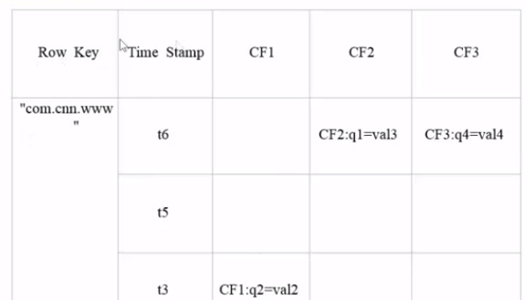

# Hbase学习笔记

### 前言

已经学完HDFS,yarn,MApReduce,,Zookeeper..

然后pig已经淘汰。

#### Hadoop的生态主要是：

yarn资源调度

zookeeper:高可用，维持内存数据库

Hive:数据仓库，可以分析HBase

Flume:数据收集

sqoop:非关系型数据转关系型数据

mahout:数据挖掘

shark:淘汰


### HBASE的介绍：

HBase 是一种分布式、可扩展、支持海量数据存储的 NoSQL 数据库。（列存，非结构化和半结构化的松散数据）

利用Hadoop HDFS作为其文件存储系统，利用Hadoop MapReduce来处理HBase中的海量数据，利用Zookerper作为其分布式协同服务

### Hbase的底层原理：


Hmaster资源管理，HRegionServer包含HRegion包含store,MemStore,StoreFile(HFile)

Client:进行访问Hbase的接口

Zookeeper:保证任何时候，集群只有一个maseter,监控Region server（高可用）存储所有Region的寻址入口

HMaster:保证负载均衡，合理分配任务给RegionServer,发现失效的Region server失效，重新分配Region

Regionserver:维护region,处理IO请求，负责切分运行中变大的region

Region:Hbase会将表水平切分多个区域，每个region保存某段连续的数据

Store:就是列族，memstor还在内存中，flashcache控制溢写，合并是会对版本冗余（超过了最大的版本数）进行删除，storeFile已经写入磁盘中了




**rowkey:**

检索时用的，按字典顺序排序，一个rowkey只能存储64k的字节数据

Clunmn Family(CF):

数据操作就是在列族层面上的

Timestamp时间戳：

控制版本，有HBase自动赋值

cell:

单元格是由行和列交叉决定（rowkey,column,version）

也就是rowkey,CF和时间戳（timestamp）

Hlog:容灾，记录日志


```
#/etc/profile修改
export JAVA_HOME=/opt/module/jdk
export PATH=$JAVA_HOME/bin
export HBASE_HOME=/opt/module/hbase
export PATH=$HBASE_HOME/bin
#启动命令
start-hbase.sh
#停止命令
stop-hbase.sh


#进入客户端命令
hbase shell
#查看帮助命令
help
#查看有哪些表
list
#创建表
create 'student','info'
#插入数据到表
'student','1001','info:sex','male'
#扫描数据
scan 'student'
#查看指定的数据
get 'student','1001','info:name'
#统计表的数据行数
count 'student'
#删除数据
deleteall 'student','1001'
#清空表数据
truncate 'student'
清空表的操作顺序为先 disable，然后再 truncate。
#删除表，首先让表disable,然后才能drop
disable 'student'
drop 'student'


#离开客户端命令
quit
```

