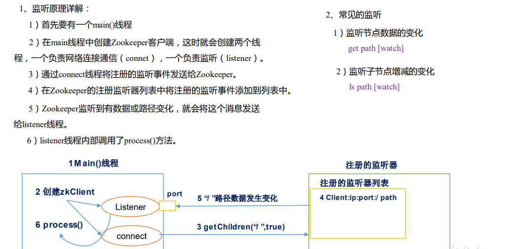

原理：

监听原理：



选举机制：半数机制，所以zookeeper是奇数比较好

安装及测试

```shell
#解压
tar -zxvf *** -C  指定的目录


[damon@damon2 software]$ ls
zookeeper-3.4.6.tar.gz
[damon@damon2 software]$ cd ..
[damon@damon2 opt]$ cd module/
[damon@damon2 module]$ ls
jdk1.8.0_212  zookeeper-3.4.6
[damon@damon2 module]$ cd zookeeper-3.4.6/
[damon@damon2 zookeeper-3.4.6]$ ls
bin        CHANGES.txt  contrib     docs             ivy.xml  LICENSE.txt  README_packaging.txt  recipes  zookeeper-3.4.6.jar      zookeeper-3.4.6.jar.md5
build.xml  conf         dist-maven  ivysettings.xml  lib      NOTICE.txt   README.txt            src      zookeeper-3.4.6.jar.asc  zookeeper-3.4.6.jar.sha1
[damon@damon2 zookeeper-3.4.6]$ cd conf
[damon@damon2 conf]$ ls
configuration.xsl  log4j.properties  zoo_sample.cfg
[damon@damon2 conf]$ mv zoo_sample.cfg zoo.cfg
[damon@damon2 conf]$ ls
configuration.xsl  log4j.properties  zoo.cfg
[damon@damon2 conf]$ vim zoo.cfg 
[damon@damon2 conf]$ cd ..
[damon@damon2 zookeeper-3.4.6]$ mkdir zkData
[damon@damon2 zookeeper-3.4.6]$ bin/zkServer.sh start
JMX enabled by default
Using config: /opt/module/zookeeper-3.4.6/bin/../conf/zoo.cfg
Starting zookeeper ... STARTED
[damon@damon2 zookeeper-3.4.6]$ jps
3891 QuorumPeerMain
3908 Jps
[damon@damon2 zookeeper-3.4.6]$ bin/zkServer.sh status
JMX enabled by default
Using config: /opt/module/zookeeper-3.4.6/bin/../conf/zoo.cfg
Mode: standalone
[damon@damon2 zookeeper-3.4.6]$  bin/zkCli.sh
Connecting to localhost:2181
2021-11-06 03:23:39,198 [myid:] - INFO  [main:Environment@100] - Client environment:zookeeper.version=3.4.6-1569965, built on 02/20/2014 09:09 GMT
2021-11-06 03:23:39,200 [myid:] - INFO  [main:Environment@100] - Client environment:host.name=damon2
2021-11-06 03:23:39,200 [myid:] - INFO  [main:Environment@100] - Client environment:java.version=1.8.0_212
2021-11-06 03:23:39,205 [myid:] - INFO  [main:Environment@100] - Client environment:java.vendor=Oracle Corporation
2021-11-06 03:23:39,205 [myid:] - INFO  [main:Environment@100] - Client environment:java.home=/opt/module/jdk1.8.0_212/jre
2021-11-06 03:23:39,205 [myid:] - INFO  [main:Environment@100] - Client environment:java.class.path=/opt/module/zookeeper-3.4.6/bin/../build/classes:/opt/module/zookeeper-3.4.6/bin/../build/lib/*.jar:/opt/module/zookeeper-3.4.6/bin/../lib/slf4j-log4j12-1.6.1.jar:/opt/module/zookeeper-3.4.6/bin/../lib/slf4j-api-1.6.1.jar:/opt/module/zookeeper-3.4.6/bin/../lib/netty-3.7.0.Final.jar:/opt/module/zookeeper-3.4.6/bin/../lib/log4j-1.2.16.jar:/opt/module/zookeeper-3.4.6/bin/../lib/jline-0.9.94.jar:/opt/module/zookeeper-3.4.6/bin/../zookeeper-3.4.6.jar:/opt/module/zookeeper-3.4.6/bin/../src/java/lib/*.jar:/opt/module/zookeeper-3.4.6/bin/../conf:
2021-11-06 03:23:39,205 [myid:] - INFO  [main:Environment@100] - Client environment:java.library.path=/usr/java/packages/lib/amd64:/usr/lib64:/lib64:/lib:/usr/lib
2021-11-06 03:23:39,205 [myid:] - INFO  [main:Environment@100] - Client environment:java.io.tmpdir=/tmp
2021-11-06 03:23:39,205 [myid:] - INFO  [main:Environment@100] - Client environment:java.compiler=<NA>
2021-11-06 03:23:39,205 [myid:] - INFO  [main:Environment@100] - Client environment:os.name=Linux
2021-11-06 03:23:39,205 [myid:] - INFO  [main:Environment@100] - Client environment:os.arch=amd64
2021-11-06 03:23:39,206 [myid:] - INFO  [main:Environment@100] - Client environment:os.version=3.10.0-862.el7.x86_64
2021-11-06 03:23:39,206 [myid:] - INFO  [main:Environment@100] - Client environment:user.name=damon
2021-11-06 03:23:39,206 [myid:] - INFO  [main:Environment@100] - Client environment:user.home=/home/damon
2021-11-06 03:23:39,206 [myid:] - INFO  [main:Environment@100] - Client environment:user.dir=/opt/module/zookeeper-3.4.6
2021-11-06 03:23:39,206 [myid:] - INFO  [main:ZooKeeper@438] - Initiating client connection, connectString=localhost:2181 sessionTimeout=30000 watcher=org.apache.zookeeper.ZooKeeperMain$MyWatcher@25f38edc
Welcome to ZooKeeper!
2021-11-06 03:23:39,231 [myid:] - INFO  [main-SendThread(localhost:2181):ClientCnxn$SendThread@975] - Opening socket connection to server localhost/127.0.0.1:2181. Will not attempt to authenticate using SASL (unknown error)
JLine support is enabled
2021-11-06 03:23:39,293 [myid:] - INFO  [main-SendThread(localhost:2181):ClientCnxn$SendThread@852] - Socket connection established to localhost/127.0.0.1:2181, initiating session
2021-11-06 03:23:39,316 [myid:] - INFO  [main-SendThread(localhost:2181):ClientCnxn$SendThread@1235] - Session establishment complete on server localhost/127.0.0.1:2181, sessionid = 0x17cf18ddcfc0000, negotiated timeout = 30000

WATCHER::

WatchedEvent state:SyncConnected type:None path:null
[zk: localhost:2181(CONNECTED) 0] quit
Quitting...
2021-11-06 03:23:48,590 [myid:] - INFO  [main:ZooKeeper@684] - Session: 0x17cf18ddcfc0000 closed
2021-11-06 03:23:48,590 [myid:] - INFO  [main-EventThread:ClientCnxn$EventThread@512] - EventThread shut down
[damon@damon2 zookeeper-3.4.6]$  bin/zkServer.sh stop
JMX enabled by default
Using config: /opt/module/zookeeper-3.4.6/bin/../conf/zoo.cfg
Stopping zookeeper ... STOPPED
[damon@damon2 zookeeper-3.4.6]$  bin/zkServer.sh stop
JMX enabled by default

```

