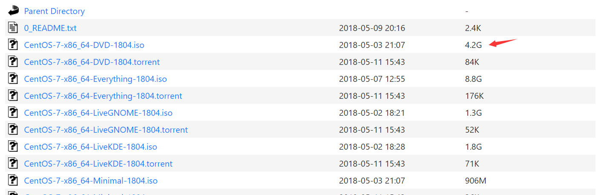

# 虚拟机的环境准备

author:Damon

11.4-11.5

**VM+centos7.5**

**{部署zookeeper Hbase}**

目标：准备一台干净的虚拟机。适合hadoop大数据框架的部署，配置JAVA

前几次的笔记整理都是基于ubuntu系统来配置的

这次笔者采用centos7.5

网址：https://vault.centos.org/7.5.1804/isos/x86_64/



VM和vbox,个人建议vm的功能强大，但是vm是要钱的，如果未来企业没有购买vm的使用权，可以使用vb来练练手。

笔者使用的是VM16pro来进行操作

在配置虚拟机的时候要看清自己的主机配置

处理器配置的时候：

设置你的处理器数量（P）和每个处理器内核（C）两两相乘不能超过本机的内核总数

笔者的电脑配置，4核8G


所以笔者配置的是1核心3G的配置

### 首先是网络设置。

**1.将网络配置成桥接模式。**
  **在桥接模式下，虚拟机和主机是平行关系，也就是一起共享一张网卡**
  **而NAT模式下是，从属关系。访问外部网络必须通过主机来访问。因此虚拟机的IP只有主机才能访问到。**

​	其实桥接和nat都可以，如果进入虚拟机后，你的电脑不能联网，建议你使用桥接

**2.桥接模式的IP一般会变动，为了避免远程连接都要重新设置IP,我们需要将IP设置为静态ip**


```shell
#修改里面的网关等
vim /etc/sysconfig/network-scripts/ifcfg-ens33 
TYPE="Ethernet"    #网络类型（通常是Ethemet）
PROXY_METHOD="none"
BROWSER_ONLY="no"
BOOTPROTO="static"   #IP的配置方法[none|static|bootp|dhcp]（引导时不使用协议|静态分配IP|BOOTP协议|DHCP协议）
DEFROUTE="yes"
IPV4_FAILURE_FATAL="no"
IPV6INIT="yes"
IPV6_AUTOCONF="yes"
IPV6_DEFROUTE="yes"
IPV6_FAILURE_FATAL="no"
IPV6_ADDR_GEN_MODE="stable-privacy"
NAME="ens33"   
UUID="e83804c1-3257-4584-81bb-660665ac22f6"   #随机id
DEVICE="ens33"   #接口名（设备,网卡）
ONBOOT="yes"   #系统启动的时候网络接口是否有效（yes/no）
#IP地址
IPADDR=192.168.10.100  
#网关  
GATEWAY=192.168.10.2      
#域名解析器
DNS1=192.168.10.2


```

```shell

#重启网络服务
systemctl restart network 
#修改主机名和映射配置
vim /etc/hostname
vim /etc/hosts
reboot

 sudo apt install net-tools
 sudo apt-get update
 sudo apt-get install vim
 #是否开启ssh
 sudo apt-get instpytall openssh-server
```

 

