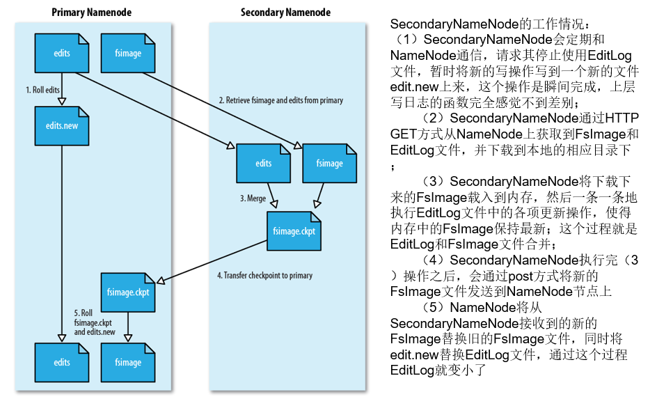

# Hadoop学习笔记_HDFS_

### 分布式文件系统HDFS

#### 为什么使用分布式文件系统

与之前使用**多个处理器和专用高级硬件的并行化处理装置**不同的是，目前的分布式文件系统所采用的计算机集群，都是由**普通硬件**构成的，这就大大**降低了硬件上的开销**

#### 分布式文件系统的结构

分布式文件系统在物理结构上是由计算机集群中的多个节点构成的，这些节点分为两类，一类叫“主节点”(Master Node)或者也被称为“名称结点”(NameNode)，另一类叫“从节点”（Slave Node）或者也被称为“数据节点”(DataNode)

#### 分布式文件系统的目标

- **兼容廉价的硬件设备**
- **流数据读写**
- **大数据集**
- **简单的文件模型**
- **强大的跨平台兼容性**

#### 分布式文件系统的局限性

- **不适合低延迟数据访问**
- **无法高效存储大量小文件**（HDFS默认一个块64MB）
- **不支持多用户写入及任意修改文件**

### 名称节点与数据节点

#### 名称节点的数据结构

在HDFS中，名称节点负责分布式文件系统的命名空间，保存了两个核心数据结构，即FsImage和EditLog

- FsImage 用于维护文件系统树中所有文件和文件夹的元数据

  FsImage文件包含文件系统中所有目录和文件inode的序列化形式。每个inode是一个文件或目录的元数据的内部表示，并包含此类信息：文件的复制等级、修改和访问时间、访问权限、块大小以及组成文件的块。对于目录，则存储修改时间、权限和配额元数据

  FsImage文件没有记录每个块存储在哪个数据节点。而是由名称节点把这些映射信息保留在内存中，当数据节点加入HDFS集群时，数据节点会把自己所包含的块列表告知给名称节点，此后会定期执行这种告知操作，以确保名称节点的块映射是最新的。

- 操作日记文件EditLog中记录了所有针对文件的创建、删除、重命名等操作

  

名称节点记录了每个文件中各个快所在的数据节点的位置信息

也就是说名称节点就是记录了文件的位置信息和操作信息

#### 为什么要设计第二名称节点

在名称节点运行期间，HDFS的所有更新操作都是直接写到EditLog中，久而久之， EditLog文件将会变得很大

虽然这对名称节点运行时候是没有什么明显影响的，但是，当名称节点重启的时候，名称节点需要先将FsImage里面的所有内容映像到内存中，然后再一条一条地执行EditLog中的记录，当EditLog文件非常大的时候，会导致名称节点启动操作非常慢，而在这段时间内HDFS系统处于安全模式，一直无法对外提供写操作，影响了用户的使用

解决的办法就是加入第二名称节点

#### 第二名称节点的功能

**第二名称节点**是HDFS架构中的一个组成部分，它是用来保存名称节点中对HDFS 元数据信息的备份，并减少名称节点重启的时间。SecondaryNameNode一般是单独运行在一台机器上

也就是说Secondary Namenode 会一段时间将第一名称节点通信，将它的FsImage和Editlogs进行合并操作，从而缩小Editlogs文件的大小，其中获取文件是通过GET方式，输出文件是通过POST方式

#### 数据节点

- 数据节点是分布式文件系统HDFS的工作节点，负责数据的存储和读取，会根据客户端或者是名称节点的调度来进行数据的存储和检索，并且向名称节点定期发送自己所存储的块的列表
- 每个数据节点中的数据会被保存在各自节点的本地Linux文件系统中

