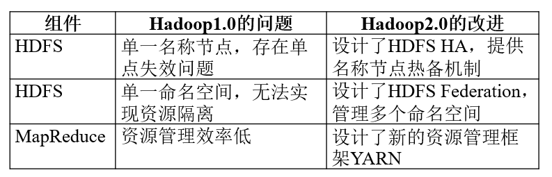
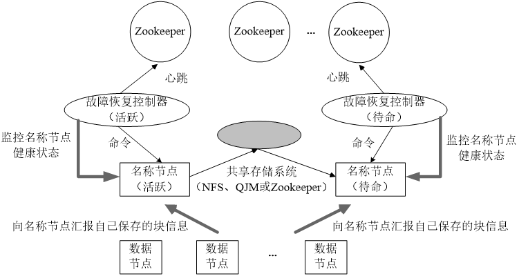
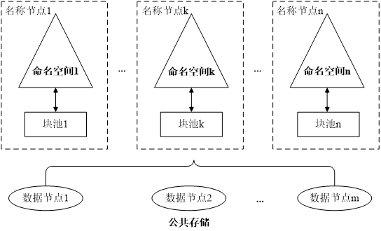
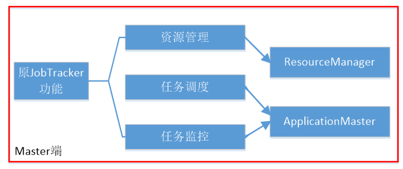
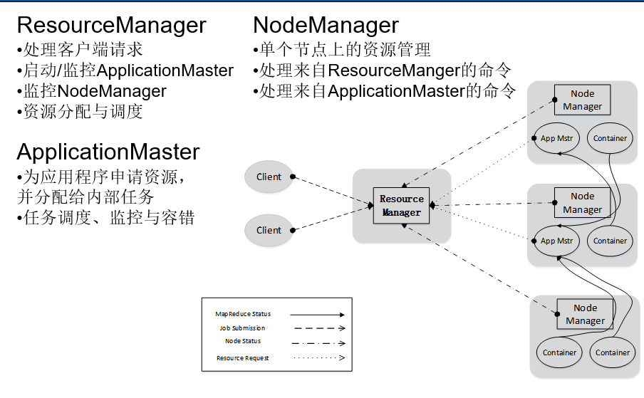
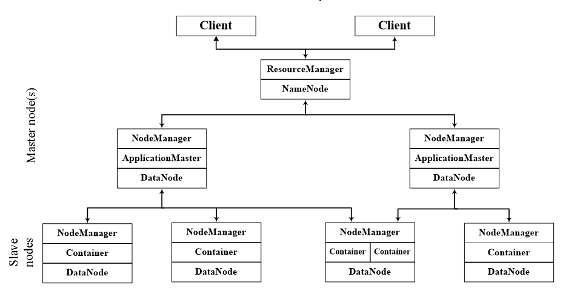

# Hadoop学习笔记_yarn_

### 前言

#### Hadoop1.0的不足

- 抽象层次低，需人工编码
- 表达能力有限
- 开发者自己管理作业（Job）之间的依赖关系
- 难以看到程序整体逻辑
- 执行迭代操作效率低
- 资源浪费（Map和Reduce分两阶段执行）
- 实时性差（适合批处理，不支持实时交互式）

#### Hadoop的优化与发展

- 一方面是Hadoop自身两大核心组件MapReduce和HDFS的架构设计改进
- 另一方面是Hadoop生态系统其它组件的不断丰富，加入了Pig、Tez、Spark和Kafka等新组件

#### 具体表现

### HDFS HA

- HDFS HA（High Availability）是为了解决单点故障问题
- HA集群设置两个名称节点，“活跃（Active）”和“待命（Standby）”
- 两种名称节点的状态同步，可以借助于一个共享存储系统来实现
- 一旦活跃名称节点出现故障，就可以立即切换到待命名称节点
- Zookeeper确保一个名称节点在对外服务
- 名称节点维护映射信息，数据节点同时向两个名称节点汇报信息

### HDFS Federation

#### HDFS 1.0中存在的问题：

- 单点故障问题
- 不可以水平扩展（是否可以通过纵向扩展来解决？）
- 系统整体性能受限于单个名称节点的吞吐量
- 单个名称节点难以提供不同程序之间的隔离性
- HDFS HA是热备份，提供高可用性，但是无法解决可扩展性、系统性能和隔离性

#### HDFS Federation的设计：

- 在HDFS Federation中，设计了多个相互独立的名称节点，使得HDFS的命名服务能够水平扩展，这些名称节点分别进行各自命名空间和块的管理，相互之间是联盟（Federation）关系，不需要彼此协调。并且向后兼容
- HDFS Federation中，所有名称节点会共享底层的数据节点存储资源，数据节点向所有名称节点汇报
- 属于同一个命名空间的块构成一个“块池”

#### HDFS Federation相对于HDFS1.0的优势

**HDFS Federation设计可解决单名称节点存在的以下几个问题：**

- HDFS集群扩展性。多个名称节点各自分管一部分目录，使得一个集群可以扩展到更多节点，不再像HDFS1.0中那样由于内存的限制制约文件存储数目
- 性能更高效。多个名称节点管理不同的数据，且同时对外提供服务，将为用户提供更高的读写吞吐率
- 良好的隔离性。用户可根据需要将不同业务数据交由不同名称节点管理，这样不同业务之间影响很小

需要注意的，HDFS Federation并不能解决单点故障问题，也就是说，每个名称节点都存在在单点故障问题，需要为每个名称节点部署一个后备名称节点，以应对名称节点挂掉对业务产生的影响

### yarn的设计思路

MapReduce1.0既是一个计算框架，也是一个资源管理调度框架

到了Hadoop2.0以后，MapReduce1.0中的资源管理调度功能，被单独分离出来形成了YARN，它是一个纯粹的资源管理调度框架，而不是一个计算框架

被剥离了资源管理调度功能的MapReduce 框架就变成了MapReduce2.0，它是运行在YARN之上的一个纯粹的计算框架，不再自己负责资源调度管理服务，而是由YARN为其提供资源管理调度服务

#### ResourceManager

- ResourceManager（RM）是一个全局的资源管理器，负责整个系统的资源管理和分配，主要包括两个组件，
- 调度器接收来自ApplicationMaster的应用程序资源请求，把集群中的资源以“容器”的形式分配给提出申请的应用程序，容器的选择通常会考虑应用程序所要处理的数据的位置，进行就近选择，从而实现“计算向数据靠拢”
- 容器（Container）作为动态资源分配单位，每个容器中都封装了一定数量的CPU、内存、磁盘等资源，从而限定每个应用程序可以使用的资源量
- 调度器被设计成是一个可插拔的组件，YARN不仅自身提供了许多种直接可用的调度器，也允许用户根据自己的需求重新设计调度器
- 应用程序管理器（Applications Manager）负责系统中所有应用程序的管理工作，主要包括应用程序提交、与调度器协商资源以启动ApplicationMaster、监控ApplicationMaster运行状态并在失败时重新启动等

#### ApplicationMaster

**ApplicationMaster的主要功能是：**

- 当用户作业提交时，ApplicationMaster与ResourceManager协商获取资源，ResourceManager会以容器的形式为ApplicationMaster分配资源；
- 把获得的资源进一步分配给内部的各个任务（Map任务或Reduce任务），实现资源的“二次分配”；
- 与NodeManager保持交互通信进行应用程序的启动、运行、监控和停止，监控申请到的资源的使用情况，对所有任务的执行进度和状态进行监控，并在任务发生失败时执行失败恢复（即重新申请资源重启任务）；
- 定时向ResourceManager发送“心跳”消息，报告资源的使用情况和应用的进度信息；
- 当作业完成时，ApplicationMaster向ResourceManager注销容器，执行周期完成。

NodeManager

NodeManager是驻留在一个YARN集群中的每个节点上的代理，主要负责：

- 容器生命周期管理
- 监控每个容器的资源（CPU、内存等）使用情况
- 跟踪节点健康状况
- 以“心跳”的方式与ResourceManager保持通信
- 向ResourceManager汇报作业的资源使用情况和每个容器的运行状态
- 接收来自ApplicationMaster的启动/停止容器的各种请求

需要说明的是，NodeManager主要负责管理抽象的容器，只处理与容器相关的事情，而不具体负责每个任务（Map任务或Reduce任务）自身状态的管理，因为这些管理工作是由ApplicationMaster完成的，ApplicationMaster会通过不断与NodeManager通信来掌握各个任务的执行状态

### yarn的目标：

**一个集群多个框架**

- 一个企业当中同时存在各种不同的业务应用场景，需要采用不同的计算框架
- - MapReduce实现离线批处理
  - 使用Impala实现实时交互式查询分析
  - 使用Storm实现流式数据实时分析
  - 使用Spark实现迭代计算
- 
- 这些产品通常来自不同的开发团队，具有各自的资源调度管理机制
- 为了避免不同类型应用之间互相干扰，企业就需要把内部的服务器拆分成多个集群，分别安装运行不同的计算框架，即“一个框架一个集群”
- - 导致问题
  - 集群资源利用率低
  - 数据无法共享
  - 维护代价高

