#  期末作业

author:Damon 

### 前言:

这个项目我开始想了一个挺有意思的就是弄一个全国疫情爬虫的网站，这一过程差不多弄了半个多月，最后在docker中部署Mysql时出现了一些问题。最终还是没有将这个项目展现出来，不过这一过程收获颇丰。

这次大作业最终也是准备弄一个前端的技术来呈现这次作业的主题：分别是智慧城市和智慧医疗。

那么下面进入正题:

### 项目设计：

#### 项目说明：

本项目基于前端，实现智能交通和智能医疗的可视化应用。

智能医疗和智能交通在docker hub 下载到自己的镜像中，能完全实现和本文一样的效果，文章最后会对项目安装有更进一步的说明。

为了避免api的乱用，明年春节后我将把百度的api限制为自己的ip地址（39.108.188.86）

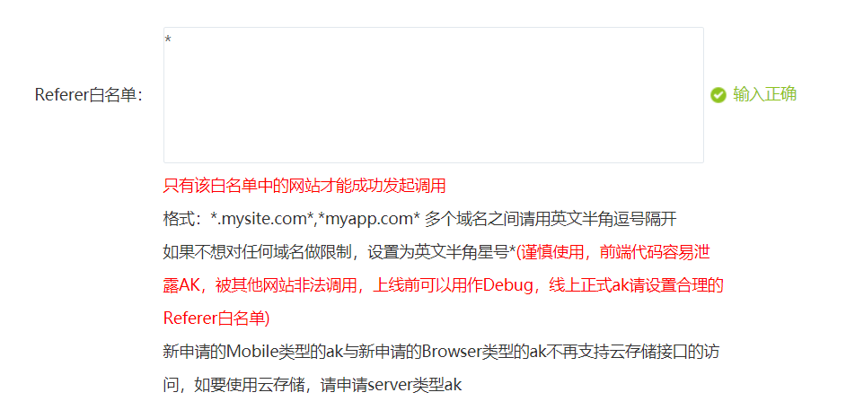

本项目也可以通过以下两个网址进行查看：（ip地址,有效期至2022年9月）

智能交通http://39.108.188.86:8001/     域名可能一星期后申请下来 (http://damonpkl.cn:8000/）

智能医疗http://39.108.188.86:8001/     域名可能一星期后申请下来（http://damonpkl.cn:8001/）


#### 项目源码：

（仅是docker部分,前端部分就放文件夹。）

------

```shell
#第一部分就是:创建文件夹，用于docker中的容器数据卷，我在docker笔记中也做了相应的笔记，简单来说容器卷就是将docker产生的数据同步到本地，本质就是目录挂载。
#如果不用容器卷，可以docker pull 一个简单的操作系统如centos,在centos镜像中yum -y install nginx，笔者没有试过，理论上应该也是可以的。
[root@DamonPKL /]# cd home
[root@DamonPKL home]# ls
[root@DamonPKL home]# mkdir CityU_Damon
[root@DamonPKL home]# ls
CityU_Damon
[root@DamonPKL home]# cd CityU_Damon/
[root@DamonPKL CityU_Damon]# mkdir -p ./nginx/www ./nginx/logs ./nginx/conf
[root@DamonPKL CityU_Damon]# ls
nginx
[root@DamonPKL CityU_Damon]# cd nginx
[root@DamonPKL nginx]# ls
conf  logs  www
#上面就是创建三个文件夹，主要是为了和nginx的文件夹进行目录挂载
```

------

```shell
第二部分就是下载nginx,并启动运行nginx
[root@DamonPKL ~]# docker -v
Docker version 20.10.9, build c2ea9bc
[root@DamonPKL ~]# docker images
REPOSITORY   TAG       IMAGE ID       CREATED        SIZE
nginx        latest    f652ca386ed1   4 days ago     141MB
centos       7         eeb6ee3f44bd   2 months ago   204MB
[root@DamonPKL ~]# docker ps
CONTAINER ID   IMAGE     COMMAND   CREATED   STATUS    PORTS     NAMES
[root@DamonPKL ~]# docker run --name CityU-test -p 8002:80 -d nginx
49c04e7059517e6d46083514a7210e95298185286ed861c7e1cbf8434fbf1320

```

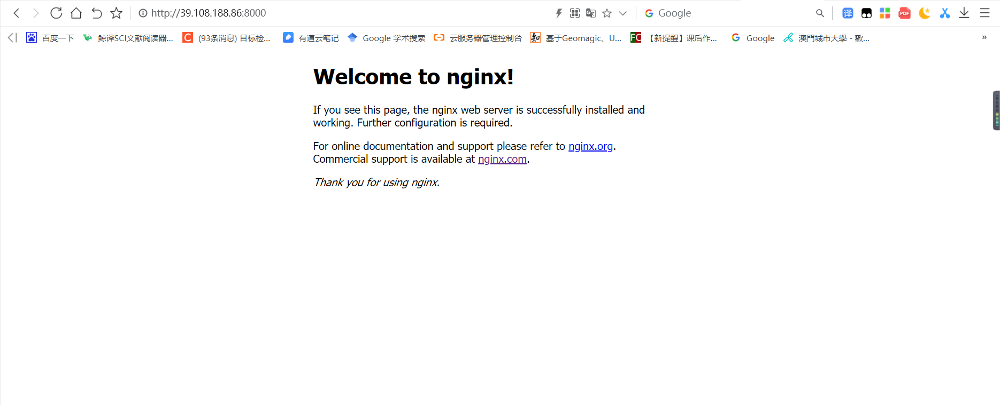

-----

```shell
#第三部分就是将运行的nginx的配置文件nginx.conf复制到自己创建的目录下
[root@DamonPKL ~]# docker ps
CONTAINER ID   IMAGE     COMMAND                  CREATED         STATUS         PORTS                  NAMES
adb94caaeb65   nginx     "/docker-entrypoint.…"   2 minutes ago   Up 2 minutes   0.0.0.0:8000->80/tcp   CityU-test

[root@DamonPKL ~]# docker cp adb94caaeb65:/etc/nginx/nginx.conf /home/CityU_Damon/nginx/conf
[root@DamonPKL /]# cd /home/CityU_Damon/nginx/conf/
[root@DamonPKL conf]# ls
nginx.conf

```

------

```shell
#第四部分就是把刚刚那个容器删除
[root@DamonPKL conf]# docker ps
CONTAINER ID   IMAGE     COMMAND                  CREATED          STATUS          PORTS                  NAMES
adb94caaeb65   nginx     "/docker-entrypoint.…"   49 minutes ago   Up 49 minutes   0.0.0.0:8000->80/tcp   CityU-test
[root@DamonPKL conf]# docker kill adb94caaeb65
adb94caaeb65

```

---


```shell
#第五部分就是开始部署，简单说一下就是开放了8000 和 8001 端口，命名为CityU_Damon1,然后进行相应的目录挂载
#部署智慧交通项目
#这里不能使用容器卷的技术，试了几个小时发现，容器卷技术不写入容器层所以push的时候没有保存文件。
#我最终是对容器内进行操作
[root@DamonPKL ~]# docker run -d -p 8000:80 --name CityU_Damon1 nginx
f9b2b064b97e7399fc90a9b729276c817450b0a0a12704d76dd89c8de4b3fdd2
[root@DamonPKL ~]# docker ps
CONTAINER ID   IMAGE     COMMAND                  CREATED         STATUS         PORTS                  NAMES
f9b2b064b97e   nginx     "/docker-entrypoint.…"   3 seconds ago   Up 2 seconds   0.0.0.0:8000->80/tcp   CityU_Damon1
[root@DamonPKL ~]# docker cp /home/CityU_Damon/nginx/www/. f9b2b064b97e:usr/share/nginx/html/   
[root@DamonPKL ~]# docker cp /home/CityU_Damon/nginx/conf/nginx.conf f9b2b064b97e:/etc/nginx/nginx.conf 
[root@DamonPKL ~]# docker cp /home/CityU_Damon/nginx/logs/. f9b2b064b97e:/var/log/nginx/ 

#CityU_Damon2目录设置和CityU_Damon1一样，这里就不行过多的赘述
#部署指挥医疗项目
[root@DamonPKL ~]# docker run -d -p 8001:80 --name CityU_Damon2 nginx
5105bee6e6cd80c3ccb3c4866700e8c2c77639cdbdb5d9b17669552ed2343b42
[root@DamonPKL ~]# docker ps
CONTAINER ID   IMAGE     COMMAND                  CREATED          STATUS          PORTS                  NAMES
5105bee6e6cd   nginx     "/docker-entrypoint.…"   8 seconds ago    Up 7 seconds    0.0.0.0:8001->80/tcp   CityU_Damon2
f9b2b064b97e   nginx     "/docker-entrypoint.…"   12 minutes ago   Up 12 minutes   0.0.0.0:8000->80/tcp   CityU_Damon1
[root@DamonPKL ~]# docker cp /home/CityU_Damon2/nginx/www/. 5105bee6e6cd:usr/share/nginx/html/   
[root@DamonPKL ~]# docker cp /home/CityU_Damon2/nginx/conf/nginx.conf 5105bee6e6cd:/etc/nginx/nginx.conf 
[root@DamonPKL ~]# docker cp /home/CityU_Damon2/nginx/logs/. 5105bee6e6cd:/var/log/nginx/ 

```

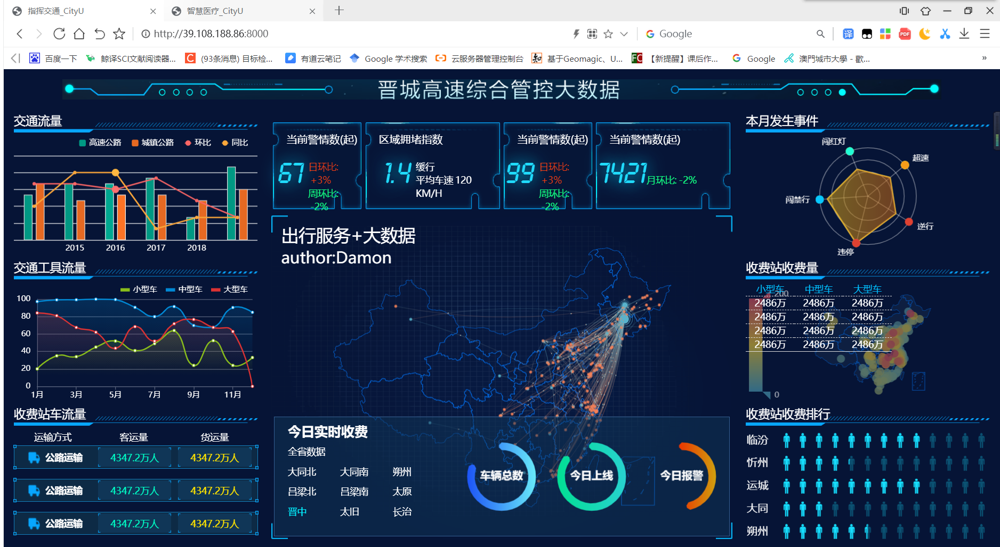

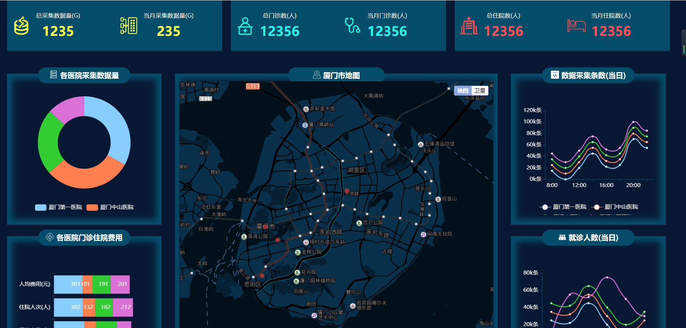

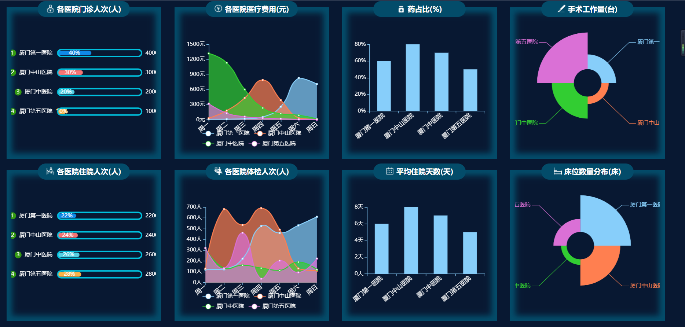

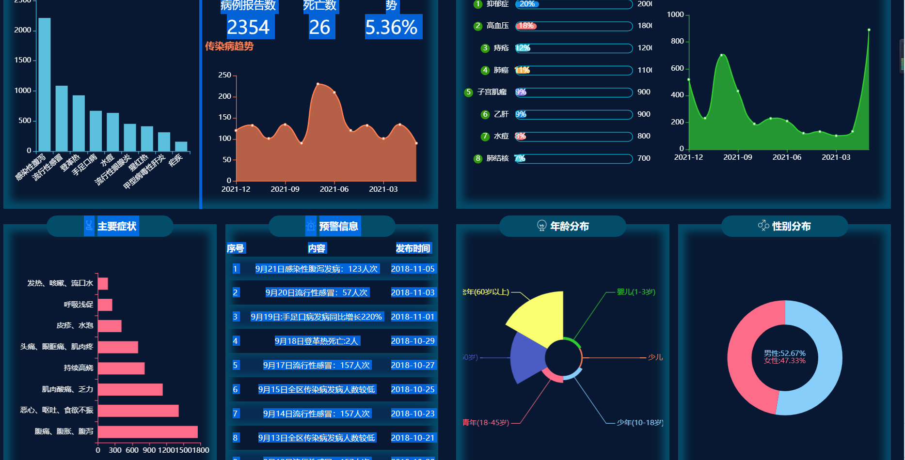

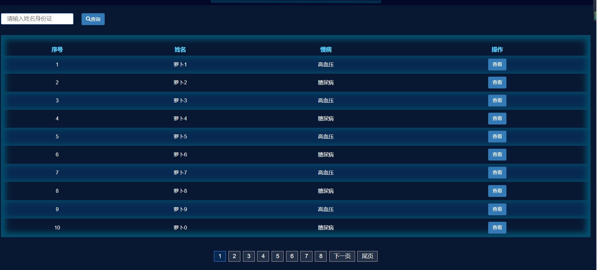

----

```shell
#项目上传到docker hub
#镜像名不能大写
#上传智慧交通的项目
[root@DamonPKL ~]# docker commit -a="Damon" -m="Submission of final assignment" f9b2b064b97e damonpkl/cityu_damon1:1.0
sha256:6f74805f9f437bd9992473219e10095f6349af91fe602fc8f75931dd8f317adc
[root@DamonPKL ~]# docker login
Authenticating with existing credentials...
WARNING! Your password will be stored unencrypted in /root/.docker/config.json.
Configure a credential helper to remove this warning. See
https://docs.docker.com/engine/reference/commandline/login/#credentials-store

Login Succeeded
[root@DamonPKL ~]# docker images
REPOSITORY              TAG       IMAGE ID       CREATED          SIZE
damonpkl/cityu_damon1   1.0       6f74805f9f43   35 seconds ago   143MB
cityu_damon1            0.1       cb4185bd3491   41 minutes ago   141MB
nginx                   latest    f652ca386ed1   5 days ago       141MB
[root@DamonPKL conf]# docker push damonpkl/cityu_damon1:1.0
The push refers to repository [docker.io/damonpkl/cityu_damon1]
95caeedfcb7b: Pushed 
2bed47a66c07: Mounted from library/nginx 
82caad489ad7: Mounted from library/nginx 
d3e1dca44e82: Mounted from library/nginx 
c9fcd9c6ced8: Mounted from library/nginx 
0664b7821b60: Mounted from library/nginx 
9321ff862abb: Mounted from library/nginx 
1.0: digest: sha256:04d781dee768513b6e76726db66e5b918b6dd4f0eec7bd0b7a157713a31204a0 size: 1778

```

----

```shell
#上传智慧医疗的项目
#步骤和上面一致
[root@DamonPKL conf]# docker ps
CONTAINER ID   IMAGE     COMMAND                  CREATED             STATUS             PORTS                  NAMES
7e0edd8374c2   nginx     "/docker-entrypoint.…"   57 minutes ago      Up 57 minutes      0.0.0.0:8001->80/tcp   CityU_Damon2
5ee20da39d91   nginx     "/docker-entrypoint.…"   About an hour ago   Up About an hour   0.0.0.0:8000->80/tcp   CityU_Damon1
[root@DamonPKL conf]# docker commit -a="Damon" -m="Submission of final assignment2" 5105bee6e6cd damonpkl/cityu_damon2:1.0
sha256:704d6fe30718e6d221bbb9930a5c51b8f72df34da6a29c0c523afff5d065d2f8
[root@DamonPKL conf]# docker login
Authenticating with existing credentials...
doWARNING! Your password will be stored unencrypted in /root/.docker/config.json.
Configure a credential helper to remove this warning. See
https://docs.docker.com/engine/reference/commandline/login/#credentials-store

Login Succeeded
[root@DamonPKL conf]# docker images
REPOSITORY              TAG       IMAGE ID       CREATED          SIZE
damonpkl/cityu_damon2   1.0       704d6fe30718   22 seconds ago   141MB
cityu_damon1            0.1       18445368709e   14 minutes ago   141MB
damonpkl/cityu_damon1   1.0       18445368709e   14 minutes ago   141MB
nginx                   latest    f652ca386ed1   5 days ago       141MB
centos                  7         eeb6ee3f44bd   2 months ago     204MB
[root@DamonPKL conf]# docker push damonpkl/cityu_damon2:1.0
The push refers to repository [docker.io/damonpkl/cityu_damon2]
92cafd55f24e: Pushed 
2bed47a66c07: Mounted from damonpkl/cityu_damon1 
82caad489ad7: Mounted from damonpkl/cityu_damon1 
d3e1dca44e82: Mounted from damonpkl/cityu_damon1 
c9fcd9c6ced8: Mounted from damonpkl/cityu_damon1 
0664b7821b60: Mounted from damonpkl/cityu_damon1 
9321ff862abb: Mounted from damonpkl/cityu_damon1 
1.0: digest: sha256:6af660040bf516811c73cbc4d07854c9ac397dcb642f1966a140e6c6a9cc6c53 size: 1778

```

上传到docker hub 的截图

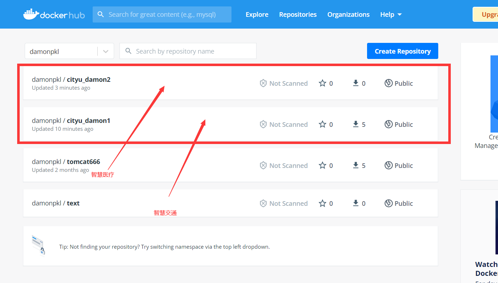

### 项目安装（用户）：

```shell
#为了保证安装的可靠性，重新开了一台虚拟机进行测试
[root@damontext ~]# docker -v
Docker version 20.10.11, build dea9396
[root@damontext ~]# docker ps
CONTAINER ID   IMAGE     COMMAND   CREATED   STATUS    PORTS     NAMES
[root@damontext ~]# docker images
REPOSITORY   TAG       IMAGE ID   CREATED   SIZE
```

#### 安装智慧交通与智慧医疗项目（用户使用）

首先要保证相应的端口打开，本例中是将8000和8001端口打开

```shell
[root@damontext ~]# docker pull damonpkl/cityu_damon1:1.0
1.0: Pulling from damonpkl/cityu_damon1
e5ae68f74026: Pull complete 
21e0df283cd6: Pull complete 
ed835de16acd: Pull complete 
881ff011f1c9: Pull complete 
77700c52c969: Pull complete 
44be98c0fab6: Pull complete 
903e906f297e: Pull complete 
Digest: sha256:43ab1426767649c4d7f215258633c8e8d48bdaa5c49a648ba035a5b732a364b2
Status: Downloaded newer image for damonpkl/cityu_damon1:1.0
docker.io/damonpkl/cityu_damon1:1.0
[root@damontext ~]# docker pull damonpkl/cityu_damon2:1.0
1.0: Pulling from damonpkl/cityu_damon2
e5ae68f74026: Already exists 
21e0df283cd6: Already exists 
ed835de16acd: Already exists 
881ff011f1c9: Already exists 
77700c52c969: Already exists 
44be98c0fab6: Already exists 
418dffa34e04: Pull complete 
Digest: sha256:36c9959ac0afb68ecf2735024cc595b8cddbe0a58887fee776a55fc3318600fb
Status: Downloaded newer image for damonpkl/cityu_damon2:1.0


```

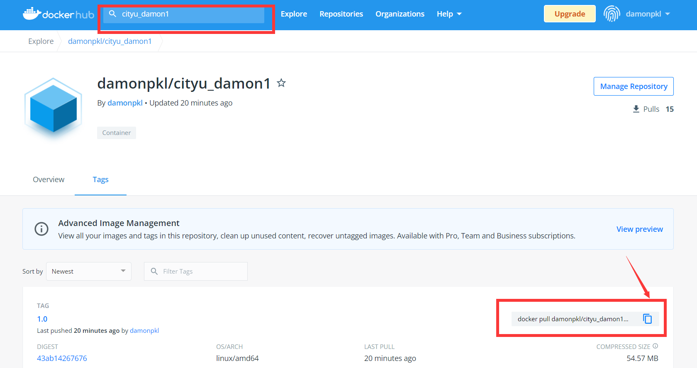


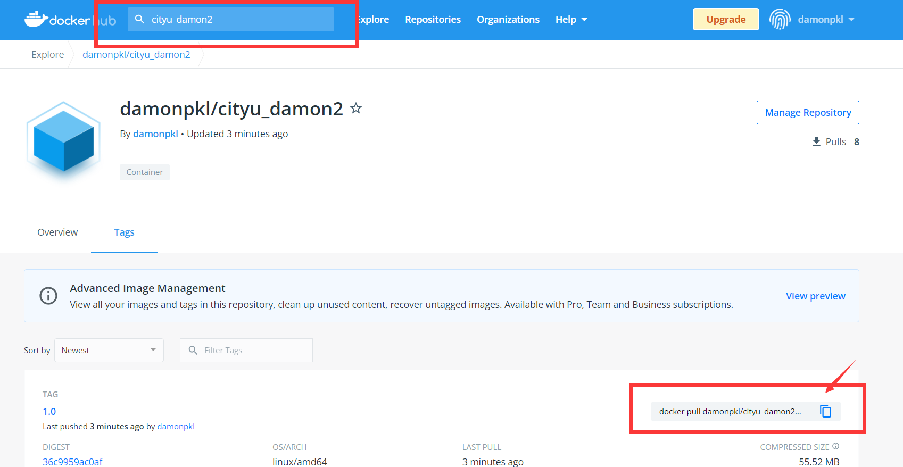


```shell
##测试
[root@damontext ~]# docker images
REPOSITORY              TAG       IMAGE ID       CREATED          SIZE
damonpkl/cityu_damon2   1.0       07a86b789988   10 minutes ago   144MB
damonpkl/cityu_damon1   1.0       6f74805f9f43   29 minutes ago   143MB
.io/damonpkl/cityu_damon2:1.0
##测试新下载的智慧交通项目
[root@damontext ~]# docker run --name CityU-test1 -p 8000:80 -d 6f74805f9f43
c6d811b3cd3204bf984cf3aad37969fdf166641b348ff27ca80fda99a12feff0
##测试新下载的智慧医疗项目
[root@damontext ~]# docker run --name CityU-test2 -p 8001:80 -d 07a86b789988
e6aff6a03ba27cec1416ee7cfb821f28ba4b78fa5cdc3042639a565641f596e8


```

测试成功：

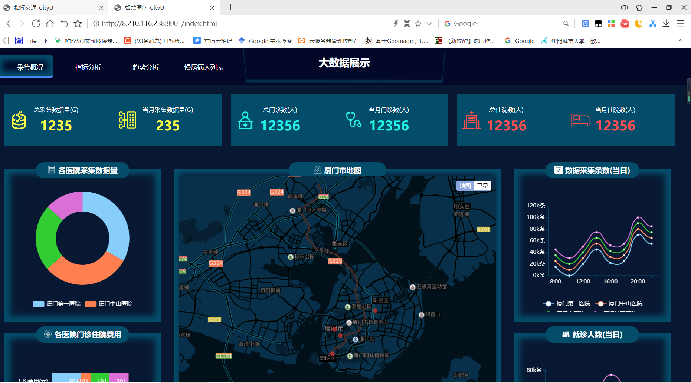


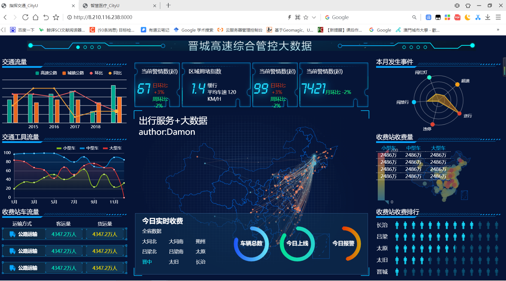

