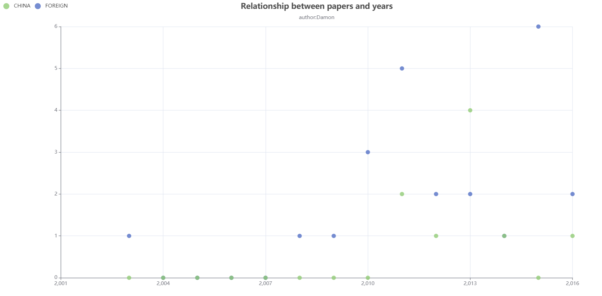
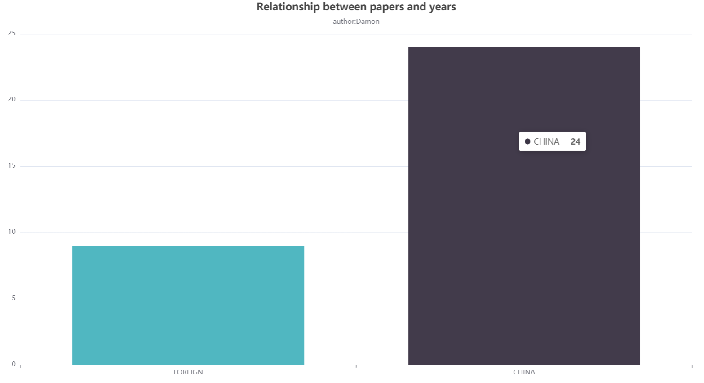
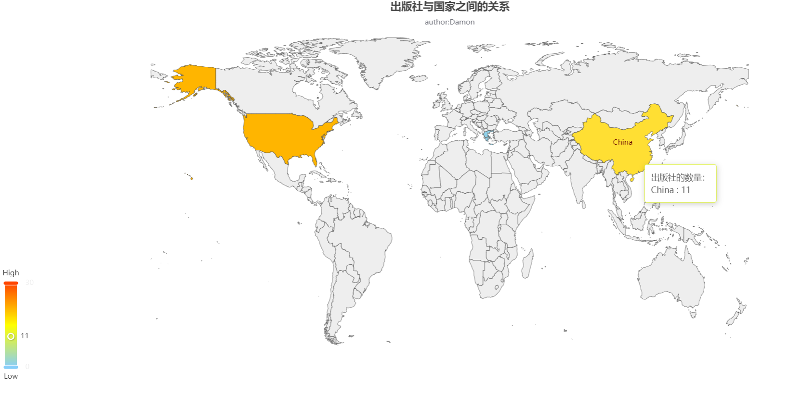
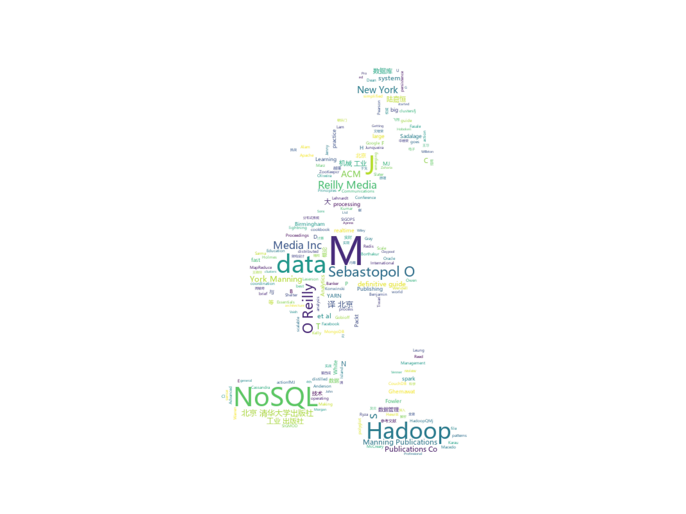
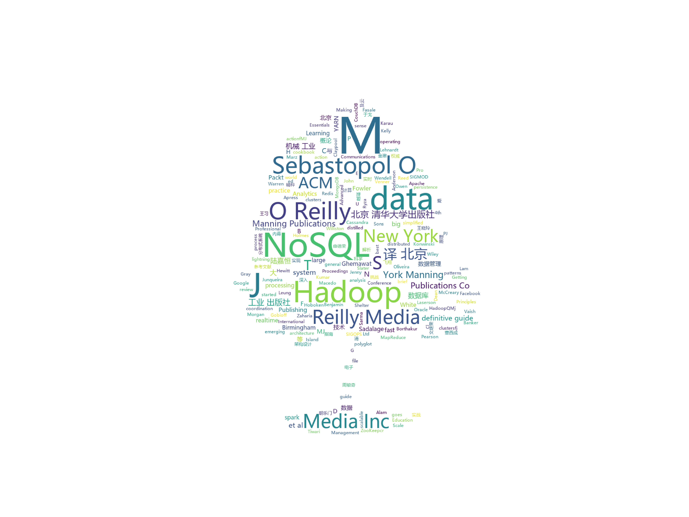

# 参考文献的数据可视化

author:Damon

题目：

請參閱課本P.196 習題10

要求: 展示至少三種不同可視化的呈現結果

### 思路：

三种方法：

第一种：网页可视化（散点图聚合成柱状图）

第二种：网页可视化（网页地图可视化）

第三种：词云


三种可视化的效果：

#### 第一种网页可视化：

**目标：统计随年份的增长，中文和英文期刊的比例关系**

方法：使用网页来编写（js，html）,异步动态加载散点图和柱状图。


```html
<!--网页源码-->

<!DOCTYPE html>
<html style="height: 100%">
	<head>
		<meta charset="utf-8">
	</head>
	<body style="height: 100%; margin: 0">
		<div id="container" style="height: 100%"></div>

		<script type="text/javascript" src="echarts.min.js"></script>
		<script type="text/javascript">
			var dom = document.getElementById("container");
			var myChart = echarts.init(dom);
			var app = {};

			var option;


			// prettier-ignore
			const ForeignData = [
				[2003, 1],
				[2004, 0],
				[2005, 0],
				[2006, 0],
				[2007, 0],
				[2008, 1],
				[2009, 1],
				[2010, 3],
				[2011, 5],
				[2012, 2],
				[2013, 2],
				[2014, 1],
				[2015, 6],
				[2016, 2]
			];
			// prettier-ignore
			const ChineseData = [
				[2003, 0],
				[2004, 0],
				[2005, 0],
				[2006, 0],
				[2007, 0],
				[2008, 0],
				[2009, 0],
				[2010, 0],
				[2011, 2],
				[2012, 1],
				[2013, 4],
				[2014, 1],
				[2015, 0],
				[2016, 1]
			];

			function calculateSum(data, dim) {
				let total = 0;
				for (var i = 0; i < data.length; i++) {
					total += data[i][dim];
				}
				return total;
			}
			const scatterOption = (option = {
				xAxis: {
					scale: true
				},
				legend: {
					data: ['CHINA', 'FOREIGN'],
					left: 10
				},
				yAxis: {
					scale: true
				},
				title: {
					text: 'Relationship between papers and years',
					subtext: 'author:Damon',
					left: 'center'
				},
				tooltip: {},

				series: [{

						type: 'scatter',
						name: 'FOREIGN',
						dataGroupId: 'ForeignData',
						universalTransition: {
							enabled: true,
							delay: function(idx, count) {
								return Math.random() * 400;
							}
						},
						data: ForeignData
					},
					{
						type: 'scatter',
						name: 'CHINA',
						dataGroupId: 'ChineseData',
						universalTransition: {
							enabled: true,
							delay: function(idx, count) {
								return Math.random() * 400;
							}
						},
						data: ChineseData
					}
				]
			});
			const barOption = {
				xAxis: {
					type: 'category',
					data: ['FOREIGN', 'CHINA']
				},
				yAxis: {},
				title: {
					text: 'Relationship between papers and years',
					subtext: 'author:Damon',
					left: 'center'
				},
				tooltip: {},
				series: [{
					type: 'bar',
					id: 'total',

					data: [{
							value: calculateSum(ChineseData, 1),
							groupId: 'CHINA',
							itemStyle: {
								normal: {
									color: '#50b7c1'
								}
							}
						},
						{
							value: calculateSum(ForeignData, 1),
							groupId: 'FOREIGN',
							itemStyle: {
								normal: {
									color: '#3c3645'
								}
							}
						}
					],
					universalTransition: {
						enabled: true,
						seriesKey: ['FOREIGN', 'CHINA'],
						delay: function(idx, count) {
							return Math.random() * 400;
						}
					}
				}]
			};
			let currentOption = scatterOption;
			setInterval(function() {
				currentOption = currentOption === scatterOption ? barOption : scatterOption;
				myChart.setOption(currentOption, true);
			}, 4000);


			if (option && typeof option === 'object') {
				myChart.setOption(option);
			}
		</script>
	</body>
</html>

```





### 第二种可视化：

目标：统计出版社在全球的分布，以及在列出的目录下出版社在各国出版了多少篇论文

```html
<!--网页源码-->
<html lang="en",style="height: 100%">
<head>
    <meta charset="UTF-8">
    <title>Document</title>
    <script src="echarts.js"></script>
    <script src="world.js"></script>
</head>
<body style="height: 100%; margin: 0">
<div id="main" style="width:100%;height:640px;"></div>
<script>
    var myChart = echarts.init(document.getElementById('main'));
    option = {
      title: {
        text: '出版社与国家之间的关系',
        subtext: 'author:Damon',
        left: 'center',
        top: 'top'
      },
      tooltip: {
        trigger: 'item',
        formatter: function (params) {
          var value = (params.value + '').split('.');
          value =
            value[0].replace(/(\d{1,3})(?=(?:\d{3})+(?!\d))/g, '$1,');
          return params.seriesName + '<br/>' + params.name + ' : ' + value;
        }
      },
      toolbox: {
        show: true,
        orient: 'vertical',
        left: 'right',
        top: 'center',
        feature: {
          dataView: { readOnly: false },
          restore: {},
          saveAsImage: {}
        }
      },
      visualMap: {
        min: 0,
        max: 30,
        text: ['High', 'Low'],
        realtime: false,
        calculable: true,
        inRange: {
          color: ['lightskyblue', 'yellow', 'orangered']
        }
      },
      series: [
        {
          name: '出版社的数量：',
          type: 'map',
          mapType: 'world',
          roam: true,
          emphasis: {
            label: {
              show: true
            }
          },
          data: [
            { name: 'China', value: 11 },
            { name: 'Greece', value: 1 },
            { name: 'United States', value: 21 }
          ]
        }
      ]
    };
    
    if (option && typeof option === 'object') {
      myChart.setOption(option);
    }
    
    


</script>
</body>
</html>
```





###  第三种词云可视化：

目标：将所有的文献汇聚在一起，统计词频。

方法：使用python工具实现词云统计。(其实也可以用R语言来实现，python简单一些)

文档转为图片-->图片转为word-->原数据与word的数据校验-->原数据复制到txt文档导入到数据库中-->用python连接数据库实现数据可视化的效果

方便一些，我就直接使用txt格式导出词云

参考：https://amueller.github.io/word_cloud/

```python
#python代码源码
import jieba        #分词
from matplotlib import pyplot as plt    #绘图，数据可视化
from wordcloud import WordCloud         #词云
from PIL import Image                   #图片处理
import numpy as np                      #矩阵运算
import sqlite3                          #数据库

#打开准备好的txt文件，去空格和空行
text = open('../dataset.txt',encoding="utf-8").read().strip(' ').replace("\n", "")
#测试一下
#print(text)

#分词
cut = jieba.cut(text)
string = ' '.join(cut)
#测试看看分好出来的词组
#print(string)


#导入图片
img = Image.open(r'.\img\tree.jpg')   #打开遮罩图片
img_array = np.array(img)   #将图片转换为数组
wc = WordCloud(
    background_color='white',
    mask=img_array,
    font_path="msyh.ttc"    #字体所在位置：C:\Windows\Fonts
)
wc.generate_from_text(string)

#绘制图片
fig = plt.figure(1)
plt.imshow(wc)
plt.axis('off')     #是否显示坐标轴

#plt.show()    #显示生成的词云图片

#输出词云图片到文件
plt.savefig(r'.\img\word5.jpg',dpi=1000)

```

随便选了两张图导出的可视化图片：




