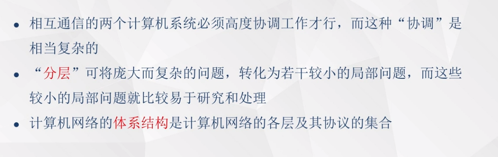
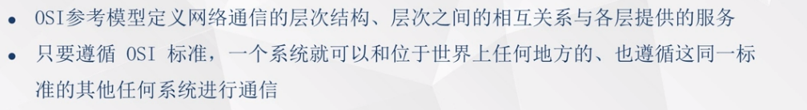
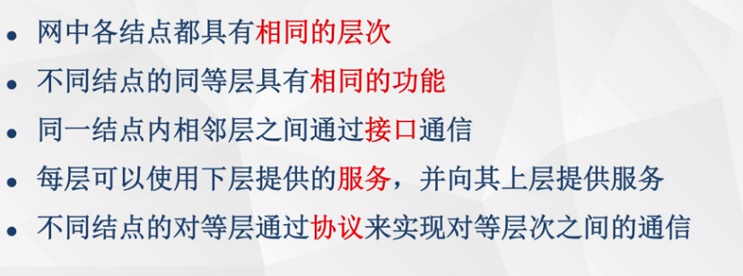
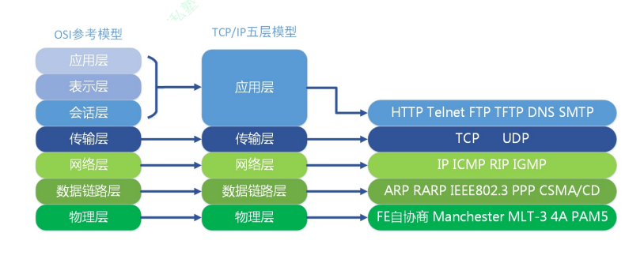
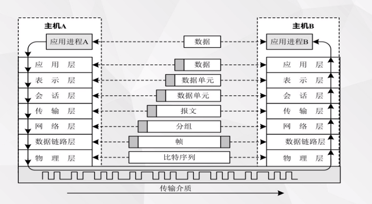
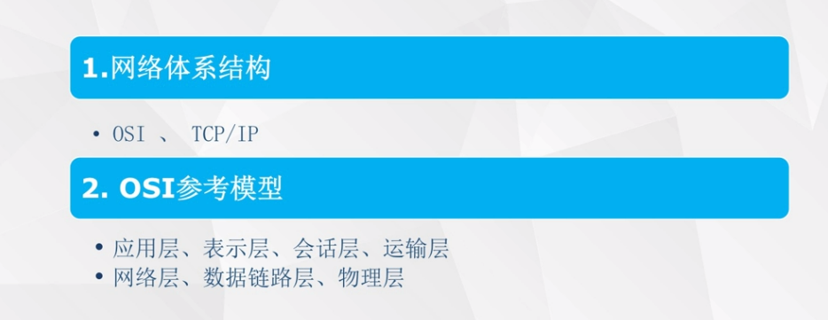
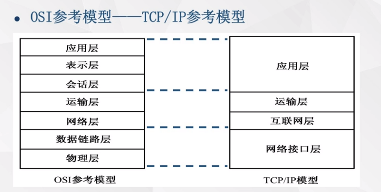
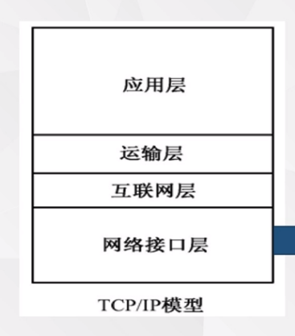
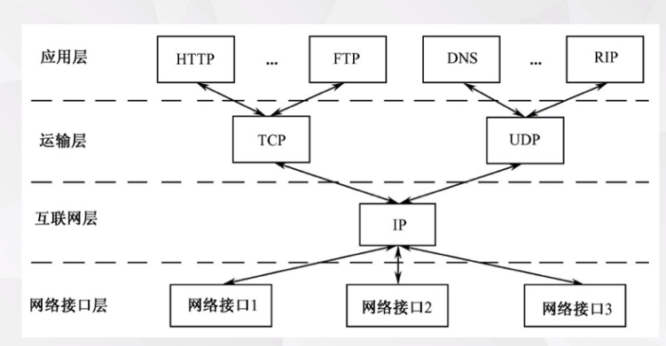
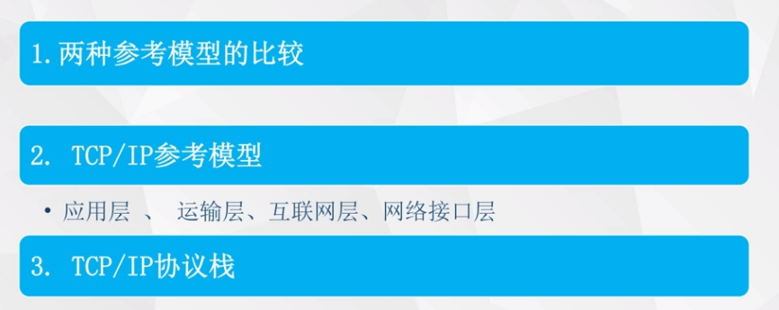

# 04计算机网络体系结构

OSI参考模型：理论模型

TCP/IP参考模型：因特网标准

OSI参考模型--分层原则

物理层：利用传输介质实现比特序列的传输（比特为二进制位）

数据链路层：采用差错控制与流量控制的方法，使得有差错的物理线路变成无差错的数据链路

网络层：实现路由选择，分组转发与拥塞控制等功能，为“分组”传输选择“最佳”的路由

运输层：向高层用户提供可靠的“端-端”通信服务，向高层屏蔽下层数据通信的具体细节

会话层：维护两个通信计算机之间的进程通信，管理数据交换

表示层：处理两个通信的计算机系统的数据表示方式，完成数据的格式变换、加密与解密、压缩与恢复

应用层：为应用软件提供多种网络服务，例如万维网、文件传输、电子邮件与其他服务等

数据封装，数据的解封装

# TCP/IP

两种参考模型比较

网络接口层：是TCP/IP参考模型的最底层，它负责通过网络发送和接受IP数据报

互联网层：使用IP协议提供“尽力而为”的网络分组传输服务。将运输层报文段封装成IP数据报，选择适当的发送路径，并将数据报转发到下一个结点

运输层：负责在会话的进程之间建立和维护“端-端”的连接。定义了两种不同的协议：传输控制协议（TCP）与用户数据报协议（UDP）

TCP可靠的数据传输，面向传输

UDP数据传输不可靠，也不是面向传输。但是高效，即实时性要求高，例如视频、语音

应用层：HTTP,FTP,SMTP,POP..为应用软件提供网络服务

