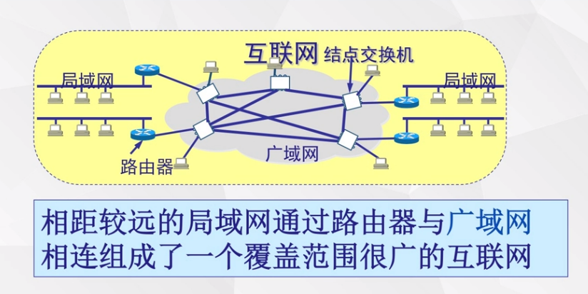
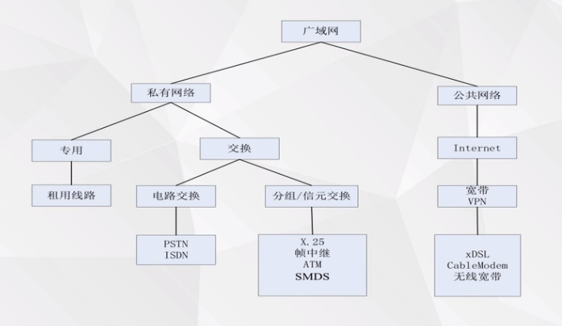
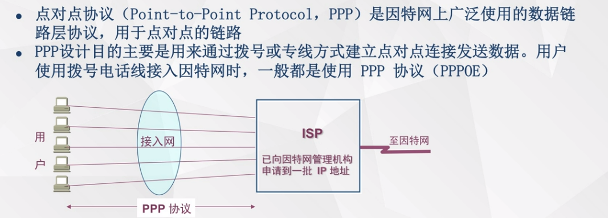
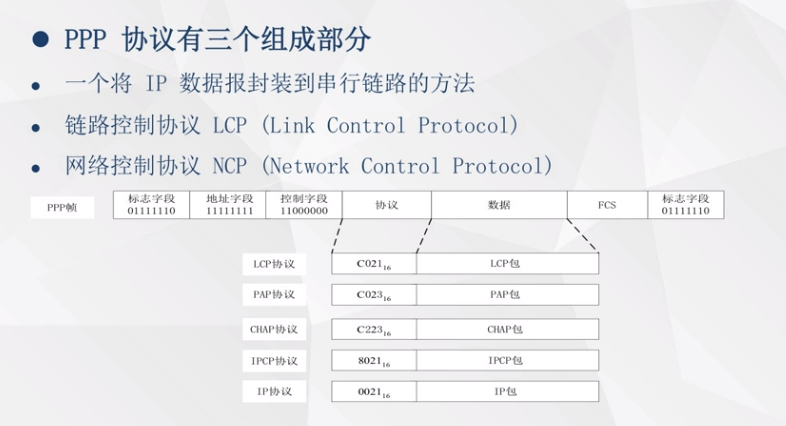
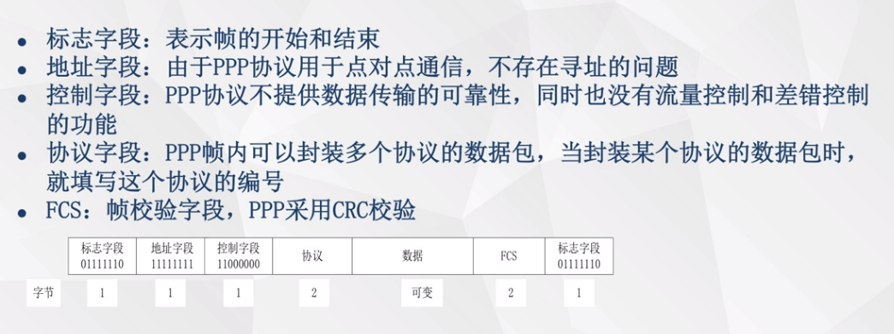
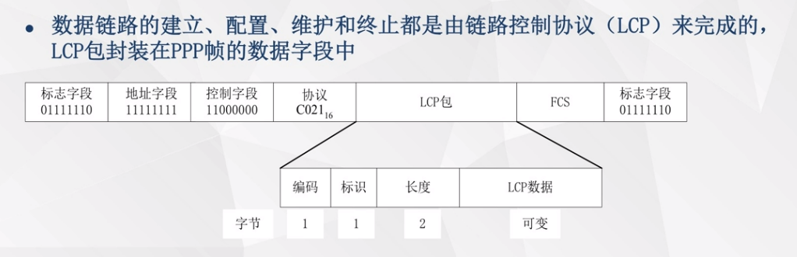
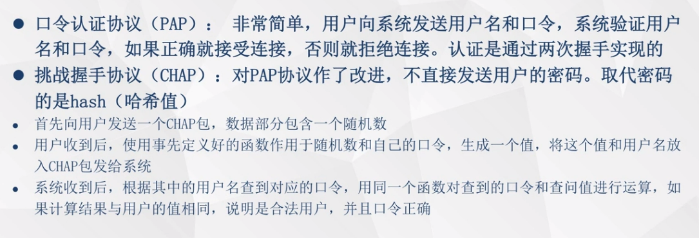
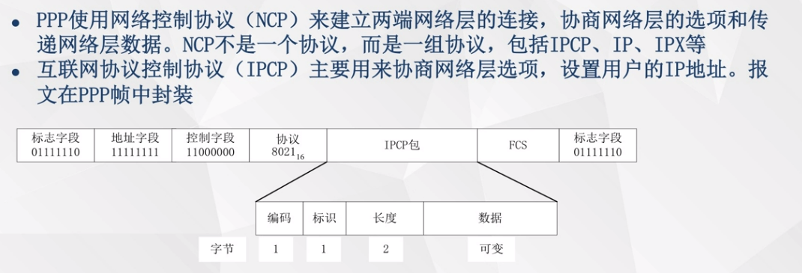
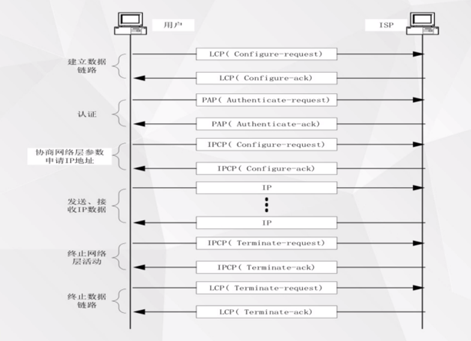
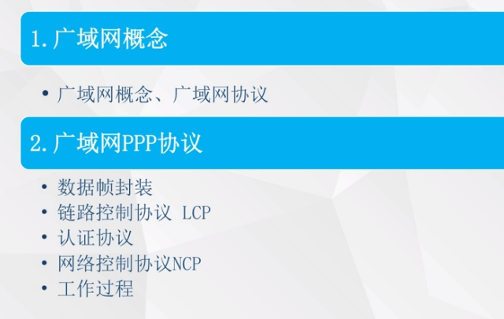

# 06广域网技术

PPP协议就属于租用线路

电路交换，电信运营商为每一次连接建立并维护一条专用的物理链路

分组交换，它可以实现多组通信

家庭中就是pppoE

### 工作过程

分为7个阶段

第一个阶段用户家中的计算机需要通过专用的呼叫设备，与路由器的对端建立物理链路的连接，一旦物理链路成功后。

进入第二阶段，也就是数据链路的连接，这个时候用户需要用LCP协议，发送LCP协议，跟用户的对端也就是电信运营商去协商在发送数据的时候用户名密码等情况 

一旦用户连接建立

进入第三阶段，就需要通过PAP协议或者是CHAP协议进入到用户认证阶段保证用户的合法接入

一旦接入成功

进入第四阶段，也就是网络层的配置阶段，它需要通过IPCP协议去请求和协商网络协议信息 地址等等

一旦IPCP协议成功，

进入第五阶段，接下来正式的运输网络层需要的信息，通过IP协议进行传输数据

当数据传输完成之后，

进入第六阶段，我们需要终止网络层的活动，需要关闭它的连接，通过IPCP协议释放申请到的IP地址等

进入第七阶段，通过LCP协议去中断数据链路层的连接，断开网络层的连接

