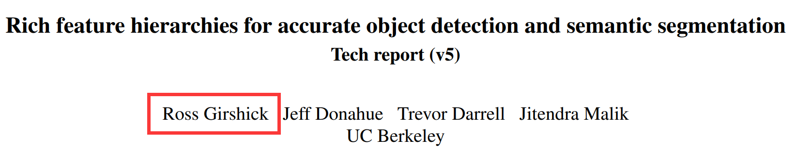
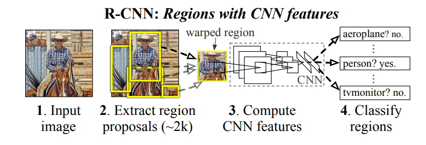

# Rcnn的学习笔记

author:Damon

### RCNN的源来：

**Since we combine region proposals with CNNs, we call our method R-CNN: Regions with CNN features.**

### 论文的成果：

**In this paper, we propose a simple and scalable detection algorithm that improves mean average precision (mAP) by more than 30% relative to the previous best result on VOC 2012—achieving a mAP of 53.3%.**

### 论文的原理分为四步：

- 第一步是导入一个图片

- 将图片划分为2千个左右的region proposals

  - While R-CNN is agnostic to the particular region proposal method, we use selective search to enable a controlled comparison with prior detection work
    - we use selective search’s “fast mode” in all experiments

- 对每个候选区域，使用深度网络提取特征 

  - Using the Caffe implementation of the CNN described by Krizhevsky et al.   
    - Features are computed by forward propagating a mean-subtracted 227×227 RGB image through five convolutional layers and two fully connected layers.
    - 227×227 RGB image    
  - We warp each proposal and forward propagate it through the CNN in order to compute features.
    - 大概就是一个region proposal 就会得到4096维，然后2000个region proposals就会得到2000x4096的矩阵

- 进行划分区域

  - Then, for each class, we score each extracted feature vector using the SVM trained for that class.
  - Object category classifiers.
    - 这两步骤大概就是，上面2000 X 4096矩阵与N个SVM分类器，权重矩阵是4096 X N ,然后通过IoU的方法进行目标分类
    - （原文翻译：我们通过IoU重叠阈值来解决这个问题，低于该阈值的区域被定义为负片。）

  - We followed the same protocol of submitting test results to the ILSVRC2013 evaluation server only twice, once with and once without bounding-box regression.

  - We use a simple bounding-box regression stage to improve localization performance. After scoring each selective search proposal with a class-specific detection SVM,we predict a new bounding box for the detection using a class-specific bounding-box regressor.

    （我们使用一个简单的边界框回归阶段来提高定位性能。在使用特定于类的检测 SVM 对每个选择性搜索建议进行评分后，我们使用特定于类的边界框回归器预测用于检测的新边界框。）

