# 项目思路：

author：Damon

感觉大部分时间都是在环境的配置和训练的等待

### 主流框架：

- pytorch
- Tensorflow
- 百度飞浆
- ...

### 项目目标:


**WoBERT**（Word-based BERT，我的BERT！）

https://github.com/ZhuiyiTechnology/WoBERT

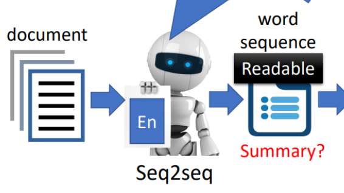

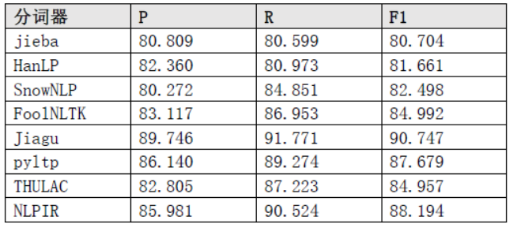

### 本周任务：

#### 学习tensorflow框架

过程略


#### 寻找有趣的项目进行测试调用

文本摘要：

尝试使用现有的模型进行测试

##### 开源jiagu自然语言处理工具：

```
例句
脸上疤痕可以通过抗疤痕类的药膏或者激光祛疤来进行治疗。抗疤痕类的药膏在涂抹一段时间之后，能够起到淡化疤痕的效果，激光去疤可以选择性的针对疤痕部位的皮肤，刺激皮下真皮层当中的胶原蛋白生成，达到淡化疤痕作用。可根据自身情况选择合适的治疗方法。
文本摘要

第0部分
激光去疤手术是通过激光的强光束，然后作用于局部皮肤的真层，通过特定波长的光照，使局部皮肤下的细胞发生萎缩，对色素沉着部位的疤痕进行击碎，随着人体的新陈代谢排出体外。
第1部分
脸上疤痕可以通过激光去疤的手术来进行治疗。
第2部分
术后要做好疤痕部位的护理。
***********************************************************************
***********************************************************************
例句
脸上疤痕可以通过激光去疤的手术来进行治疗。激光去疤手术是通过激光的强光束，然后作用于局部皮肤的真层，通过特定波长的光照，使局部皮肤下的细胞发生萎缩，对色素沉着部位的疤痕进行击碎，随着人体的新陈代谢排出体外。术后要做好疤痕部位的护理。
文本摘要

第0部分
1.一般来讲，6个月内的疤痕，会有较好的淡化效果。
第1部分
等到伤口愈合后，看看是否有明显的疤痕，如果有非常明显的疤痕建议尽早使用去疤产品。
第2部分
而且，如果伤口已经很长时间了，那么，使用的时间也会相应较长。
***********************************************************************
***********************************************************************
```


##### TextRank算法：

可以用来从文本中提取关键词和摘要（重要的句子）。TextRank4ZH是针对中文文本的TextRank算法的python算法实现。


```
**********************************************************************

疤痕 0.08419723070136931
疤 0.05558901051951859
淡化 0.052908333755792444
激光 0.05141342653221885
皮下 0.04241662602719115
治疗 0.04220002334765136
生成 0.0414948158742014
涂抹 0.0411024618905304
刺激 0.03956553259764127
起到 0.03956000638244823
脸上疤痕可以通过激光去疤的手术来进行治疗。激光去疤手术是通过激光的强光束，然后作用于局部皮肤的真层，通过特定波长的光照，使局部皮肤下的细胞发生萎缩，对色素沉着部位的疤痕进行击碎，随着人体的新陈代谢排出体外。术后要做好疤痕部位的护理。


关键短语：
淡化疤痕

摘要：
1 0.44641892869419647 激光去疤手术是通过激光的强光束，然后作用于局部皮肤的真层，通过特定波长的光照，使局部皮肤下的细胞发生萎缩，对色素沉着部位的疤痕进行击碎，随着人体的新陈代谢排出体外
0 0.3045998952438153 脸上疤痕可以通过激光去疤的手术来进行治疗
2 0.24898117606198822 术后要做好疤痕部位的护理
**********************************************************************


**********************************************************************

进行 0.059897361822319764
疤痕 0.05920166416793773
局部 0.05631578824628063
部位 0.04905208054882003
手术 0.04337499395896172
激光 0.04325369951920705
光照 0.04140542332855822
发生 0.040930259425218773
作用 0.0404960537600568
皮肤 0.0404960537600568
1.一般来讲，6个月内的疤痕，会有较好的淡化效果。而且，如果伤口已经很长时间了，那么，使用的时间也会相应较长。等到伤口愈合后，看看是否有明显的疤痕，如果有非常明显的疤痕建议尽早使用去疤产品。二恢复期间应注意饮食清淡，忌食鱼腥类、辛辣等含刺激性及色素的食物，并注意防晒。创伤愈合后使用消瘢痕药物，可防止瘢痕增生。三、海蓝迷迭香面霜与浓缩的修复精华相结合，效果更佳。


关键短语：
局部皮肤

摘要：
2 0.19888526983579333 等到伤口愈合后，看看是否有明显的疤痕，如果有非常明显的疤痕建议尽早使用去疤产品
3 0.16666666666666666 二恢复期间应注意饮食清淡，忌食鱼腥类、辛辣等含刺激性及色素的食物，并注意防晒
1 0.16452722286465415 而且，如果伤口已经很长时间了，那么，使用的时间也会相应较长
**********************************************************************
```

上面两个的文本摘要类似，估计是用了同一个训练集来进行训练

#####  WOBERT

BERT AlBERT

```

不知道哪里有问题，最简单的embeding调用都没成功

```


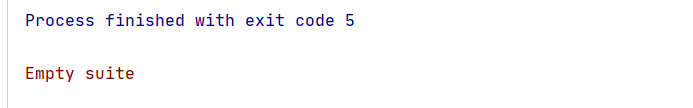

##### roberta-wwm-ext

哈工大讯飞联合实验室发布的预训练语言模型。


```

```

GPT2_chatrobot

```
  user :你好啊
chatbot:你好我好大家好
  user :你在干嘛呢
chatbot:你不上课啊
  user :今天是周末啊，笨蛋
chatbot:我在学校呢
  user :我也是，周末还要做作业
chatbot:我还没写呢我们都还没写
  user :周末你有去哪里玩吗
chatbot:没有去南京
  user :南京有什么好玩的啊
chatbot:我们没去南京
  user :你刚刚又说你去了南京，你是不是耍我啊
chatbot:我刚刚才到南京
  user :你好笨啊
chatbot:我没有
  user :你是大笨蛋
chatbot:你才是大笨蛋
  user :你全家都是大笨蛋
chatbot:你个傻冒
  user :你个智障
chatbot:哈哈哈
```

##### GPT2-Chinese

```
简单的测试
```

1.聊天机器人

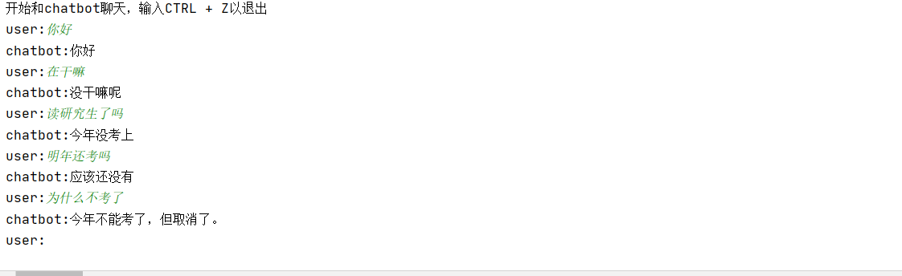

2.将九松的项目丢到gpt中进行训练，达到对话的效果

```
程序调了好久跑起来了，。
主要的方法就是将项目的文档中的question 和answer分别调整为对话的模式
然后继续训练
```

所以我觉得硬train一发试一试。

语料是选取原文的一万行（一万个问题和一万个回答）。

这个是训练100次的，loss从9降到1-2之间波动

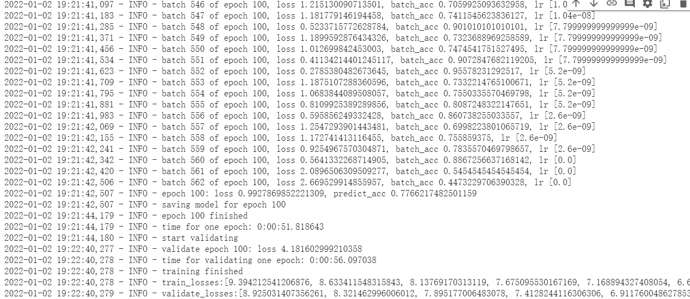

```
2022-01-02 19:22:40,278 - INFO - train_losses:[9.394212541206876, 8.633411548315843, 8.13769170313119, 7.675095530167169, 7.168894327408054, 6.680284395760913, 6.242924776789981, 5.855672719215583, 5.528983101726003, 5.257992410150711, 5.032820309608432, 4.830113964148688, 4.650783238037625, 4.488627111784504, 4.341833558371059, 4.203759667712174, 4.079586662855861, 3.9649964397063884, 3.8570013160807384, 3.758219253550221, 3.66452849377941, 3.5749222057145684, 3.4901652374301517, 3.407621936017508, 3.334779974404603, 3.258118092377415, 3.1843173223882384, 3.111846890738002, 3.0445906182625118, 2.976704877890726, 2.9088748057117666, 2.843440052029077, 2.7844423021710214, 2.724115063499301, 2.6636655156722697, 2.6115033696554733, 2.556359827518463, 2.5035662154710168, 2.451614359943892, 2.402268398698963, 2.3522367222877585, 2.306091042387952, 2.258909243493742, 2.213564133092602, 2.169309063314119, 2.1229847149916816, 2.082476588967008, 2.040263312355055, 2.0000454329511026, 1.963954761571307, 1.9238651098941992, 1.8840494172853084, 1.8474441612954666, 1.8077045308949684, 1.7736436749056141, 1.7402877322931731, 1.7086379118661439, 1.6746470987584667, 1.6447821766456252, 1.6117810503019556, 1.5859880606474825, 1.5571425937885066, 1.527848907530944, 1.5008443845336548, 1.4712562183468367, 1.446588495925228, 1.4236877710157443, 1.3969322347025854, 1.3738162646938474, 1.349772514980883, 1.3319223952675205, 1.3057379512069913, 1.2891498617430175, 1.2628922300194505, 1.246668194748753, 1.2283239737948488, 1.2106962141405222, 1.1939093950486268, 1.1772591370386585, 1.160769896097879, 1.1467037089566743, 1.1315433518742326, 1.1203926359949588, 1.1060954767189841, 1.0931848264249617, 1.08577193791756, 1.0703045574689676, 1.0626301480675933, 1.0534471379480328, 1.0444677373480542, 1.036486207855554, 1.0282853275431432, 1.0216686003891176, 1.0172540135549057, 1.0102018398428303, 1.0043421962507255, 1.0006179521092315, 0.9964074069813053, 0.9929503360464904, 0.9927869852221309]
2022-01-02 19:22:40,279 - INFO - validate_losses:[8.925031407356261, 8.321462996006012, 7.895177006483078, 7.4128244116306306, 6.911760048627853, 6.436667626142502, 6.022205178022385, 5.658925588607788, 5.372143914937973, 5.141236672878265, 4.947144538402557, 4.782794638395309, 4.639456669926643, 4.5144990278482435, 4.4048266541957855, 4.310493443131447, 4.228637467622757, 4.150640862345695, 4.092281212210655, 4.027838266968727, 3.9804865647554397, 3.9353609615564347, 3.896327164888382, 3.8616118495464327, 3.841895319700241, 3.8009235986471177, 3.773389645695686, 3.7452041758298873, 3.7302581877708434, 3.7003455584049223, 3.6795140198469163, 3.677558381199837, 3.666828485608101, 3.6594073263406752, 3.6497252523899077, 3.63587230348587, 3.6426544476747513, 3.641751308441162, 3.6511859724521636, 3.6535323917865754, 3.6626487950086593, 3.6673404488563537, 3.669611654996872, 3.6742229890823364, 3.683146933197975, 3.6910023905038836, 3.690880957484245, 3.709797265648842, 3.7271046777963637, 3.735590697646141, 3.738481905221939, 3.7534876207113266, 3.7762554000616073, 3.7819495877027514, 3.7894622919559477, 3.8134598764181136, 3.823231340646744, 3.8448539328575135, 3.848478351354599, 3.857445217013359, 3.8671263910532, 3.891594596147537, 3.9054920972585676, 3.912916296362877, 3.9370079987049102, 3.9562703642845154, 3.952501103401184, 3.982408679008484, 3.9911915543079375, 4.001718581676483, 4.013094441652298, 4.022560349106788, 4.036288563489914, 4.048122785449028, 4.052382466912269, 4.062670086741448, 4.072520968675613, 4.0835413697958, 4.094313834547997, 4.100085642814636, 4.101032098531723, 4.105542756319046, 4.120089974880218, 4.126816906690598, 4.138338206768036, 4.140814276337624, 4.1505305473804475, 4.152696082115173, 4.158907564878464, 4.161240339040757, 4.166684564113617, 4.168855149388313, 4.174205477595329, 4.17204379439354, 4.173314471244812, 4.175314700245857, 4.17816794347763, 4.179068223953247, 4.1812981171607975, 4.181602999210358]
[ ]

```


测试一下效果

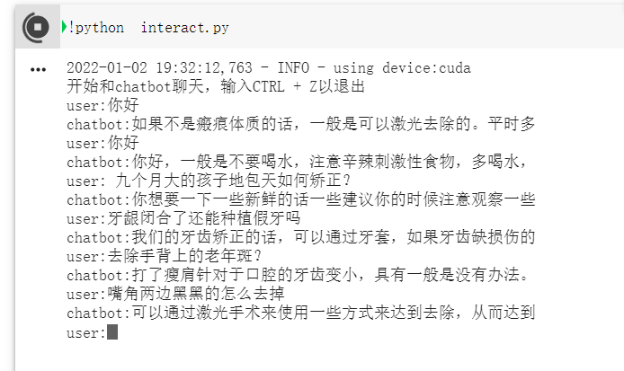


因为原作者的算法是设置对话类型，有max_len 的限制

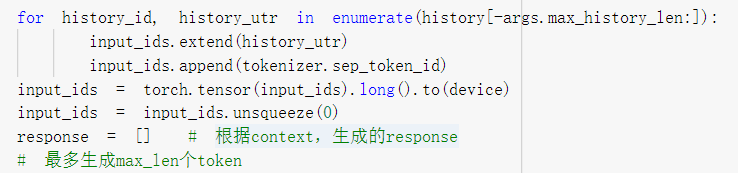

最后觉得项目要求的是文章类的，对话类的表达效果可能相对来说有限，对话效果很多都是基于原本的语料进行训练，和我们项目最初的想法不和

https://github.com/PaddlePaddle/RocketQA/tree/main/examples/

然后试一下国内的产品，因为生成中文的话，百度飞桨也许是一个不错的选择

##### 百度飞桨

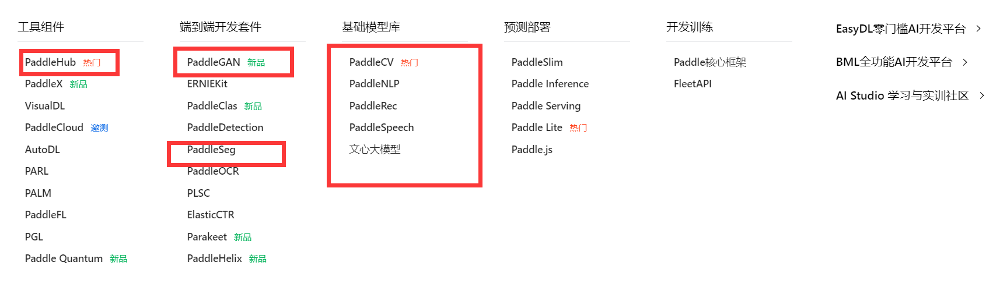


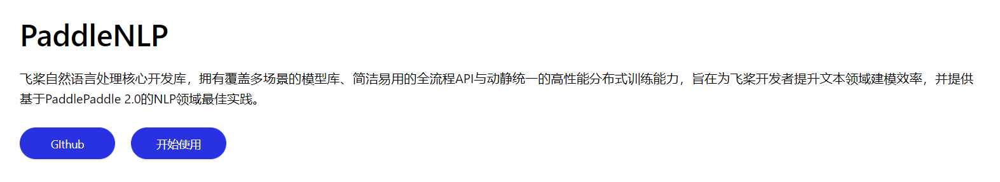


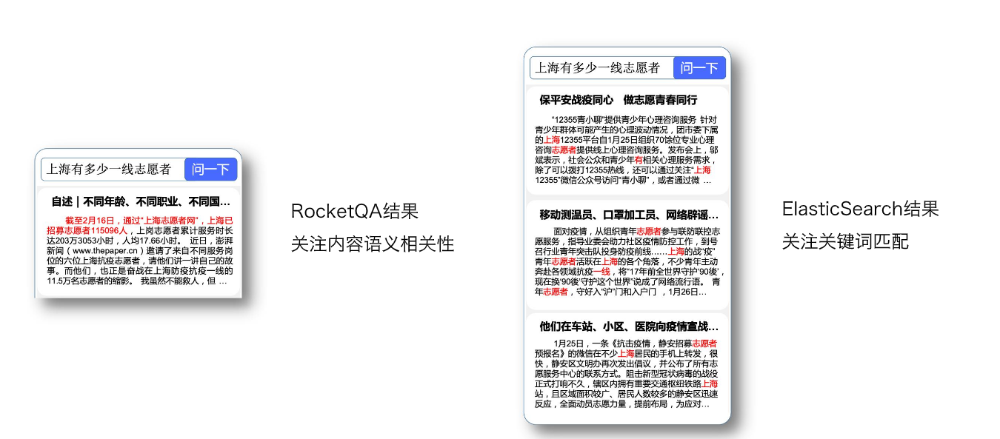

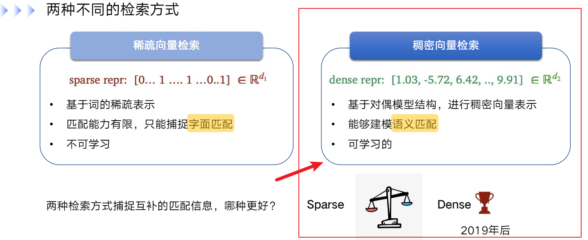

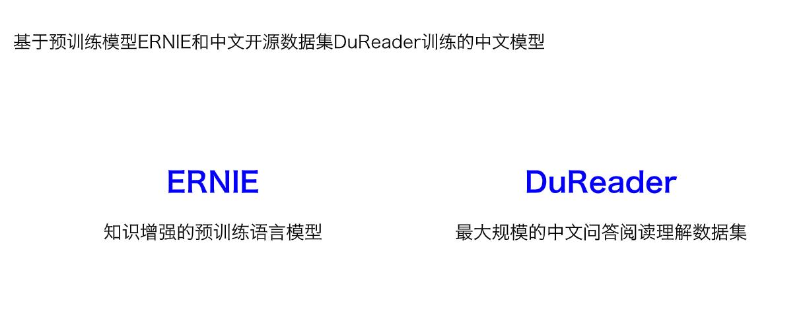

```
已开源
```

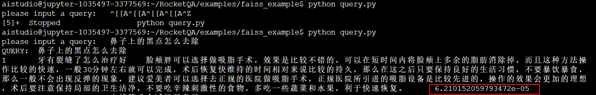

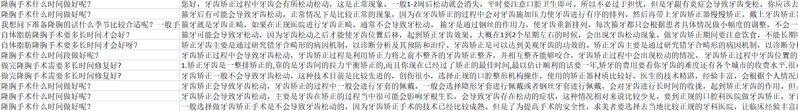

数据集可能是有一些问题的，这个是原本设置的干扰还是其他？

然后就结束了。。
