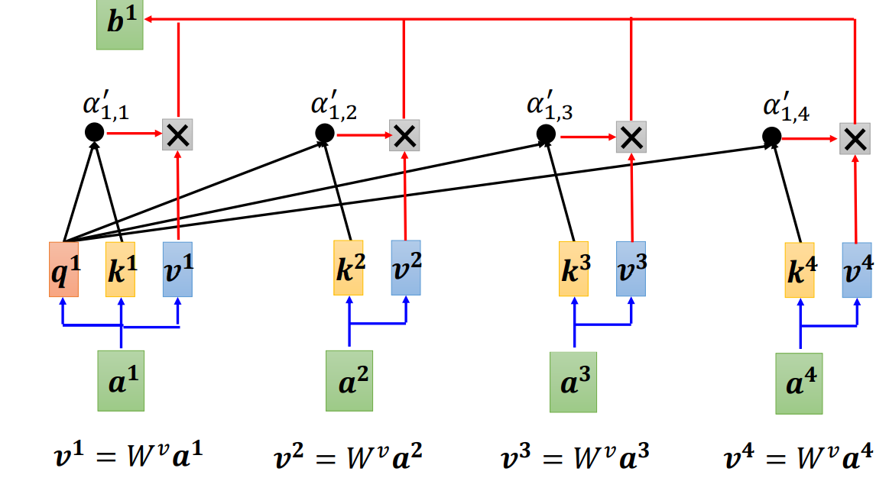
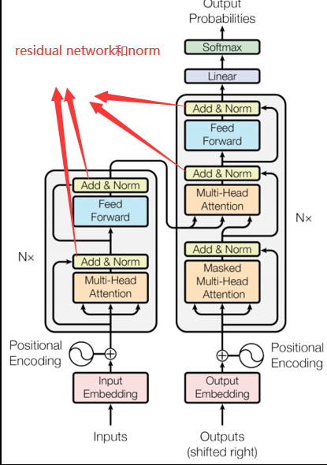
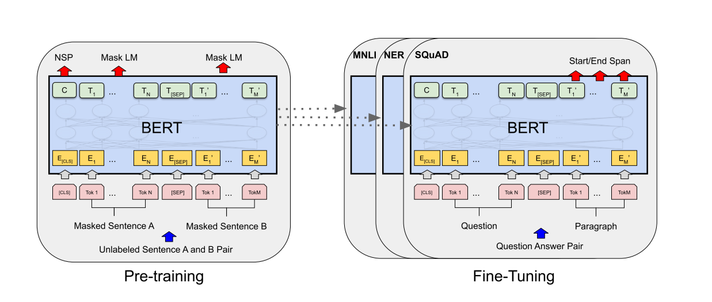
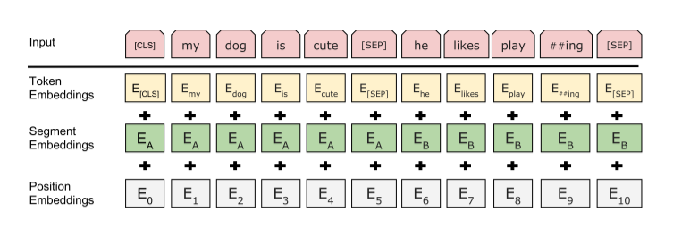
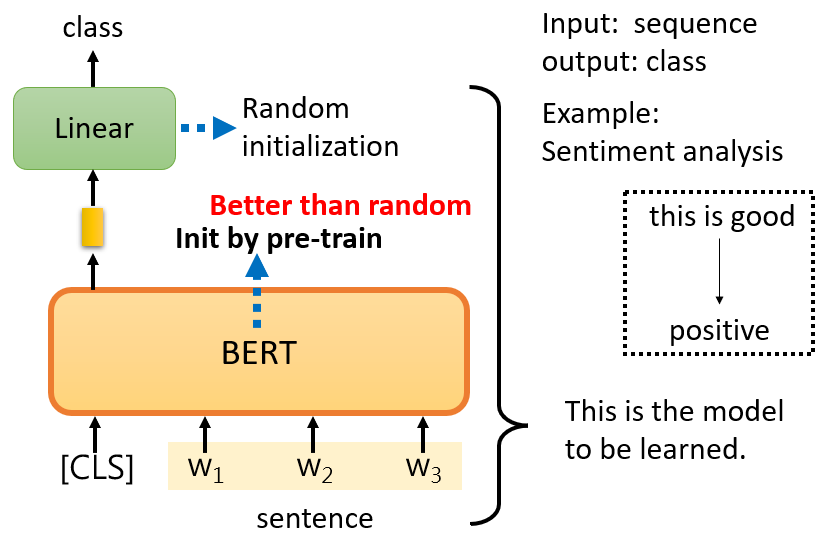
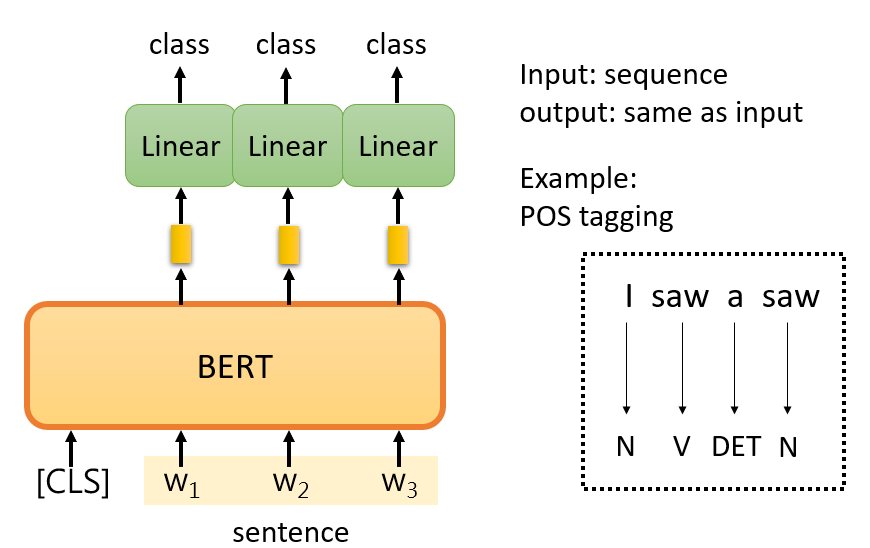
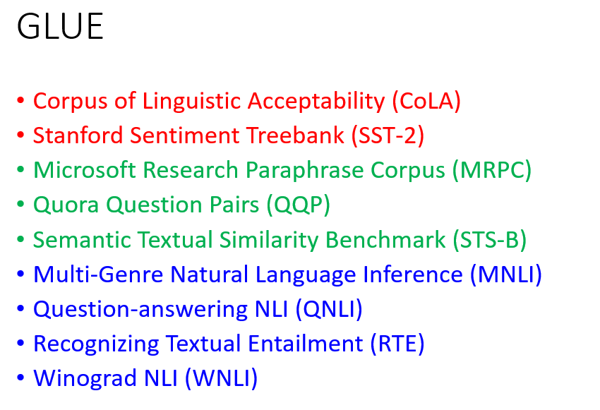
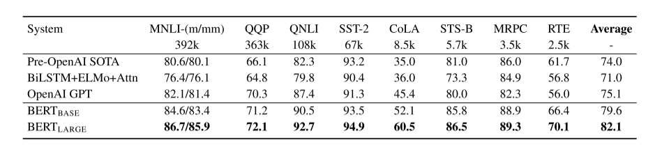

# BERT论文的学习笔记

author：Damon

# Bert：用于语言理解的深度双向转换器的预训练

简述：BERT模型十分的大，340M

### Abstract

BERT is conceptually simple and empirically powerful. It obtains new state-of-the-art re- sults on eleven natural language processing tasks, including pushing the GLUE score to 80.5% (7.7% point absolute improvement), MultiNLI accuracy to 86.7% (4.6% absolute improvement), SQuAD v1.1 question answer- ing Test F1 to 93.2 (1.5 point absolute im- provement) and SQuAD v2.0 Test F1 to 83.1 (5.1 point absolute improvement).

Bert在概念上很简单，在经验上很强大。它在11个自然语言处理任务上获得了新的最先进的结果，包括将GLUE得分提高到80.5%（7.7%的绝对提高），将MultiNLI准确率提高到86.7%（4.6%的绝对提高），将Squad v1.1问答测试F1提高到93.2（1.5点的绝对改进）和将Squad v2.0测试F1提高到83.1（5.1点的绝对改进）。

简单来说：

与别的文章的区别是什么？效果有多好？，结果都是非常非常号，测试的评分也明显提高

### Introduction

#### 提出了现有的问题：

We argue that current techniques restrict the power of the pre-trained representations, espe- cially for the fine-tuning approaches. The ma- jor limitation is that standard language models are unidirectional, and this limits the choice of archi- tectures that can be used during pre-training.

我们认为，当前的技术限制了预先训练表示的能力，特别是对于微调方法。主要的限制是标准语言模型是**单向的**，这限制了预训练期间可以使用的体系结构的选择。

In this paper, we improve the fine-tuning based approaches by proposing BERT.

在本文中，我们通过提出BERT改进了基于微调的方法.

#### 简答小结（结合全文）：

Bert 模型主要是参考了 Elmo的双向信息（句子从左看到右，从右看到左），使用了transform的enconde的模型。

原文说现在的BERT的模型已经十分好了，我们要使用的话仅仅只需要通过fine-tune的就可以训练好自己的模型

**什么是enconde?**

个人理解就是，transform就是一个用于机器翻译的模型，然后BERT只采用了transform的encoder模块，encoder在这里我觉得就是理解句子，也就是标题说的language understanding。input 和output 是一样的。

self -attention,自注意机制

transform的基本模块encoder和decoder

### Related Work（相关工作，主要技术）

主要就是想说明bert整个模型是一个**Unsupervised和supervised**的过程。

**pre-train过程是unsupervised learning（资料来源于自身），fine-tune过程是supervised learning（有标注的资料），所以整个过程是semi-supervised。（参考csdn）**

**Masked sentence 是什么呢**？

常用的maked的方法：

- 遮住某些词汇，文章也是简单说了，尽量不要第一个和最后一个
- 替换词汇

本文使用的方法是，系统随机使用上面两种方法，作为maked sentence 的方法

**Nest sentence prediction 是什么？**（sop）

就是对句子a 和句子吧 进行判断，看看是否属于同一个矩阵，文章说了两种方法，一种是加token ,一种是加多神经网络最后classification。

本文使用的是加一个token

【cls】看句意，用于分割

【sep】句子分割

这里还 引用了一个叫word piece的方法，就是其他的【】

大概的意思就是，机器直接阅读的计算量太大了，我们给机器一个字典，减少工作量

### 实验

### 结论（Conlusion）

首先是在很多个测试集中表现很好，比如说GLUE

测试的分数

Recent empirical improvements due to transfer learning with language models have demonstrated that rich, unsupervised pre-training is an integral part of many language understanding systems. In particular, these results enable even low-resource tasks to benefit from deep unidirectional architec- tures. Our major contribution is further general- izing these findings to deep bidirectional architec- tures, allowing the same pre-trained model to suc- cessfully tackle a broad set of NLP tasks.

由于语言模型的迁移学习，最近的经验改进表明，丰富的、无监督的预训练是许多语言理解系统的组成部分。特别是，这些结果使得即使是低资源任务也能从深度单向架构中受益。我们的主要贡献是将这些发现进一步推广到深度双向架构，允许相同的预训练模型成功处理广泛的NLP任务。

小结：

**BERT用的是编码器，GPT用的是解码器。BERT做机器翻译、文本的摘要（生成类的任务）不好做。**

**还有一个就是模型真的越大越好。**

tips:

**supervised learning是需要有标签的资料的，而self-supervised learning不需要外界提供有标签的资料，他的带标签的资料源于自身。**

