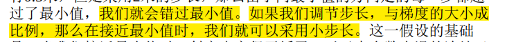
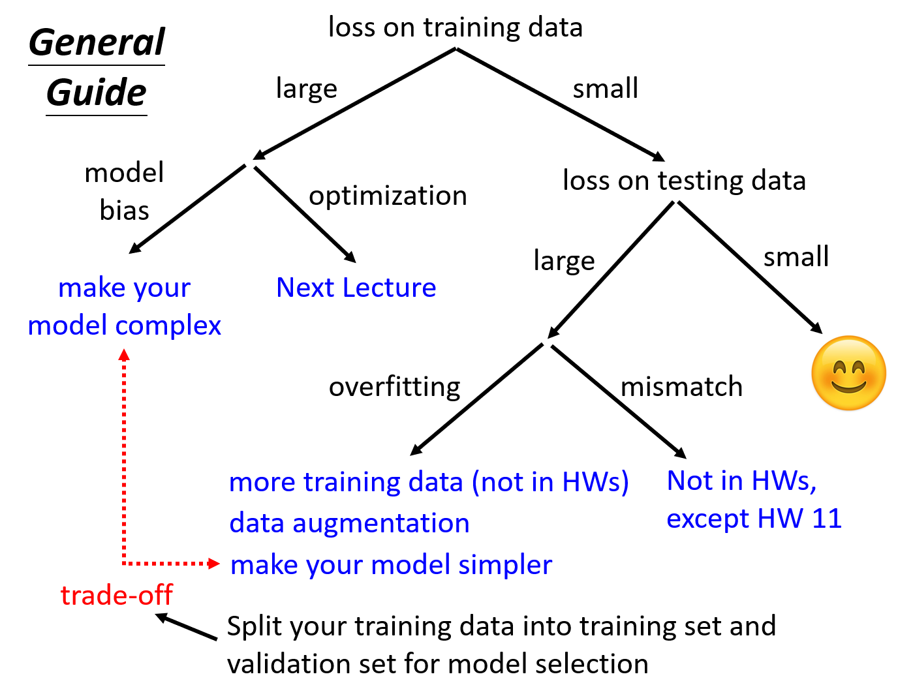

# 视频学习笔记

author:damon

在论文中：

**self-attention**

**transformer**

**bert** 

侧重点：

**反向传播**

**loss**

loss是关于未知参数的函数，不同的参数将算出不一样的loss，而loss 就是用来评估这些未知参数好不好的，loss越小，证明预测得越准。

**loss 的计算方式有很多种，例如 MAE（绝对平均误差）、MSE（均方误差）、cross entropy（交叉熵）**

**optimization**

主要的方法：

- gradient descent
- batch

这里会遇到叫**Critical Point**，所以我们得对GD 进行进一步的优化,引入了**Momentum（动量）**

给GD一个刹车.

就是疯狂的加参数，给GD更有弹性。

 **Adaptive learning rate**

Adam

**Batch Normalization**

 **softmax**

### 小结

CNN

全连接

卷积

池化
