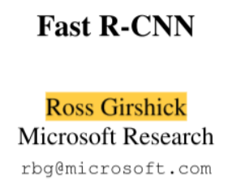
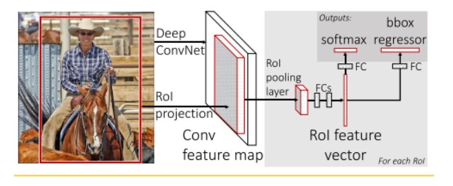

# Fast Rcnn的学习笔记

author:Damon

### 前言

Rcnn         是基于AlexNet来实现的

Fast Rcnn 是基于VGG16 来实现的

前言主要说了Fast Rcnn网络速度比上一篇Rcnn 相比 速度以及准确率都得到了提高

### 需要解决的目标：

 First, numerous candidate object locations (often called “proposals”) must be processed. Second, these candidates provide only rough localization that must be refined to achieve precise localization. Solutions to these problems often compromise speed, accuracy, or simplicity.

首先，必须处理许多候选对象位置（通常称为“建议”）。其次，这些候选对象只提供粗略的定位，必须进行细化以实现精确的定位。针对这些问题的解决方案通常会影响速度、准确性或简单性。

### 将采用的方法：

We propose a single-stage training algorithm that jointly learns to classify object proposals and refine their spatial locations.

我们提出了一种单阶段训练算法，联合学习分类目标建议和优化它们的空间位置。

 

三个步骤：

An input image

一张图像生成1K~2K个候选区域(使用Selective Search方法) 

****

The network first processes the whole image with several convolutional (conv) and max pooling layers to produce a conv feature map

该网络首先用多个卷积(conv)和最大池化层来处理整个图像，以生成一个conv特征图

第二步的话原文说参考了spp net的方法：大概就是直接是在原图找ROI,然后将ROI投影到特征图中。然后在通过池化层将图片变成7X7大小的特征图（The RoI pooling layer uses max pooling to convert the features inside any valid region of interest into a small feature map with a fixed spatial extent of H×W (e.g., 7 × 7),）

****

Then, for each object proposal a region of interest (RoI) pooling layer extracts a fixed-length feature vector from the feature map.Each feature vector is fed into a sequence of fully connected (fc) layers that finally branch into two sibling output layers: one that produces softmax probability estimates over K object classes plus a catch-all “background” class and another layer that outputs four real-valued numbers for each of the K object classes. Each set of 4 values encodes refined bounding-box positions for one of the K classes.

然后，对于每个对象建议，感兴趣区域（RoI）池层从特征图中提取固定长度的特征向量。每个特征向量被输入到一系列完全连接（fc）的层中，这些层最终分为两个同级输出层：一个层对K个对象类加上一个“背景”类生成softmax概率估计，另一个层为K个对象类中的每一个输出四个实数。每组4个值对其中一个K类的限定边界框位置进行编码。

第三步的话，就是将7x7大小的特征图展平成特征向量，然后通过一系列的全连接层得到RoI feature vector ，最后并联两个全连接层分别得到一个目标概率和边界框回归参数

****

 loss

正样本、负样本

