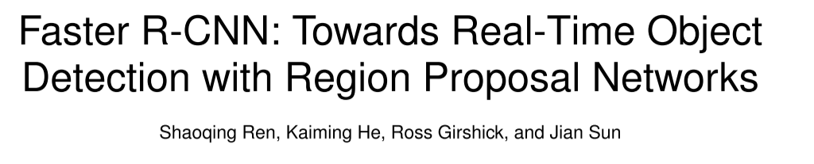
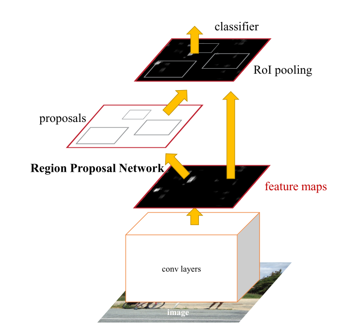
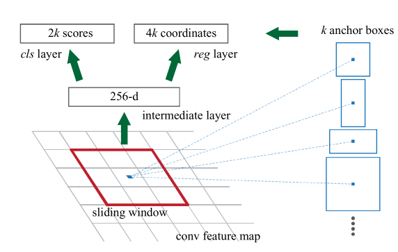

# Faster Rcnn的学习笔记

author:Damon

论文的研究成果：

论文的方法：

Region proposal methods typically rely on inex- pensive features and economical inference schemes. Selective Search [4], one of the most popular meth- ods, greedily merges superpixels based on engineered low-level features. Yet when compared to efficient detection networks [2], Selective Search is an order of magnitude slower, at 2 seconds per image in a CPU implementation. EdgeBoxes [6] currently provides the best tradeoff between proposal quality and speed, at 0.2 seconds per image. Nevertheless, the region proposal step still consumes as much running time as the detection network.

区域提议方法通常依赖于廉价的特征和经济的推理方案。选择性搜索[4]是最流行的方法之一，贪婪地合并基于工程低级特征的超像素。然而，与有效的检测网络[2]相比，选择性搜索慢了一个数量级，在CPU实现中每幅图像2秒。EdgeBox[6]目前提供了提案质量和速度之间的最佳权衡，每张图像0.2秒。尽管如此，区域建议步骤仍然消耗与检测网络一样多的运行时间。

In this work, we introduce a Region Proposal Network (RPN) that shares full-image convolutional features with the detection network, thus enabling nearly cost-free region proposals. An RPN is a fully convolutional network that simultaneously predicts object bounds and objectness scores at each position. The RPN is trained end-to-end to generate high-quality region proposals, which are used by Fast R-CNN for detection.

在这项工作中，我们引入了一个区域建议网络（RPN），它与检测网络共享完整的图像卷积特征，从而实现几乎免费的区域建议。RPN是一个完全卷积的网络，可以同时预测对象边界和每个位置的对象性分数。RPN经过端到端的训练，生成高质量的区域建议，并由Fast R-CNN用于检测。

rpn的原理

To generate region proposals, we slide a small network over the convolutional feature map output by the last shared convolutional layer. This small network takes as input an n × n spatial window of the input convolutional feature map. Each sliding window is mapped to a lower-dimensional feature (256-d for ZF and 512-d for VGG, with ReLU [33] following). This feature is fed into two sibling fully- connected layers—a box-regression layer (reg) and a box-classification layer (cls). We use n = 3 in this paper, noting that the effective receptive field on the input image is large (171 and 228 pixels for ZF and VGG, respectively). This mini-network is illustrated at a single position in Figure 3 (left). Note that be- cause the mini-network operates in a sliding-window fashion, the fully-connected layers are shared across all spatial locations. This architecture is naturally im- plemented with an n×n convolutional layer followed by two sibling 1 × 1 convolutional layers (for reg and cls, respectively).

为了生成区域方案，我们在最后一个共享卷积层的卷积特征地图输出上滑动一个小网络。该小型网络以输入卷积特征映射的 n × n 空间窗口作为输入。每个滑动窗口映射到一个低维特征(zf 为256-d，vgg 为512-d，relu [33]随后)。该特征被输入到两个同级的全连接层中，即盒回归层(reg)和盒分类层(cls)。在本文中我们使用 n = 3，注意到输入图像上的有效感受野很大(zf 和 vgg 分别为171和228像素)。这个迷你网络在图3(左)的单一位置显示。请注意，由于微型网络以滑动窗口的方式运行，完全连接的层是跨所有空间位置共享的。该体系结构自然地实现了 n × n 卷积层和两个同级1 × 1卷积层(分别用于 reg 和 cls)。