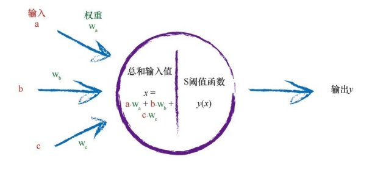

# Python神经网络编程

author:Damon

### 前言：

我们将从非常简单的预测神经元开始，然后逐步改进它们，直到达到 它们的极限。顺着这条路，我们将做一些短暂的停留，学习一些数学概 念。我们需要这些数学概念来理解神经网络如何学习和预测问题的解。

我们将浏览一些数学思想，**如函数、简单的线性分类器、迭代细化、 矩阵乘法、梯度演算、通过梯度下降进行优化，甚至是几何旋转。**但是， 所有这些数学概念将会以一种非常优雅清晰的方式进行解释，并且除了简 单的中学数学知识以外，读者完全不需要任何前提知识或专业技术。

### 第一章

预测机（Regression）

持续地、一点一点地改进答案的方法称为迭代。

分类器（classification）

**迭代细化:**

迭代的正确方法：我们采用ΔA 几分之一的一个变化值，而不是采用整个ΔA，充满激情地跳跃到每一个新的A值。

神经元

阈值：输入得满足设定的要求

**sigmoid函数：**

矩阵乘法

