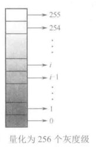

# 数字图像处理第一章

author:Damon

## 数字图像处理及应用第一章学习

### 基本概念：

**1.1**

图像分为两种，模拟图像和数字图像两类。模拟图像是通过某种物理量的强弱变化来记录图像上各个点的亮度信息。数字图像则完全是用数字来记录图像的亮度信息。

在计算机中，组成数字图像的基本单位是像素（Pixel） /ˈpɪksl/

数字图像处理的基本特点：

- 处理信息量大
- 占用频带较宽
- 各像素相关性大（图像信息的压缩潜力大）
- 受人的因素影响大（因为计算机视觉是模仿人的视觉，所以图像的质量评价还有进一步研究）

数字图像处理的优点：

- 再现性好
- 处理精度高
- 适用面宽
- 灵活性高

数字图像处理的主要研究内容：

- 图像获取
- 图像变换（傅里叶变换等）
- 图像编码压缩
- **图像增强和复原**（预处理环节，目的提高图像质量）
- **图像分割**（有意义的特征部分提取出来）
- 图像描述
- 图像匹配（寻找相似性）
- 图像融合
- **图像识别**（图像识别是图像经过某些预处理_**增强、复原、压缩**_后，进行图像分割和特征提取，从而进行判别分类。对图像目标分类识别常采用经典的统计模式分类方法，以及后来发展起来的人工神经元网络和支持向量机等分类方法）
- **运动目标检测和跟踪**

**1.2**

图像的获取手段：

- CCD图像传感器
- CMOS图像传感器
- CID图像传感器
- 其他典型成像设备

图像的显示与输出：

- 输入信号

  - 模拟信号：

    该显示屏只有R、G、B三路模拟信号可以输入

  - 数字信号：

    该显示屏的输入信号是数字信号

  - 合成视频信号：

    它的输入信号是包含色度、亮度和同步信号的混合视频信号，通过一根视频信号线传输

现有的打印输出，主要采用半调输出技术。半调输出技术是通过将灰度（或彩色）图像转化为二值点模式，从而在输出设备上保持输出图像原有的灰度级，它主要分为幅度调制技术（通过调整输出黑点的尺寸来显示不同的灰度）和频率调制技术（使用空间分布变化来表示不同的灰度，如果黑点分布比较密，所表示的灰度就比较暗，反之，如果分布比较稀疏，则表示比较亮的灰度）两类。

**1.3**

采样：就是把位置空间连续的**模拟图像f(x,y)**转化成**离散点集合**的一种操作

量化：就是把图像fx(x,y)在各个采样点上连续的值变化成离散值或整数值的一种操作。

量化分为两种：

- 均匀量化，如上图将图像的灰度值平均分为256等分，对于黑--白范围内交均匀分布的图像，可以得到较小的量化误差
- 非均匀量化是依据一副图像具体的灰度值分布的概率密度函数，按总的量化误差最小的原则进行的量化。
  - 具体做法：对图像中的像素灰度值分布频繁出现的灰度值范围，量化间隔可以取下一些。对于那些像素灰度值较小出现的范围，则量化的间隔要大一些。

**1.4**

自然界的所有颜色都可以有**红绿蓝（R、G、B）**三种颜色合成，图像处理也是如此。

油墨和颜料的三基色是CMY,CMY三基色的特点就是油墨和颜料用得越多，颜色就越暗，所以CMY称为**三减色**

HSI(Hue/Saturation/Intensity,色调、饱和度、强度)模型。采用色调和饱和度来描述颜色，

色调表示颜色，颜色与彩色光的波长有关。

饱和度表示色的纯度，也就是彩色光掺杂白光的程度。白光越多饱和度越低。

强度表示人眼感受到彩色光颜色的强弱程度

图像类型：

- 二值图像（黑、白）
- 灰度图像（灰度图像只表达图像的的亮度信息而没有颜色信息。）
- 彩色图像（不仅包含亮度信息，还要包含颜色信息。彩色的表示方法是多样化的）

数字图像的可以使用矩阵来表示，因此可以采用矩阵理论和矩阵算法对数字图像进行分析和处理

二维数组的**行**代表图像的**高**，二维数组的**列**代表图像的**宽**,二维数组元素的值就是像素的灰度值

**这边的行和列和我们平时说的好像相反**

图像数据的存储

**1.5**

图像质量评价

**图像处理系统的终端都是人眼**

HVS（Human Visual System）的结构

HVS包括从光线入眼到大脑成像的四个生理处理过程：光学处理、视网膜处理、侧膝体处理、和视皮层处理。

图像质量主管评价

- 绝对评价

  

- 相对评价

  

图像质量客观评价分为三类：全参考、部分参考、无参考

算法性能评价

