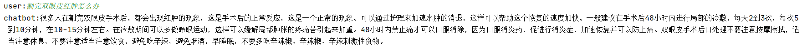
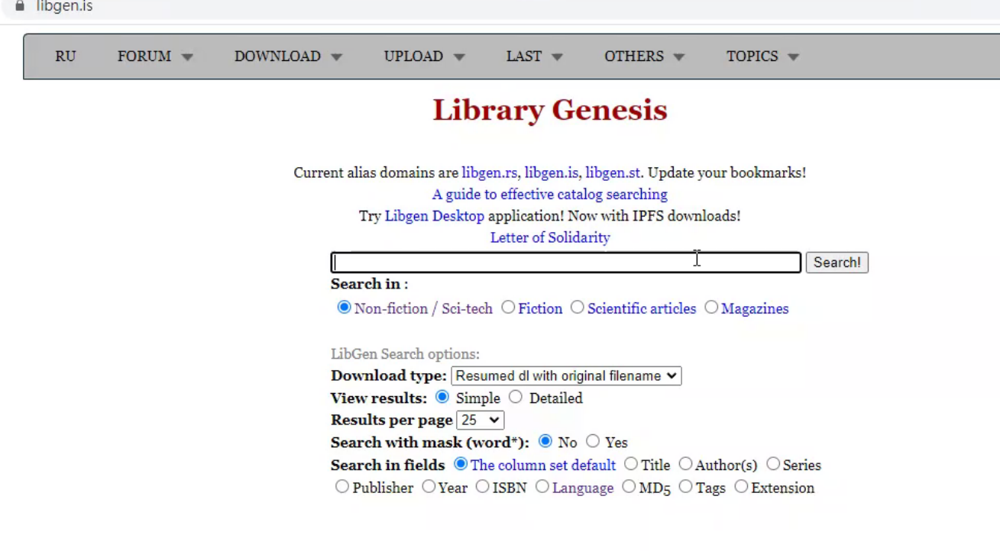

# 项目思路2.0

author:Damon

### 前言：

上次语料有问题，终止了gpt2的训练，这次使用新的语料进行简单的训练和测试

ok

直接找个项目进行测试

### 正文

这次准备基于上次的例子对模型进行训练，目标训练1000次，数据集选择全文。

最后训练了250次

占用内存大概80个G

epoch40:

epoch50:

user:割完双眼皮红肿怎么办
chatbot:"患者割完双眼皮红肿，此时需要进行正确判断，部分患者无需担心。通常2-3天是红肿、淤青，此时淤血、肿胀最明显，5天后拆线，淤血、淤青消散。拆线后可能还会出现红肿，此时可以使用热毛巾进行热敷，加速局部血液循环，促进渗出和淤青消退。热敷1周左右基本可恢复到术前上眼皮的红肿，此时可以辅助辅助服用活血化瘀、活血化瘀、云南白药等药物，加速淤血消肿药物。服用促进行辅助治疗，可促进淤血化瘀青散瘀类补充血消散。

epoch55:

user:割完双眼皮红肿怎么办
chatbot:在做完双眼皮手术之后，出现红肿是正常的表现，只要在手术区域局部区域，一般不可以化妆，尽量不要使用刺激性的化妆品，局部可以涂抹红霉素软膏进行外涂，一般手术后三个月内都可以恢复的，局部的红肿会逐渐消退。求美者在双眼皮手术之后三个月，如果还是红肿和烧灼感，考虑是瘢痕增生的因素，考虑是组织修复的时候，不要过于紧张和瘢痕软化，否则会对于刺激局部位，否则会影响瘢痕软化妆。因此时要进行相应在手术后期涂抹消退，不要多做好很多注意，否则会使用防止

epoch140:

user:割完双眼皮红肿怎么办

chatbot:做完双眼皮以后，局部的红肿是不能完全避免的，因为刚做完手术有创伤，肯定有红肿、淤青，是正常现象，但是应该在一两周的时间内，红肿就大部分消退了，两周以后淤青也基本消退了，是正常的现象。如果红肿三天以后越来越重，要提高警惕，因为有感染和过敏的可能。感染就是有炎症，需要吃抗生素，必须经过一些消炎药，必须经过一些治疗，吃抗生素严格外用药，必要脱止。当然后注意饮食盐酸纠正确保护理的饮食可以，放心情绪和护理的饮食，减少吃抗生活血、多吃的摄入高蛋白、高蛋白、高维生素，少食物，摄入富含蛋白中的食盐、高蛋白质、蔬菜、营养，补充蛋白质、摄入过度都有营养，少摄入辛辣椒、蛋白质辣椒、高的摄入，少吃的食物的食物。

epoch149

user:割完双眼皮怎么办
chatbot:"割双眼皮即进行双眼皮手术，术后需注意进行眼部活动，多数可能是眼部肿胀导致，其眼部肿胀在减轻或不适，需要注意休息，尽量减少眼睛疲劳。双眼皮手术后，建议多休息为好，避免过度用眼，术后3天内还要进行冰敷，以减轻眼部肿胀，可以缓解眼部肿胀。

epcoh250:

user:割完双眼皮红肿怎么办

chatbot:早期，如果双眼皮出现红肿，要警惕是否有麦粒肿的形成，这种情况下不要紧张。如果刚刚做完手术，患者眼睑部位的水肿，感觉有点呆板，有点疼，无论是睁开眼还是闭眼，都是正常的。但如果在闭眼的时候，可以看到小的点疼痛，但是不是很明显，这种情况下，可以耐受。

GPU:

user:割完双眼皮怎么办 

chatbot:"割双眼皮即进行双眼皮手术，术中需切开、缝合，伤口需一段时间自然愈合。术后为使肿胀减轻或减少出血，可让患者术后当天进行冰敷。

 user:割完双眼皮红肿怎么办 

chatbot:双眼皮手术后，因为术中适当的进行冰敷，可以减轻术后出血和肿胀，促进恢复。术后的恢复、减少的疼痛感，但注意用眼卫生，饮食要清淡，避免辛辣刺激性食物。" 

user:割双眼皮需要多少钱

 chatbot:割双眼皮一般选择7天内、术后热敷4天，而术后需要睡觉得到第5天，可以后进行睁开始消肿胀。此期拆线，以后拆线未拆线，以后拆线，拆线处于软化妆可能恢复查患者不会造成活动脉回流血、浓妆，故已经历辛辣、卸妆，如果影响伤口，以及避免揉搓眼睛一般不需要用力不会对着急于影响拆线，但是拆线，如果保留下。" 

简单说一下自己的观点：

- 感觉不是epoch越多次，效果就越好。
- cpu和Gpu训练的效果不同，GPU的答案更为简洁
- gpt也许不是最好的选择，按照项目的要求也许深度学习很难train出来，随机森林也许是不错的选择，bert+知识图谱。

因为gpt2这个有很大的随机性，可以设置seed来限制，训练简单，但是回答时间效率低。

为了提高时间效率估计得回到bert中。bert比gpt2模型简单一些，使用特定的语义索引模型来训练。

然后具体的思路,等看完知识图谱，mluvus。

