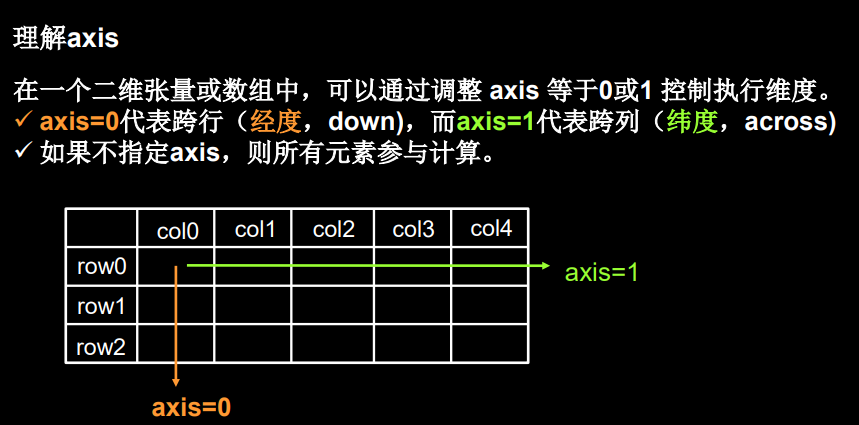

# Tensorflow的学习笔记

author:Damon

### Tensorflow2历史:

- 2019年3月，测试版发布
- 2019年10月，Tensorflow2.0发布
- 2020年1月，Tensorflow2.1发布

### 第一章：

#### Tensor(张量):

多维数组，阶：张量的维数

看方括号有几个，0个是0阶，n个是n阶

#### 数据类型：

#### 创建张量：

**tf.constant(张量内容，dtype=数据类型（可选）)**

最后一个，逗号隔开几个数字代表是几维向量

（2，）代表：1维，里面有两个元素

将numpy的数据类型转换为Tensor数据类型：

**tf. convert_to_tensor(数据名，dtype=数据类型(可选))**

常用函数

TensorFlow中的数学运算

**最大值的索引**

#### 鸢尾花分类实验

### 第二章

#### 预备知识

两个向量的最大值

