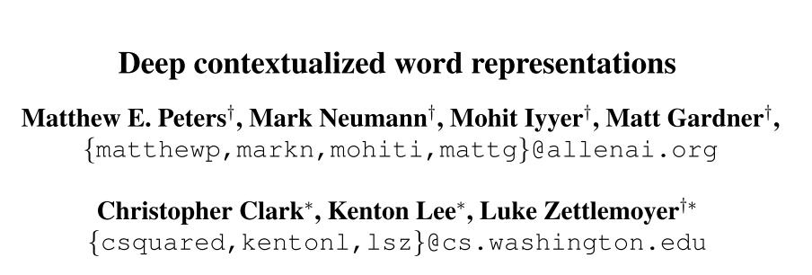
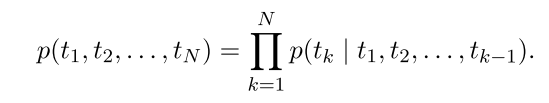
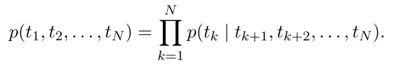
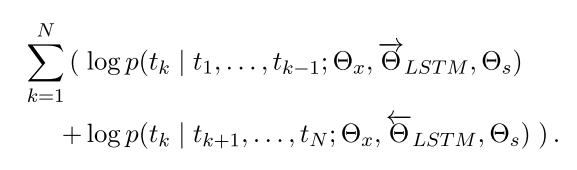
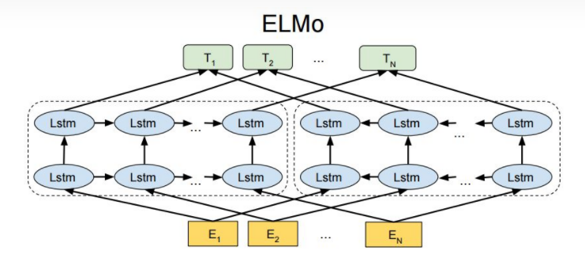
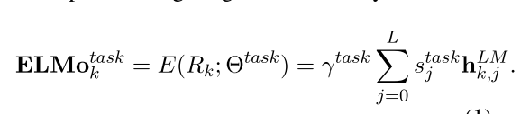

# ELMO的学习笔记

author:Damon

**For this reason, we call them ELMo (Embeddings from Language Models) representations.**

### 背景：

   Word2vec和GloVe都属于静态的词向量，无法解决一词多义的问题。
   ELMo、Bert、GPT、它们都是基于语言模型的动态词向量。

#### Word2vec：

简单来说就是，开始大家用的方法是One-Hot简单的方法，但是因为有一词多义的现象，然后呢，就提出了一个Distributed Representation的方法。通过这个方法，可以将词从稀疏变得更加紧凑。这个方法有点连接上下文的感觉。

bert的预训练方法借鉴了word2vec。

#### GloVe:（没看太懂，可能解释有误）

简单来说就是，GloVe的提出者觉得Word2vec 不行，然后提出了共同概率的方法（共现矩阵），行是词向量，列是句子。词义相近的词语一起出现的概率高，反之亦然；提出了两个向量，词向量，句向量。然后通过很复杂的数学公式（统计学相关的），得到GloVe模型，可以让词向量包含更多的语义。

-----

### 正文

#### 论文的成果：

significantly improve the state of the art across six challenging NLP problems

能够解决在当时的NLP问题，并且有很好的表现

#### 论文的前言：

介绍了作者借鉴很多人的方法,自己的方法和过去的人进行比较。

比如说：

借鉴：

Other recent work has also focused on learning context-dependent representations. context2vec (Melamud et al., 2016) uses a bidirectional Long Short Term Memory (LSTM; Hochreiter and Schmidhuber, 1997) to encode the context around a pivot word.

最近的其他工作也集中在学习上下文相关的表示上。 context2vec（Melamud 等人，2016 年）使用双向长短期记忆（LSTM；Hochreiter 和 Schmidhuber，1997 年）来编码围绕枢轴词的上下文。

对比：

In con- trast, after pretraining the biLM with unlabeled data, we fix the weights and add additional task- specific model capacity, allowing us to leverage large, rich and universal biLM representations for cases where downstream training data size dictates a smaller supervised model.

相比之下，在使用未标记数据对 biLM 进行预训练后，我们固定权重并添加额外的任务特定模型容量，允许我们在下游训练数据大小决定较小监督模型的情况下利用大型、丰富和通用的 biLM 表示。

#### 论文方法：ELMo: Embeddings from Language Models

A forward language model computes the probability of the sequence by modeling the probability of to- ken tk given the history (t1, ..., tk−1):

A backward LM is similar to a forward LM, ex- cept it runs over the sequence in reverse, predict- ing the previous token given the future context:

A biLM combines both a forward and backward LM. Our formulation jointly maximizes the log likelihood of the forward and backward directions:

具体流程图：

预训练好上面的biLM模型之后，ELMo就是根据下面公式来作词表示：

In (1), stask are softmax-normalized weights and the scalar parameter γtask allows the task model to scale the entire ELMo vector. γ is of practical im- portance to aid the optimization process (see sup- plemental material for details). Considering that the activations of each biLM layer have a different distribution, in some cases it also helped to apply layer normalization (Ba et al., 2016) to each biLM layer before weighting.

在 (1) 中，stask 是 softmax 归一化的权重，标量参数 γtask 允许任务模型缩放整个 ELMo 向量。  γ 对于帮助优化过程具有实际重要性（有关详细信息，请参阅补充材料）。 考虑到每个 biLM 层的激活具有不同的分布，在某些情况下，它还有助于在加权之前对每个 biLM 层应用层归一化（Ba et al., 2016）。

