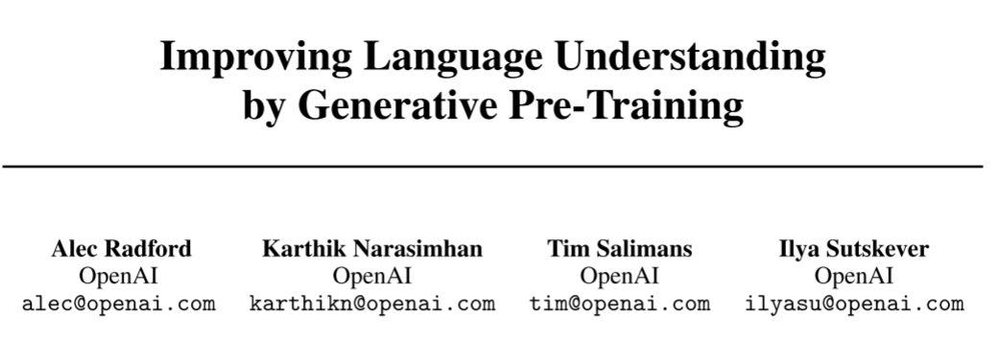
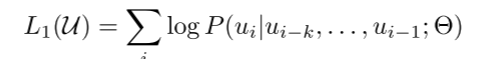
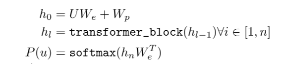
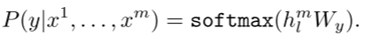
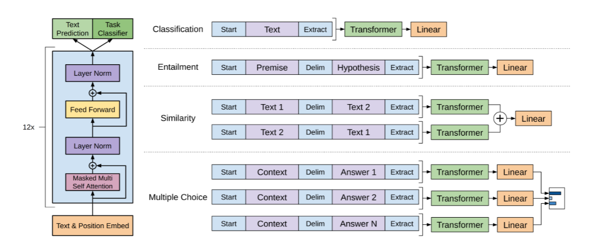
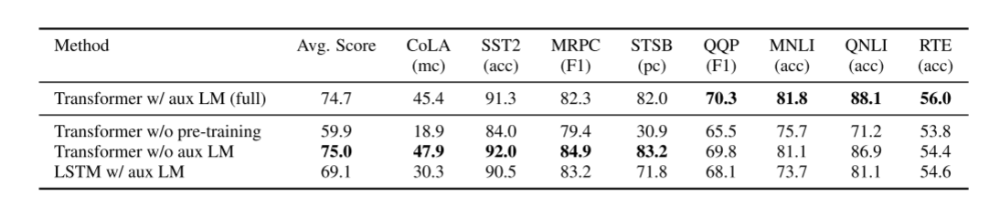
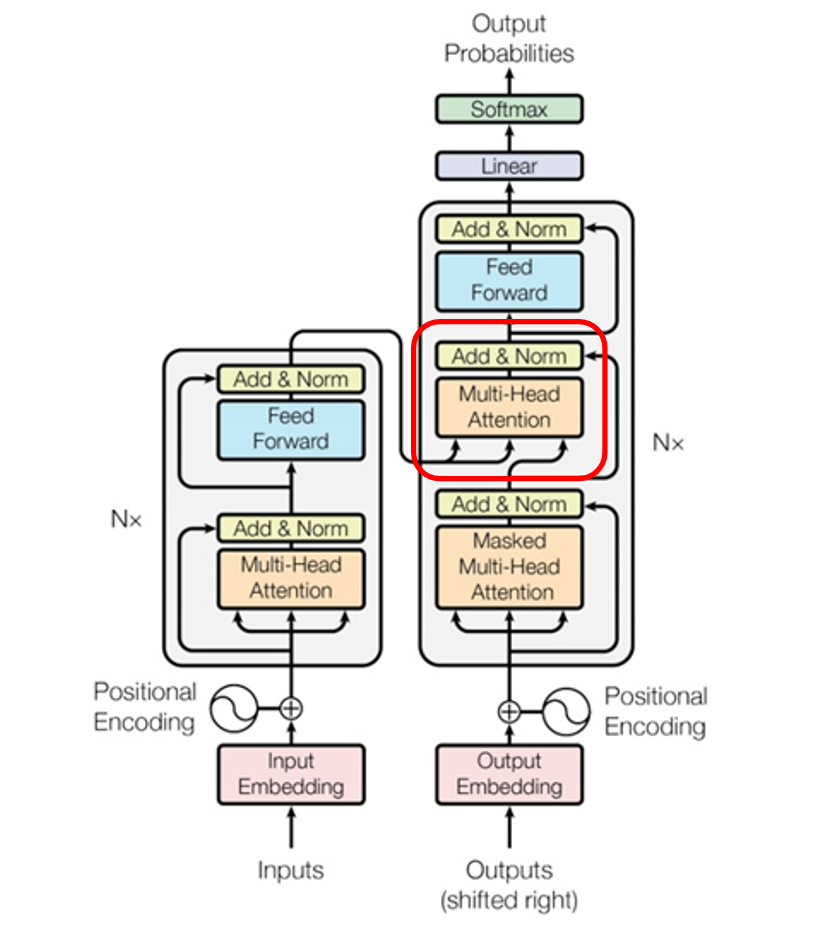

# GPT的学习笔记

author:Damon

### Abstract

We demonstrate that large gains on these tasks can be realized by generative pre-training of a language model on a diverse corpus of unlabeled text, followed by discriminative fine-tuning on each specific task.

我们证明，通过在不同的未标记文本语料库上对语言模型进行生成式预训练，然后对每个特定任务进行有区别的微调，可以实现这些任务的巨大收益

significantly improving upon the state of the art in 9 out of the 12 tasks studied.

在所研究的 12 项任务中，有 9 项显着改进了最先进的技术。  

### Related Work

In this paper, we explore a semi-supervised approach for language understanding tasks using a
combination of unsupervised pre-training and supervised fine-tuning.

在这篇文章中，我们探索出了一种对自然语言理解任务的半监督方法，融合了无监督的预训练(pre-training)和有监督的微调(fine-tuning)过程。

本文提出了一种通用表示，能够在范围广泛的任务中稍加修改、适应就能快速进行transfer.整个过程分成两个阶段。

阶段一：在无标签的海量数据中训练语言模型，学习神经网络模型的参数。

阶段二：应用阶段一训练完成模型参数用相关标签数据训练target task。

### Framework

**Unsupervised pre-training**

Given an unsupervised corpus of tokens U = {u1, . . . , un}, we use a standard language modeling objective to maximize the following likelihood

其中 k 是上下文窗口的大小，条件概率 P 使用参数为 Θ 的神经网络建模。

 这些参数是使用随机梯度下降训练的

In our experiments, we use a multi-layer Transformer decoder [34] for the language model, which is a variant of the transformer [62]. This model applies a multi-headed self-attention operation over the input context tokens followed by position-wise feedforward layers to produce an output distribution over target tokens:

在我们的实验中，我们使用多层 Transformer 解码器 [34] 作为语言模型，它是 Transformer [62] 的变体。 该模型对输入上下文标记应用多头自注意力操作，然后是位置前馈层，以在目标标记上产生输出分布：

where U = (u−k, . . . , u−1) is the context vector of tokens, n is the number of layers, We is the token embedding matrix, and Wp is the position embedding matrix.

其中 U = (u−k, . . , u−1) 是标记的上下文向量，n 是层数，We 是标记嵌入矩阵，Wp 是位置嵌入矩阵。

**Supervised fine-tuning**

基于公式1训练的模型，本文将训练获得的参数应用于有监督的目标任务。假定有带标签的数据集C，包含的每个实例是词序列，如，带有标签y，首先作为输入通过已经预训练好的pre-trained model获得最终transformer block's activation ,然后输入带有Wy的线性输出层来预测y。

This gives us the following objective to maximize:

实验结果

