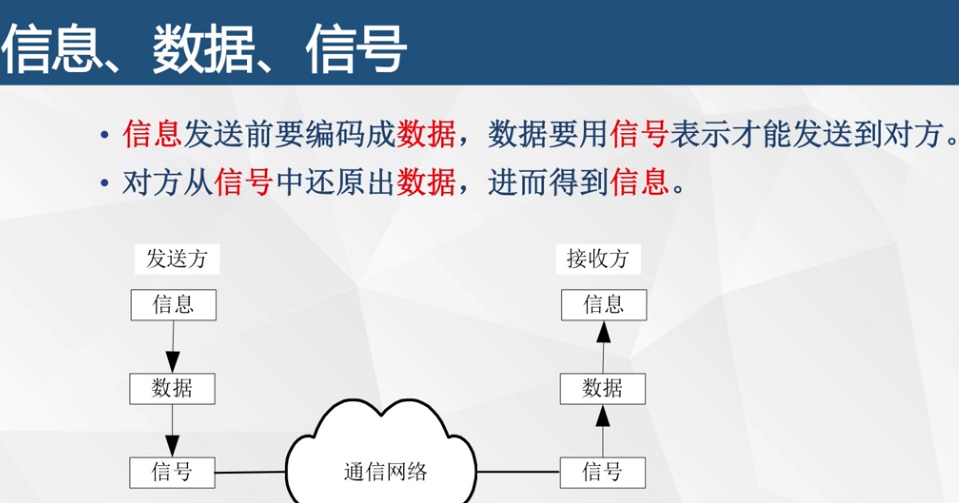
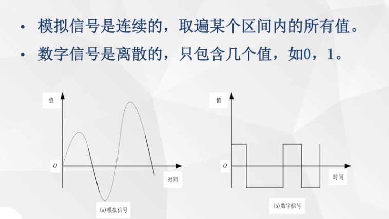
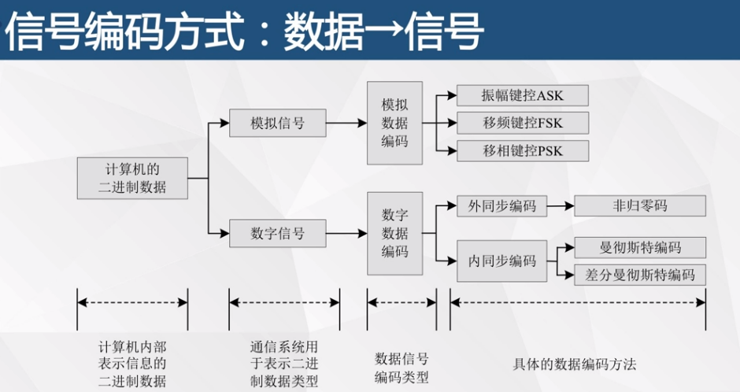
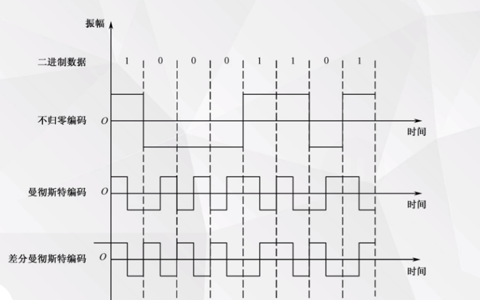
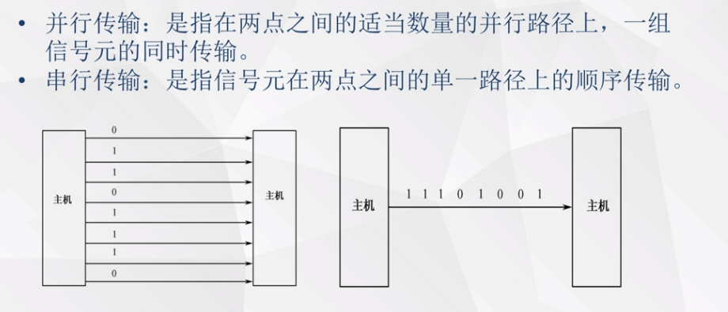
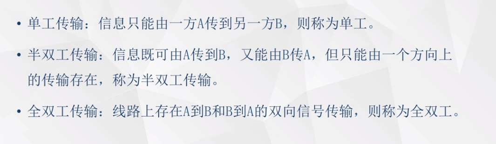
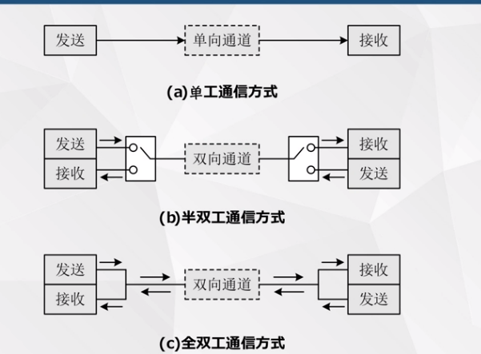
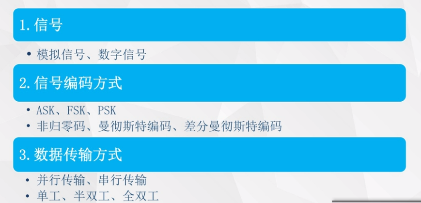

# 02数据通信技术基础

### 两种信号

不归零编码：高电位是1，低电位是0

曼彻斯特编码：高电位—>低电位是1，低电位—>高电位是0

差分曼彻斯特编码：当前这个传输周期的前半个传输码元，如果跟之前传输周期的后半个码元是一致的，也就是说没有变化，代表他要传输的数据是1，如果有变化代表是数据0

### 数据传输方式：

#### 第一种分类方式：

并行传输和串行传输

#### 第二种分类方式：

单工 半双工 和全双工

半双工同一时间只能一个方向

