# 计算机网络概述

计算机网络是指自主计算机互连集合

自主计算机：指分布在不同地理位置的多台独立的主机

互连：指使用通信介质和网络设备将计算机相互连接起来，遵循共同的网络协议。实现通信

计算机网络是网络硬件和网络协议的统一体

### 三种交换技术

#### 第一种：电路交换

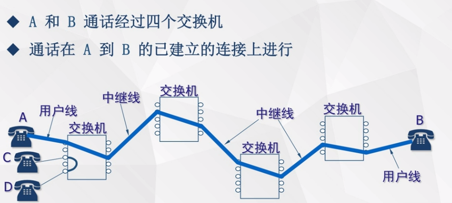

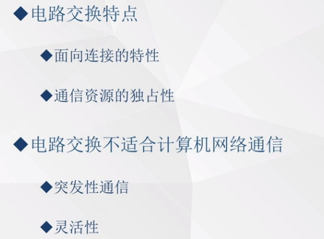

#### 第二种：报文交换

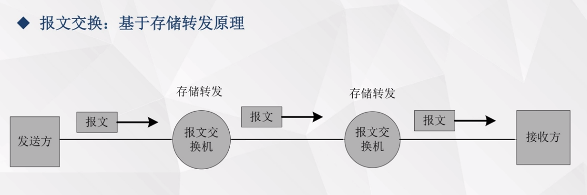

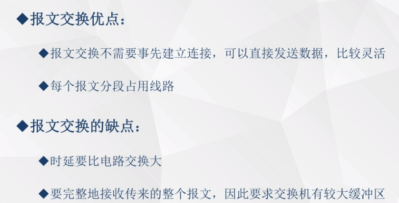

#### 第三种：分组交换

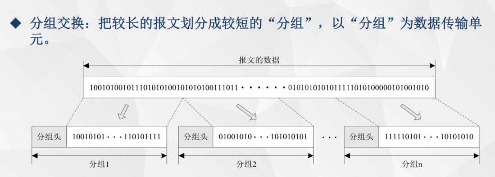

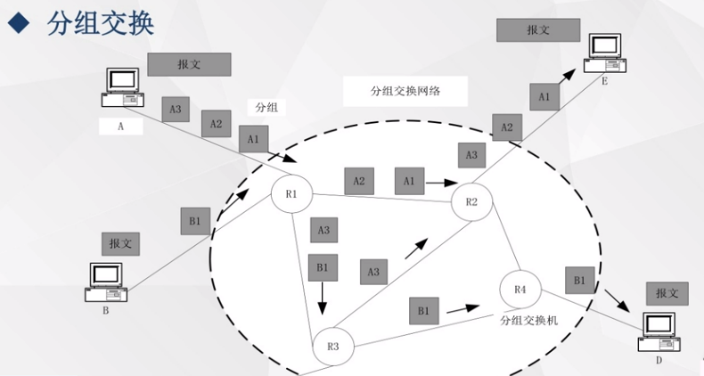

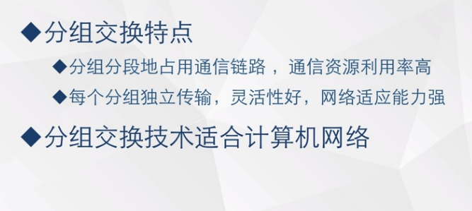

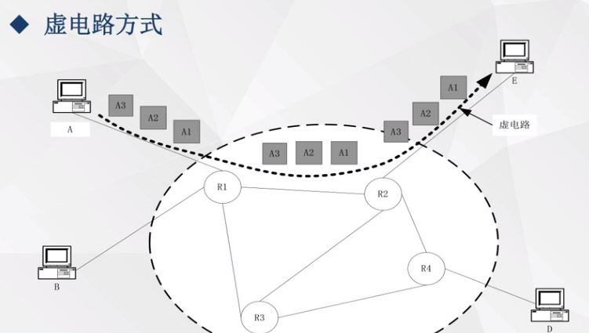

### 五种网络拓扑结构

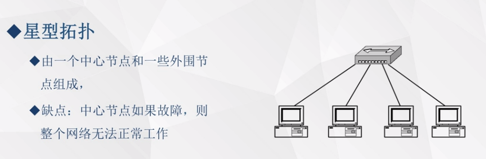

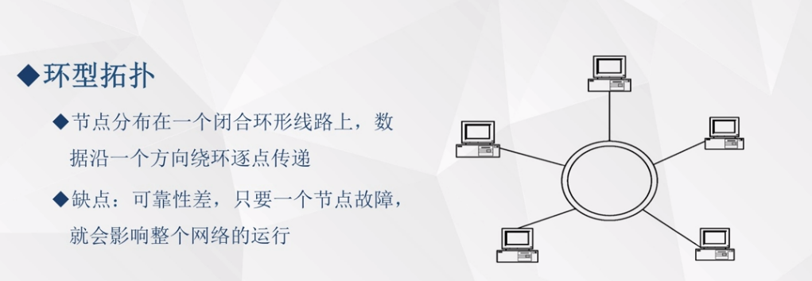

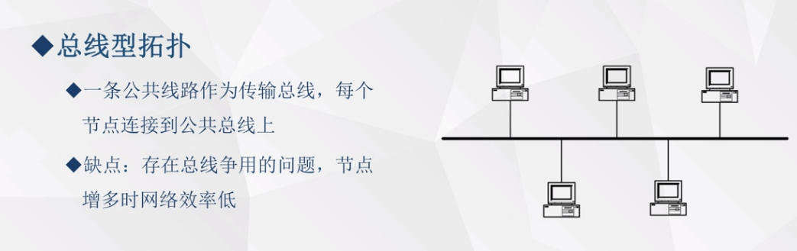

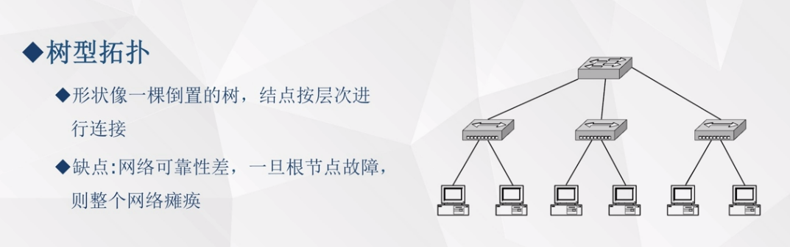

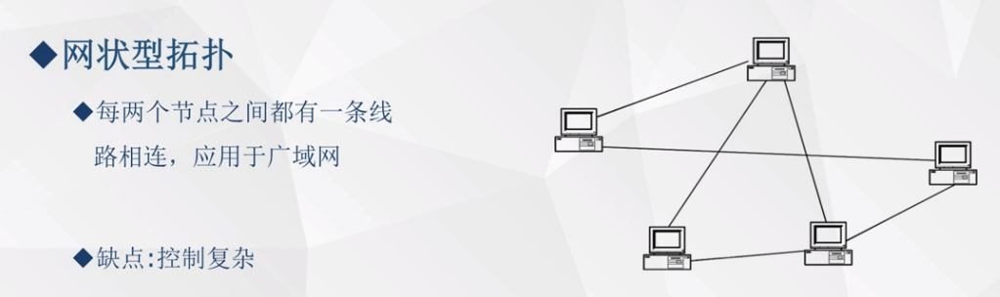

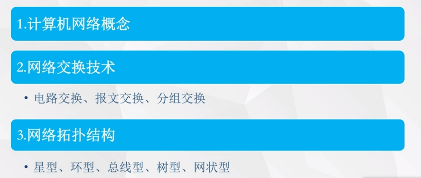